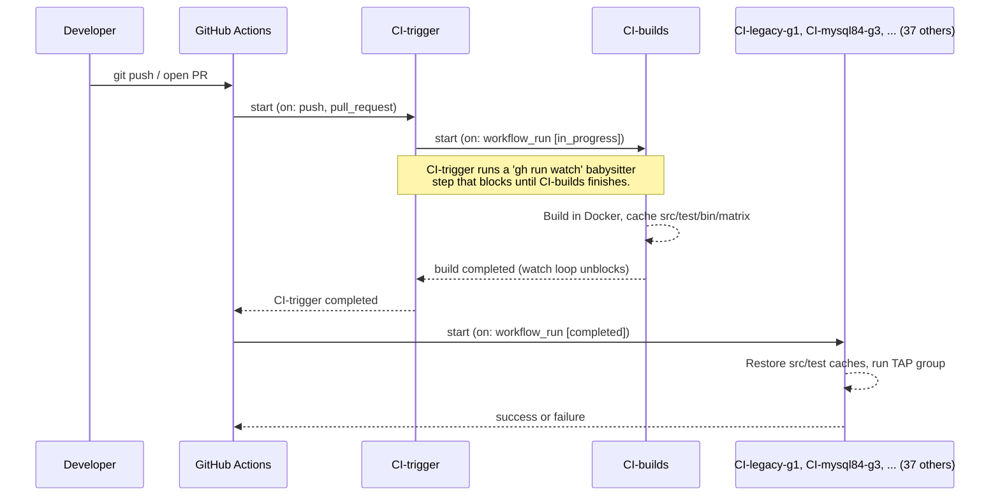

# ProxySQL CI Architecture

**Last updated:** 2026-04-11

This document is the authoritative reference for ProxySQL's GitHub Actions CI
setup. It covers the two-branch workflow split, the trigger chain, the test
groups system, how to add a new test workflow end-to-end, and the common
pitfalls.

If you touch anything under `.github/workflows/` on either `v3.0` or the
`GH-Actions` branch, read this first.

> **New to GitHub Actions terminology, or confused by check-run labels
> like `CI-maketest / builds (testgalera)`?** Jump to
> [§12 Understanding GitHub Actions vocabulary](#understanding-github-actions-vocabulary--read-this-first-if-confused)
> first — it walks through every term (workflow / run / job / matrix /
> check run / caller / reusable) with diagrams and a concrete walkthrough,
> then come back here.

---

## Table of contents

1. [TL;DR](#tldr)
2. [The two-branch architecture](#the-two-branch-architecture)
3. [Execution flow](#execution-flow)
4. [CI-trigger and CI-builds: the entry point](#ci-trigger-and-ci-builds-the-entry-point)
5. [The dedicated-reusable pattern](#the-dedicated-reusable-pattern)
6. [Cache layout produced by CI-builds](#cache-layout-produced-by-ci-builds)
7. [The TAP groups system](#the-tap-groups-system)
8. [Workflow catalogue](#workflow-catalogue)
9. [Adding a new test group end-to-end](#adding-a-new-test-group-end-to-end)
10. [Common pitfalls and historical gotchas](#common-pitfalls-and-historical-gotchas)
11. [Debugging a failing CI run](#debugging-a-failing-ci-run)
12. [Understanding GitHub Actions vocabulary — read this first if confused](#understanding-github-actions-vocabulary--read-this-first-if-confused)
13. [Glossary (quick reference)](#glossary-quick-reference)

---

## TL;DR

ProxySQL CI uses a **two-tier, two-branch** workflow split:

| Tier | Branch | Filename case | Role |
|---|---|---|---|
| **Caller** | `v3.0` (the default branch) | `CI-*.yml` (uppercase) | Thin `workflow_run`-triggered wrapper. Does nothing but delegate. |
| **Reusable** | `GH-Actions` (a dedicated branch) | `ci-*.yml` (lowercase) | The actual job body: checkout, cache, docker, tests, cleanup. |

Every test workflow you see in the GitHub Actions UI is a **pair** of files —
one on each branch — that must be kept in sync.

```text
branch: v3.0                                 branch: GH-Actions
  .github/workflows/CI-legacy-g1.yml    ──►    .github/workflows/ci-legacy-g1.yml
                 ▲                                         ▲
                 │                                         │
       "caller" (21 lines)                     "reusable workflow" (~120 lines)
       workflow_run trigger                    workflow_call interface
       uses: ci-legacy-g1.yml@GH-Actions       tests job with all the steps
```

**Why two branches?** GitHub Actions only reads `workflow_run`-triggered
workflow files from the **default branch**. Putting heavy test logic directly
on `v3.0` would mean every CI tweak churns `v3.0` history. The split keeps
`v3.0` commits focused on source code and lets CI iteration happen
independently on `GH-Actions`.

**Case matters (by convention only).** Uppercase `CI-*` = caller on `v3.0`;
lowercase `ci-*` = reusable on `GH-Actions`. GitHub itself is
case-insensitive, but the naming lets you tell at a glance which branch a
given filename belongs to.

---

## The two-branch architecture

### The problem the split solves

GitHub's `workflow_run` trigger has a hard rule:

> The workflow file that declares `on: workflow_run: ...` must live on the
> **repository's default branch** for the trigger to fire at all.

ProxySQL's default branch is `v3.0`. So the *thin caller files* that declare
`workflow_run` must live on `v3.0`. But the *body* of each test job — Docker
setup, TAP harness invocation, cleanup, artifact upload — is hundreds of lines
of shell and YAML that would otherwise have to live on `v3.0` too, churning
its commit history for every CI tweak.

Reusable workflows (`workflow_call`) solve this cleanly: the caller on `v3.0`
is a 20-line stub that says *"delegate to `ci-legacy-g1.yml` on the
`GH-Actions` branch"*, and the `GH-Actions` branch owns all the heavy logic.

### The canonical caller (20 lines)

All `CI-*.yml` files on `v3.0` follow this shape. This is
`CI-legacy-g1.yml` verbatim (other callers differ only in name and `uses:`
target):

```yaml
name: CI-legacy-g1
run-name: '${{ github.event.workflow_run && github.event.workflow_run.head_branch || github.ref_name }} ${{ github.workflow }} ${{ github.event.workflow_run && github.event.workflow_run.head_sha || github.sha }}'

on:
  workflow_dispatch:
  workflow_run:
    workflows: [ CI-trigger ]
    types: [ completed ]

concurrency:
  group: ${{ github.workflow }}-${{ github.event.workflow_run && github.event.workflow_run.head_branch || github.ref_name }}
  cancel-in-progress: true

jobs:
  run:
    if: ${{ github.event.workflow_run && github.event.workflow_run.conclusion == 'success' || ! github.event.workflow_run }}
    uses: sysown/proxysql/.github/workflows/ci-legacy-g1.yml@GH-Actions
    secrets: inherit
    with:
      trigger: ${{ toJson(github) }}
```

Breakdown:

* `on.workflow_run.workflows: [ CI-trigger ]` — this caller fires when
  `CI-trigger` completes. `CI-trigger` in turn waits for `CI-builds` to
  finish (see next section), so by the time this caller runs the cache keys
  it needs are guaranteed populated.
* `on.workflow_dispatch` — lets you run the workflow manually from the
  GitHub UI (useful for reruns).
* `concurrency.cancel-in-progress: true` — a new push to the same branch
  cancels any in-flight run. Saves runner minutes.
* `if: … conclusion == 'success'` — skip if `CI-trigger` itself failed;
  still run on `workflow_dispatch`.
* `uses: sysown/proxysql/.github/workflows/ci-legacy-g1.yml@GH-Actions` —
  the umbilical cord. GitHub checks out `GH-Actions`, reads the file, and
  runs its `workflow_call` interface as if inlined here.
* `trigger: ${{ toJson(github) }}` — serialises the entire
  `github` context as JSON and hands it to the reusable, so the reusable
  can pick out `event.workflow_run.head_sha` (the real commit under test)
  and use it as its cache key and checkout ref.

### The canonical reusable (~120 lines)

All `ci-*.yml` files on `GH-Actions` (except `ci-builds.yml` and
`ci-trigger.yml`, which are different) follow the shape of
`ci-legacy-g4.yml`. The pattern is documented in detail in
["The dedicated-reusable pattern"](#the-dedicated-reusable-pattern) below.

The top of any reusable looks like this:

```yaml
name: CI-legacy-g1

on:
  workflow_dispatch:
  workflow_call:        # <-- the important bit: "I can be called by other workflows"
    inputs:
      trigger:
        type: string

env:
  SHA: ${{ inputs.trigger && fromJson(inputs.trigger).event.workflow_run.head_sha || github.sha }}

jobs:
  tests:
    runs-on: ubuntu-22.04
    ...
```

`workflow_call` is the mirror image of the caller's `uses:`. It declares
this file's interface: the inputs it accepts, and implicitly the jobs it
will run. `fromJson(inputs.trigger).event.workflow_run.head_sha` extracts
the commit the caller was triggered on, so the reusable knows which commit
to check out and which cache to restore.

### Why the split looks confusing

The same workflow name (e.g. `CI-legacy-g1`) appears **twice**, on two
branches, at two different paths, with two different file contents:

* `v3.0:.github/workflows/CI-legacy-g1.yml` (uppercase C, 20 lines, caller)
* `GH-Actions:.github/workflows/ci-legacy-g1.yml` (lowercase c, ~120 lines,
  reusable)

They share a `name:` field, which is what the GitHub Actions UI displays,
so runs of either one show up as "CI-legacy-g1" in the Actions tab. The
duplicate naming is deliberate and harmless — you can always tell them
apart by branch or filename case.

---

## Execution flow

### Sequence (high level)



### Sequence (the full cascade)

```text
git push / open PR
  │
  ├─► CI-trigger (on: push, pull_request)  ← only this one is push-triggered
  │     │
  │     ├─► CI-builds (on: workflow_run [in_progress])
  │     │     │
  │     │     └─► Build ubuntu22-tap, debian12-dbg, ubuntu24-tap-genai-gcov
  │     │         Cache src/, test/, bin/, tap-matrix*.json
  │     │
  │     └─► (CI-trigger babysitter step `gh run watch` blocks until CI-builds
  │          completes, then CI-trigger itself completes)
  │
  └─► All test workflows fire in parallel
        (on: workflow_run [completed] targeting CI-trigger)

           CI-basictests         CI-selftests        CI-maketest
           CI-legacy-g1          CI-legacy-g2        CI-legacy-g2-genai
           CI-legacy-g3          CI-legacy-g4        CI-legacy-g5
           CI-legacy-clickhouse-g1
           CI-mysql84-g1         CI-mysql84-g2       CI-mysql84-g3
           CI-mysql84-g4         CI-mysql84-g5
           CI-unittests
           CI-repltests          CI-shuntest
           CI-taptests           CI-taptests-ssl     CI-taptests-asan
           CI-taptests-groups    CI-taptests-pgsql-cluster
           CI-codeql
           CI-3p-aiomysql        CI-3p-django-framework
           CI-3p-laravel-framework                    CI-3p-mariadb-connector-c
           CI-3p-mysql-connector-j                    CI-3p-pgjdbc
           CI-3p-php-pdo-mysql   CI-3p-php-pdo-pgsql  CI-3p-postgresql
           CI-3p-sqlalchemy
```

### Why the cascade looks the way it does

A few design choices that are not obvious from reading the YAML alone:

**1. Why do test workflows chain on `CI-trigger` instead of `CI-builds`?**

Because a `workflow_run`-triggered workflow receives
`github.event.workflow_run.head_sha` equal to the SHA of the workflow that
triggered it — and `CI-builds` is itself `workflow_run`-triggered, meaning
it always runs "on the default branch" with `head_sha` pointing at `v3.0`
HEAD, not at the PR commit. Chaining test workflows off `CI-builds` was
tried once (commit `9671a414a3`) and immediately broken: every PR test run
checked out `v3.0` code instead of PR code. It was reverted in
`78b8f5ac6` ("ci: revert test workflows to listen on CI-trigger
completion"). The correct chain is `push → CI-trigger → test workflows`,
with `CI-trigger`'s babysitter step gating the completion on `CI-builds`
so test workflows don't start before the build cache is ready.

**2. Why is `CI-trigger` needed at all?**

It's the only workflow that can fire on `push` / `pull_request` with the
PR's actual `head_sha`. Everything else uses `workflow_run`, which carries
a different SHA. `CI-trigger` captures the PR SHA, blocks on `CI-builds`,
then completes — and downstream workflows pick up the captured SHA from
its context.

**3. Why is `cancel-in-progress: true` safe?**

Every workflow uses a `concurrency.group` scoped to
`${workflow}-${branch}`, so a new push on the same branch cancels the
previous run of the same workflow. Different workflows on the same branch
run in parallel. Different branches of the same workflow run in parallel.

---

## CI-trigger and CI-builds: the entry point

These two workflows are special. The rest of the catalogue is a
fan-out downstream of them.

### `CI-trigger` / `ci-trigger.yml@GH-Actions`

| | |
|---|---|
| **Caller** | `v3.0:.github/workflows/CI-trigger.yml` |
| **Reusable** | `GH-Actions:.github/workflows/ci-trigger.yml` |
| **Triggers** | `pull_request`, `push` to version branches, `workflow_dispatch` |
| **Paths ignored** | `.github/**`, `**.md` (so doc-only PRs don't burn CI minutes) |
| **Does any real work?** | **No.** Its entire purpose is to (a) anchor the PR's `head_sha` in a `workflow_run` chain, and (b) block until `CI-builds` completes, so downstream `workflow_run[completed]` workflows can assume the build cache is ready. |

The reusable (`ci-trigger.yml@GH-Actions`) contains a babysitter step:

```bash
# Wait for CI-builds to start…
RUNID=$(gh -R ${repo} run list -w CI-builds -s in_progress | grep … | awk '{print $X}')
# …then block until it finishes.
gh -R ${repo} run watch -i 30 ${RUNID}
```

When `gh run watch` returns, `CI-trigger` completes, and every workflow
listening for `workflow_run[completed]` on `CI-trigger` fires.

### `CI-builds` / `ci-builds.yml@GH-Actions`

| | |
|---|---|
| **Caller** | `v3.0:.github/workflows/CI-builds.yml` |
| **Reusable** | `GH-Actions:.github/workflows/ci-builds.yml` |
| **Triggers** | `workflow_run` on `CI-trigger` with `types: [in_progress]` (so it starts as soon as `CI-trigger` starts, without waiting for `CI-trigger` to finish) |
| **Purpose** | Compiles ProxySQL inside Docker containers and saves the artifacts into the build cache that all downstream test workflows will restore. |

The build matrix:

| Matrix entry | Docker target | Flags set via `sed` into `docker-compose.yml` | Consumers |
|---|---|---|---|
| `ubuntu22, -tap` | `make ubuntu22-dbg` | debug + TAP test binaries | most test workflows |
| `debian12, -dbg` | `make debian12-dbg` | debug | 3p integration workflows |
| `ubuntu24, -tap-genai-gcov` | `make ubuntu24-dbg` | `PROXYSQLGENAI=1` + `WITHGCOV=1` | `CI-legacy-g2-genai` only |

### Opt-in TAP ASAN

- Add the exact `ci:asan` label to an internal PR, then push an empty commit
  to start a new ASAN standard-TAP integration run.
- Adding or removing the label alone does not trigger CI.
- Push builds and manual dispatches without `ci:asan` use the normal build.
- ASAN replaces the normal `ubuntu24-tap-genai-gcov` handoff for that commit;
  it does not duplicate the fan-out.
- Unit ASAN coverage and MySQLX behavior are unchanged.

Live CI validation of the labeled and unlabeled paths remains pending until the
branch is published; validate the mode, handoff artifact names, representative
consumer restoration, resolver failure behavior, and unchanged unit-ASAN
trigger before treating this contract as externally verified.

The flag injection is simple `sed` into `docker-compose.yml` before the
build runs:

```bash
if [[ "${{ matrix.type }}" =~ "-genai" ]]; then
  sed -i "/command/i \      - PROXYSQLGENAI=1" docker-compose.yml
fi
if [[ "${{ matrix.type }}" =~ "-gcov" ]]; then
  sed -i "/command/i \      - WITHGCOV=1" docker-compose.yml
fi
```

---

## The dedicated-reusable pattern

Every test workflow on `GH-Actions` (except `ci-builds.yml`,
`ci-trigger.yml`, and the deprecated generic `ci-taptests-groups.yml`)
follows the **dedicated-reusable** pattern: one file per test group, all
cut from the same template. The canonical template is `ci-legacy-g4.yml`.

### Anatomy of a dedicated reusable

```yaml
name: CI-legacy-g4

on:
  workflow_dispatch:
  workflow_call:
    inputs:
      trigger:
        type: string

env:
  SHA: ${{ inputs.trigger && fromJson(inputs.trigger).event.workflow_run.head_sha || github.sha }}

jobs:
  tests:
    runs-on: ubuntu-22.04
    strategy:
      fail-fast: false
      matrix:
        infradb: [ 'mysql57' ]        # cosmetic — the real infra is decided by TAP_GROUP
    env:
      BLDCACHE: ${{ inputs.trigger && fromJson(inputs.trigger).event.workflow_run.head_sha || github.sha }}_ubuntu22-tap_src
      MATRIX: '(${{ matrix.infradb }})'

    steps:
    # 1. Create an "in_progress" check run so the PR page shows yellow.
    - uses: LouisBrunner/checks-action@v2.0.0
      id: checks
      if: always()
      with:
        token: ${{ secrets.GITHUB_TOKEN }}
        name: '${{ github.workflow }} / ${{ github.job }} ${{ env.MATRIX }}'
        repo: ${{ github.repository }}
        sha: ${{ env.SHA }}
        status: 'in_progress'
        details_url: 'https://github.com/${{ github.repository }}/actions/runs/${{ github.run_id }}'

    # 2. Sparse-checkout just the CI orchestration + group definitions.
    - name: Checkout repository
      uses: actions/checkout@v4
      with:
        repository: ${{ github.repository }}
        ref: ${{ env.SHA }}
        path: 'proxysql'
        sparse-checkout: |
          test/infra
          test/tap/groups
          test/scripts

    # 3. Restore the src/ cache (proxysql binary + deps).
    - name: Cache restore src
      uses: actions/cache/restore@v4
      with:
        key: ${{ env.BLDCACHE }}
        fail-on-cache-miss: true
        path: |
          proxysql/src/

    # 4. Restore the test/ cache (TAP test binaries + infra files).
    - name: Cache restore test
      uses: actions/cache/restore@v4
      with:
        key: ${{ inputs.trigger && fromJson(inputs.trigger).event.workflow_run.head_sha || github.sha }}_ubuntu22-tap_test
        fail-on-cache-miss: true
        path: |
          proxysql/test/

    # 5. Sanity check the binary.
    - name: Verify binary
      run: |
        chmod +x proxysql/src/proxysql
        file proxysql/src/proxysql

    # 6. Build the shared Docker base image used by every infra docker-compose.
    - name: Build CI base image
      run: |
        cd proxysql/test/infra/docker-base
        docker build -t proxysql-ci-base:latest .

    # 7. Start the backends for this group (MySQL / PgSQL / MariaDB / etc.).
    - name: Start infrastructure
      run: |
        cd proxysql
        export INFRA_ID="ci-legacy-g4"
        export TAP_GROUP="legacy-g4"
        export SKIP_CLUSTER_START=1
        test/infra/control/ensure-infras.bash

    # 8. Run the TAP group.
    - name: Run legacy-g4 tests
      run: |
        cd proxysql
        export INFRA_ID="ci-legacy-g4"
        export TAP_GROUP="legacy-g4"
        export SKIP_CLUSTER_START=1
        export TAP_USE_NOISE=1       # (g4 only)
        test/infra/control/run-tests-isolated.bash

    # 9. Teardown — always runs.
    - name: Cleanup
      if: always()
      run: |
        set +e
        cd proxysql
        export INFRA_ID="ci-legacy-g4"
        export TAP_GROUP="legacy-g4"
        docker logs proxysql.ci-legacy-g4 2>&1 | tail -50 || true
        test/infra/control/stop-proxysql-isolated.bash
        test/infra/control/destroy-infras.bash

    # 10. On failure, upload ci_*_logs/ as a workflow artifact.
    - name: Archive artifacts logs
      if: ${{ failure() && !cancelled() }}
      uses: actions/upload-artifact@v4
      with:
        name: ${{ github.workflow }}-${{ env.SHA }}-logs-run#${{ github.run_number }}
        path: |
          proxysql/ci_*_logs/

    # 11. Update the check run to success/failure.
    - uses: LouisBrunner/checks-action@v2.0.0
      if: always()
      with:
        token: ${{ secrets.GITHUB_TOKEN }}
        check_id: ${{ steps.checks.outputs.check_id }}
        repo: ${{ github.repository }}
        sha: ${{ env.SHA }}
        conclusion: ${{ job.status }}
        details_url: 'https://github.com/${{ github.repository }}/actions/runs/${{ github.run_id }}'
```

### What a sibling (e.g. `ci-legacy-g1.yml`) differs in

A new group file is cut from `ci-legacy-g4.yml` by changing **only**:

* `name:` → `CI-<group>`
* `matrix.infradb: [ 'mysql57' ]` → the primary backend of the new group
  (e.g. `[ 'mysql84' ]` for `mysql84-g3`, `[ 'mysql57' ]` for `legacy-g1`).
  This value is **cosmetic for routing** — `ensure-infras.bash` ignores
  it and picks the real backends from
  `test/tap/groups/<base-group>/infras.lst` — **but it is displayed** in
  the PR UI via `env.MATRIX`, which is interpolated into the
  `LouisBrunner/checks-action` step's `name` field
  (`${{ github.workflow }} / ${{ github.job }} ${{ env.MATRIX }}`). If
  you leave it as `mysql57` on a mysql84 workflow, the check run will
  show up as `CI-mysql84-g3 / tests (mysql57)`, which misleads
  reviewers. Set it to the real primary backend.
* `INFRA_ID="ci-<group>"` (in steps 7, 8, 9)
* `TAP_GROUP="<group>"` (in steps 7, 8, 9)
* Step name `Run <group> tests`
* Cleanup `docker logs proxysql.ci-<group>`
* `TAP_USE_NOISE=1` → keep it or drop it (g4 has it for race testing; other
  groups leave it off unless the group has known flakiness that noise
  injection helps surface)

Nothing else. No infrastructure-specific code in the reusable —
`ensure-infras.bash` decides what backends to start by stripping `-gN`
from `TAP_GROUP` and looking up `test/tap/groups/<base-group>/infras.lst`.

### The `ci-unittests.yml` variant

`ci-unittests.yml` is a **slimmed** variant of the template. It drops:

* Step 6 (Build CI base image)
* Step 7 (Start infrastructure)
* Step 9 (Cleanup)

…because the `unit-tests` group sets `SKIP_PROXYSQL=1` in
`test/tap/groups/unit-tests/env.sh`, which makes `run-tests-isolated.bash`
take its host-only branch: it reads the list of `*_unit-t` binaries from
`groups.json`, runs them directly on the runner, and prints a
`PASSED / TOTAL` summary. No Docker, no backends, no cleanup.

### Why not one generic reusable workflow with `TAP_GROUP` as an input?

That was tried (`ci-taptests-groups.yml`) and doesn't work:

1. Its `tests` job matrix is built from `cat proxysql/tap-matrix.json`
   restored from the build cache. If CI-builds produces an empty
   `tap-matrix.json` (as it has recently — `find test/tap/ -name '*-t'`
   returned nothing), the tests job strategy fails to evaluate with
   *"Matrix vector 'testgroup' does not contain any values"* and the run
   wedges for 45+ minutes before timing out.
2. Its `infradb` matrix key is hardcoded to `mysql57`, so it cannot
   actually test `mysql84-*` groups even if the matrix were populated.
3. Its `testgroup` input is declared but never referenced in the file, so
   passing different values from different callers does nothing.

The dedicated pattern is slightly more verbose (one file per group), but
it's self-contained, debuggable step-by-step, and doesn't depend on any
fragile cache-populated JSON. Duplication across ~12 files is tolerable
because the files are stable — changes to the template are rare, and when
they happen they can be replicated with a single `sed`.

---

## Cache layout produced by CI-builds

`CI-builds` produces four separate cache entries per matrix build, each
keyed by `{SHA}_{dist}_{type}_{suffix}`:

| Key suffix | Contents | Who restores it |
|---|---|---|
| `_bin` | `.git/` + `binaries/` (packaging artefacts) | `CI-package-build` |
| `_src` | `proxysql/src/` (the `proxysql` binary + deps linked in) | every test workflow |
| `_test` | `proxysql/test/` (TAP test binaries, `test/infra/`, `test/scripts/`, `test/tap/`) | every test workflow |
| `_matrix` | `tap-matrix*.json` — legacy dynamic-matrix scaffolding | only the deprecated `ci-taptests-groups.yml` |

Example: for commit `abc123` built by matrix entry `ubuntu22, -tap`, the
keys are:

```text
abc123_ubuntu22-tap_bin
abc123_ubuntu22-tap_src
abc123_ubuntu22-tap_test
abc123_ubuntu22-tap_matrix
```

Cache entries expire after 7 days of inactivity (GitHub's default policy).

---

## The TAP groups system

TAP tests are split into **groups** declared in
`test/tap/groups/groups.json`. Each group has a short name (`legacy-g1`,
`mysql84-g3`, `unit-tests-g1`, etc.) and a list of test binaries that
belong to it. One test binary may belong to multiple groups.

### `groups.json` shape

```json
{
  "admin_disk_upgrade_unit-t":          [ "unit-tests-g1" ],
  "admin_show_fields_from-t":           [ "legacy-g1", "mysql84-g1", "mysql-multiplexing=false-g1", ... ],
  "ai_error_handling_edge_cases-t":     [ "ai-g1", "@proxysql_min_version:4.0" ],
  "c_tokenizer_unit-t":                 [ "unit-tests-g1" ],
  "charset_unsigned_int-t":             [ "legacy-g1", "mysql84-g1", ... ],
  "clickhouse_php_conn-t":              [ "legacy-clickhouse-g1", ... ],
  "deprecate_eof_cache-t":              [ "legacy-g4", "mysql84-g4", ... ],
  ...
}
```

Tags like `@proxysql_min_version:4.0` in a group array are **not** groups
— they're metadata filters consumed by `run-tests-isolated.bash` to skip
tests that require a newer ProxySQL than is being tested.

### Group directory layout

Each *base group* has a directory under `test/tap/groups/`:

```text
test/tap/groups/
  legacy/
    env.sh            # exports DEFAULT_MYSQL_INFRA, DEFAULT_PGSQL_INFRA, …
    infras.lst        # infra-mysql57, infra-mariadb10, docker-pgsql16-single
    pre-proxysql.bash # optional pre-hook
    setup-infras.bash # optional post-hook
  mysql84/
    env.sh            # DEFAULT_MYSQL_INFRA=infra-mysql84
    infras.lst        # infra-mysql84
  unit-tests/
    env.sh            # SKIP_PROXYSQL=1  ← makes run-tests-isolated take the host-only path
  no-infra-g1/
    infras.lst        # (empty or none — tests don't need backends)
  ...
```

**Note:** the directory is named by the **base** group (`legacy`,
`mysql84`, `unit-tests`). Subgroups like `legacy-g1`, `legacy-g3`,
`mysql84-g4`, `unit-tests-g1` do *not* have their own directories. They
share their base group's infrastructure.

### How `TAP_GROUP` is resolved

Inside `ensure-infras.bash` and `run-tests-isolated.bash`, a subgroup like
`legacy-g1` is resolved to its base group `legacy` via a single sed:

```bash
BASE_GROUP=$(echo "${TAP_GROUP}" | sed -E "s/[-_]g[0-9]+.*//")
# Source group env.sh to pick up SKIP_PROXYSQL and other group-level settings
if [ -f "${WORKSPACE}/test/tap/groups/${TAP_GROUP}/env.sh" ]; then
    source "${WORKSPACE}/test/tap/groups/${TAP_GROUP}/env.sh"
elif [ -f "${WORKSPACE}/test/tap/groups/${BASE_GROUP}/env.sh" ]; then
    source "${WORKSPACE}/test/tap/groups/${BASE_GROUP}/env.sh"
fi
```

Then it looks up `infras.lst` the same way. This means `TAP_GROUP=legacy-g1`
and `TAP_GROUP=legacy-g5` both get the *same* backend infrastructure (the
`legacy/infras.lst` contents), but they'll run *different* subsets of
tests because `groups.json` assigns different binaries to each subgroup.

### Relevant environment variables

| Variable | Default | Purpose |
|---|---|---|
| `TAP_GROUP` | — (required) | Which group to run, e.g. `legacy-g1`, `mysql84-g3`, `unit-tests-g1` |
| `INFRA_ID` | `dev-$USER` | Docker-container namespace; allows parallel runs on the same runner |
| `SKIP_PROXYSQL` | `0` | When set (via group `env.sh`), tests run directly on the host — no Docker, no backends |
| `SKIP_CLUSTER_START` | `0` | Skip the optional ProxySQL-cluster bootstrap (set by most group workflows) |
| `TAP_USE_NOISE` | `0` | Inject random delays + stress into tests that opt in (`cl.use_noise`), to surface races |
| `COVERAGE` | `0` | Enable gcov collection in the test runner container |
| `WORKSPACE` | — (auto) | Absolute path to the checkout root |

### SKIP_PROXYSQL: unit tests run on the host, not in Docker

The `unit-tests/env.sh` file contains a single line:

```bash
export SKIP_PROXYSQL=1
```

When `run-tests-isolated.bash` sees `SKIP_PROXYSQL=1` (via the group `env.sh`
sourcing above), it takes a completely different code path: it reads
`groups.json`, filters to all binaries in `TAP_GROUP` that pass the
`@proxysql_min_version` check, looks for each binary under
`test/tap/tests/unit/` or `test/tap/tests/`, and runs it directly on the
GitHub runner. No Docker containers, no backend startup, no
`proxysql-tester.py`. The workflow (`ci-unittests.yml`) accordingly omits
the "Build CI base image", "Start infrastructure", and "Cleanup" steps.

---

## Workflow catalogue

All `CI-*.yml` files on `v3.0` as of 2026-04-11. Status is as observed on
`v3.0` HEAD.

### Orchestration

| Caller (v3.0) | Reusable (GH-Actions) | Trigger | Purpose | Status |
|---|---|---|---|---|
| `CI-trigger.yml` | `ci-trigger.yml` | `push`, `pull_request`, `workflow_dispatch` | Anchor PR `head_sha`, block on `CI-builds` | ✅ |
| `CI-builds.yml` | `ci-builds.yml` | `workflow_run[in_progress]` on `CI-trigger` | Build 3 variants, populate caches | ✅ |
| `CI-lint-groups-json.yml` | *(inline, no reusable)* | `push`, `pull_request` on `groups.json` only | Lint `test/tap/groups/groups.json` format | ✅ |

### TAP test groups (dedicated-reusable pattern)

All chain off `workflow_run[completed]` on `CI-trigger`.

| Caller | Reusable | `TAP_GROUP` | Backends (from `infras.lst`) | Build cache | Status |
|---|---|---|---|---|---|
| `CI-basictests.yml` | `ci-basictests.yml` | `basictests` | mysql57 | `ubuntu22-tap_src` | ✅ |
| `CI-selftests.yml` | `ci-selftests.yml` | — (no group) | — | `ubuntu22-tap_src` | ✅ |
| `CI-maketest.yml` | `ci-maketest.yml` | — (runs `make test` in Docker) | mysql57 | `ubuntu22-tap_src` | ✅ |
| `CI-legacy-g1.yml` | `ci-legacy-g1.yml` | `legacy-g1` | mysql57, mariadb10, pgsql16 | `ubuntu22-tap_src` + `_test` | ✅ (new, PR #5597) |
| `CI-legacy-g2.yml` | `ci-legacy-g2.yml` | `legacy-g2` | mysql57, mariadb10, pgsql16, clickhouse23 | `ubuntu22-tap_src` + `_test` | ✅ |
| `CI-legacy-g2-genai.yml` | `ci-legacy-g2-genai.yml` | `legacy-g2` | mysql57, mariadb10, pgsql16, clickhouse23 | `ubuntu24-tap-genai-gcov_src` + `_test` | ✅ |
| `CI-legacy-g3.yml` | `ci-legacy-g3.yml` | `legacy-g3` | mysql57, mariadb10, pgsql16 | `ubuntu22-tap_src` + `_test` | ✅ (new, PR #5597) |
| `CI-legacy-g4.yml` | `ci-legacy-g4.yml` | `legacy-g4` | mysql57, mariadb10, pgsql16 | `ubuntu22-tap_src` + `_test` | ✅ |
| `CI-legacy-g5.yml` | `ci-legacy-g5.yml` | `legacy-g5` | mysql57, mariadb10, pgsql16 | `ubuntu22-tap_src` + `_test` | ✅ (new, PR #5597) |
| `CI-legacy-clickhouse-g1.yml` | `ci-legacy-clickhouse-g1.yml` | `legacy-clickhouse-g1` | mysql57, clickhouse23 | `ubuntu22-tap_src` + `_test` | ✅ |
| `CI-mysql84-g1.yml` | `ci-mysql84-g1.yml` | `mysql84-g1` | mysql84 | `ubuntu22-tap_src` + `_test` | ✅ (new, PR #5597) |
| `CI-mysql84-g2.yml` | `ci-mysql84-g2.yml` | `mysql84-g2` | mysql84 | `ubuntu22-tap_src` + `_test` | ✅ (new, PR #5597) |
| `CI-mysql84-g3.yml` | `ci-mysql84-g3.yml` | `mysql84-g3` | mysql84 | `ubuntu22-tap_src` + `_test` | ✅ (new, PR #5597) |
| `CI-mysql84-g4.yml` | `ci-mysql84-g4.yml` | `mysql84-g4` | mysql84 | `ubuntu22-tap_src` + `_test` | ✅ (new, PR #5597) |
| `CI-mysql84-g5.yml` | `ci-mysql84-g5.yml` | `mysql84-g5` | mysql84 | `ubuntu22-tap_src` + `_test` | ✅ (new, PR #5597) |
| `CI-unittests.yml` | `ci-unittests.yml` | `unit-tests-g1` | none (`SKIP_PROXYSQL=1`) | `ubuntu22-tap_src` + `_test` | ✅ (new, PR #5597) |
| `CI-taptests-pgsql-cluster.yml` | *(dedicated reusable)* | `pgsql-cluster-sync` | pgsql16 replicated | `ubuntu22-tap_src` + `_test` | ✅ |

### Legacy / deprecated

| Caller | Reusable | Status | Notes |
|---|---|---|---|
| `CI-taptests.yml` | `ci-taptests.yml` | ❌ Disabled manually in the UI | Jenkins-script legacy, #5521 |
| `CI-taptests-ssl.yml` | `ci-taptests-ssl.yml` | ❌ Disabled manually in the UI | Jenkins-script legacy, #5521 |
| `CI-taptests-asan.yml` | `ci-taptests-asan.yml` | ❌ Disabled manually in the UI | Jenkins-script legacy, #5521 |
| `CI-taptests-groups.yml` | `ci-taptests-groups.yml` | ⚠️ Still active, but empty-matrix-wedged; no caller routes through it after PR #5598 | Candidate for deletion |
| `CI-repltests.yml` | `ci-repltests.yml` | ❌ Broken, references `proxysql/jenkins-build-scripts` | #5521 |
| `CI-shuntest.yml` | `ci-shuntest.yml` | ❌ Broken, same as CI-repltests | #5521 |

### CodeQL + packaging

| Caller | Reusable | Trigger | Purpose | Status |
|---|---|---|---|---|
| `CI-codeql.yml` | `ci-codeql.yml` | `workflow_run[completed]` on `CI-trigger` | Security analysis | ✅ |
| `CI-package-build.yml` | `ci-package-build.yml` | `push` | Build `.deb` / `.rpm` / ARM64 packages | ✅ |
| `CI-package-amd64-tarball.yml` | *(self-contained)* | `workflow_dispatch` | Build generic Linux `.tar.gz` (amd64, all tiers) | ✅ |
| `CI-package-arm64-tarball.yml` | *(self-contained)* | `workflow_dispatch` | Build generic Linux `.tar.gz` (arm64, all tiers) | ✅ |

### Third-party integration (`CI-3p-*`)

Ten workflows test ProxySQL against external client libraries, independent
of the build cache (they build ProxySQL inline inside the workflow). Each
triggers on `workflow_run[completed]` on `CI-trigger` and reads its matrix
from GitHub repository variables like
`MATRIX_3P_AIOMYSQL_infradb_mysql`.

| Caller | Client | Protocols |
|---|---|---|
| `CI-3p-aiomysql.yml` | Python `aiomysql` (async) | MySQL |
| `CI-3p-django-framework.yml` | Django ORM | MySQL, PostgreSQL |
| `CI-3p-laravel-framework.yml` | Laravel Eloquent | MySQL, PostgreSQL |
| `CI-3p-mariadb-connector-c.yml` | MariaDB C connector | MySQL |
| `CI-3p-mysql-connector-j.yml` | MySQL Connector/J | MySQL |
| `CI-3p-pgjdbc.yml` | PostgreSQL JDBC | PostgreSQL |
| `CI-3p-php-pdo-mysql.yml` | PHP PDO MySQL | MySQL |
| `CI-3p-php-pdo-pgsql.yml` | PHP PDO PostgreSQL | PostgreSQL |
| `CI-3p-postgresql.yml` | libpq (native) | PostgreSQL |
| `CI-3p-sqlalchemy.yml` | SQLAlchemy ORM | MySQL, PostgreSQL |

### Release tarballs (generic Linux binaries)

`CI-package-amd64-tarball.yml` and `CI-package-arm64-tarball.yml` build
distribution-agnostic `.tar.gz` bundles — a portable alternative to the
`.deb`/`.rpm` packages — and attach them to the rolling `<ref>-head` draft
pre-release. Unlike most CI, these are **`workflow_dispatch`-only** (manual)
and **self-contained** (no `@GH-Actions` reusable). Trigger them from the
Actions UI (*Run workflow*) or the CLI, against any ref:

```bash
gh workflow run CI-package-amd64-tarball.yml --repo sysown/proxysql --ref v3.0
gh workflow run CI-package-arm64-tarball.yml --repo sysown/proxysql --ref v3.0
```

> Note: `workflow_dispatch` workflows are only dispatchable once the file
> exists on the repo's **default branch** (`v3.0`).

Each run's `build` job is a **matrix over the three feature tiers**, so one
dispatch produces three tarballs per architecture (`CURVER` is bumped per
tier, so the names never collide):

| Matrix leg | Flag passed to `make` | Artifact |
|---|---|---|
| `v3.0` | *(none)* | `proxysql-3.0.x-linux-<arch>.tar.gz` |
| `v3.1` | `PROXYSQL31=1` | `proxysql-3.1.x-linux-<arch>.tar.gz` |
| `v4.0` | `PROXYSQL40=1` | `proxysql-4.0.x-linux-<arch>.tar.gz` (bundles the `mysqlx` + `genai` plugin `.so`s under `lib/proxysql/`) |

Mechanics worth knowing:

* A preceding **`init_release`** job finds-or-creates the draft release tagged
  `<ref>-head` **by tag name** and reuses it, so the tarballs land on the same
  rolling draft as the `.deb`/`.rpm` packages (on `v3.0` that is `v3.0-head`).
* The build runs in the `tarball_build` docker-compose service on an
  **AlmaLinux 9** image (glibc 2.34 / OpenSSL 3), staged and packaged by
  `docker/images/proxysql/tarball-compliant/entrypoint/entrypoint.bash`.
* Each `build` leg deletes-then-uploads its own assets by name (`.tar.gz` +
  `.sha256`), so re-running refreshes them in place.

To build a tarball locally (the exact command the workflow runs — needs Docker
and access to the AlmaLinux 9 packaging image; arch is taken from `uname -m`):

```bash
make tarball-almalinux9                 # Stable (v3.0.x)
make tarball-almalinux9 PROXYSQL31=1    # v3.1.x (FFTO + TSDB)
make tarball-almalinux9 PROXYSQL40=1    # v4.0.x (+ mysqlx/genai plugins)
```

The resulting `.tar.gz` and its `.sha256` are written to `binaries/`.

---

## Adding a new test group end-to-end

Suppose you want to add `CI-mysql90-g1` (a new test group running against
MySQL 9.0). You'll touch four things across both branches.

### 1. Test assignments — `test/tap/groups/groups.json` (on `v3.0`)

Add `"mysql90-g1"` to the group arrays of every test binary that should
run in this group:

```json
{
  "admin_show_fields_from-t": [ "legacy-g1", "mysql84-g1", "mysql90-g1", ... ],
  ...
}
```

The `lint_groups_json.py` script validates the file on PR; `CI-lint-groups-json`
will run it automatically.

### 2. Group directory — `test/tap/groups/mysql90/` (on `v3.0`)

```text
test/tap/groups/mysql90/
├── env.sh        # export DEFAULT_MYSQL_INFRA="infra-mysql90"
└── infras.lst    # infra-mysql90
```

`test/infra/infra-mysql90/` must also exist and have a working
`docker-compose.yml` — see `test/infra/infra-mysql84/` as a template.

### 3. Reusable workflow — `ci-mysql90-g1.yml` (on `GH-Actions`)

Cut from `ci-legacy-g4.yml`, change `name:`, `INFRA_ID`, `TAP_GROUP`,
`docker logs proxysql.<id>`, and `matrix.infradb` (see
[What a sibling differs in](#what-a-sibling-eg-ci-legacy-g1yml-differs-in)
above for why `infradb` matters). Use `sed`:

```bash
# on the GH-Actions branch:
cd .github/workflows
sed -e "s/legacy-g4/mysql90-g1/g" \
    -e "s/infradb: \[ 'mysql57' \]/infradb: [ 'mysql90' ]/" \
    ci-legacy-g4.yml > ci-mysql90-g1.yml
# then manually drop the TAP_USE_NOISE=1 line unless you want it
python3 -c "import yaml; yaml.safe_load(open('ci-mysql90-g1.yml'))"   # sanity check
```

### 4. Caller — `CI-mysql90-g1.yml` (on `v3.0`)

Cut from `CI-legacy-g4.yml` on `v3.0`:

```bash
# on the v3.0 branch:
cd .github/workflows
sed "s/legacy-g4/mysql90-g1/g; s/ci-legacy-g4/ci-mysql90-g1/" CI-legacy-g4.yml > CI-mysql90-g1.yml
```

### 5. Merge order

**This matters.** `workflow_run`-triggered files are only read from the
default branch, so the caller on `v3.0` will start resolving
`ci-mysql90-g1.yml@GH-Actions` the moment it lands. If that file doesn't
yet exist on `GH-Actions`, the first run errors out with
`Unable to resolve action`.

1. **First**, merge the `GH-Actions` PR that adds `ci-mysql90-g1.yml`.
2. **Then**, merge the `v3.0` PR that adds `CI-mysql90-g1.yml`.

Step 2 can also bundle the `groups.json` and `test/tap/groups/mysql90/`
changes; they don't interact with the merge order.

---

## Common pitfalls and historical gotchas

### 1. Order of merges between caller and reusable

Covered in [Adding a new test group](#adding-a-new-test-group-end-to-end)
above. Bears repeating because every single historical CI breakage has
had this shape:

* **Jan 2026:** `75ce81757` added 8 v3.0 callers without creating the
  matching reusables on `GH-Actions`. The callers pointed at the generic
  `ci-taptests-groups.yml` as a placeholder. The placeholder ran, but
  its tests job was wedged on an empty matrix — every run failed for
  months. Fixed by PRs #5597 (add reusables) and #5598 (rewire callers).

### 2. `workflow_run` chains use the triggering workflow's `head_sha`

When workflow A triggers workflow B via `on: workflow_run`, workflow B
receives `github.event.workflow_run.head_sha` equal to **workflow A's**
`head_sha`, not the push/PR SHA of the user action that kicked everything
off. If workflow A was itself `workflow_run`-triggered, its `head_sha`
points at the default branch HEAD, **not** at the PR commit. Chaining a
test workflow off `CI-builds` instead of `CI-trigger` breaks PR testing
for exactly this reason. **Always chain off `CI-trigger`.**

### 3. The `ci-taptests-groups.yml` empty-matrix wedge

If you see a run where the `select` job completes in 3 seconds, the
`tests` job shows "Waiting for pending jobs", and the whole run sits for
45+ minutes before failing, the matrix came back empty. Check the
`select` job log for:

```text
matrix=[ ]
```

and trace back to `CI-builds`'s `>>>tap-matrix.txt<<<` section. If *that*
is empty too, `find test/tap/ -name '*-t'` inside the build step returned
nothing, which means the TAP test binaries weren't compiled for that
build variant. **This is an orthogonal bug in `CI-builds`**; no caller
should route through `ci-taptests-groups.yml` on the current `v3.0`, so
if you see the wedge it means someone accidentally wired a new caller at
the legacy reusable.

### 4. Duplicate workflow names show the same name in the UI

`CI-legacy-g1` appears as *one* workflow in the Actions tab but is
actually two files on two branches. When debugging, always note which
branch the failing file lives on:

* The caller is on `v3.0`: `.github/workflows/CI-legacy-g1.yml`
* The reusable is on `GH-Actions`: `.github/workflows/ci-legacy-g1.yml`

The Actions UI shows the `name:` field. Both files have the same
`name: CI-legacy-g1`. To disambiguate, open the run's raw logs: the first
job step prints
`Uses: sysown/proxysql/.github/workflows/ci-legacy-g1.yml@refs/heads/GH-Actions (<sha>)`
which tells you which version of the reusable it's running.

### 5. `LouisBrunner/checks-action` and `permissions:` blocks

Automated reviewers (CodeRabbit, Sonar) will flag the reusables for not
declaring `permissions: checks: write`. This is a false positive for this
repo: `gh api repos/sysown/proxysql/actions/permissions/workflow` returns
`default_workflow_permissions: "write"`, meaning the default
`GITHUB_TOKEN` already has all scopes. Adding a `permissions:` block
would actually **restrict** unlisted scopes to `none` and risk breaking
`actions/cache`, so don't do it in isolation. If you want to harden
tokens, do it uniformly across **all** workflows in the repo, not just
the new ones.

### 6. SHA pinning of third-party actions

Sonar's quality gate flags all `@v2.0.0` / `@v4` action tags as
hotspots recommending full commit SHAs. The baseline workflows
(`ci-basictests.yml`, `ci-legacy-g2.yml`, `ci-legacy-g4.yml`) all use
tags, not SHAs. If you want to adopt SHA pinning, it should be a single
repo-wide cleanup across all workflows — don't introduce it piecemeal.

---

## Debugging a failing CI run

### Step 1: identify which layer failed

```text
push / PR
   │
   ├─ CI-trigger failed?        → the push/PR itself has a problem
   │                               (paths filter, ref filter, branch protection)
   │
   ├─ CI-builds failed?         → compile error, deps issue, Docker issue
   │                               look at: run / builds (ubuntu22, -tap) logs
   │
   └─ a test workflow failed?   → your TAP group or its infra
                                   look at: run / tests (…) logs, artifacts
```

### Step 2: correlate commits across the chain

Because of the `workflow_run` chaining, a single `git push` produces
a *tree* of runs, all linked by the same `head_sha`. To list them:

```bash
gh run list --branch <branch> --commit <sha>
```

The v3.0 branch's runs include a run-name of the form:
`<branch> <workflow> <head_sha>`. Filter on the SHA to find all related
runs.

### Step 3: inspect the reusable version actually used

A workflow_run run records which commit of the reusable was used, under
the `referenced_workflows` field:

```bash
gh api repos/sysown/proxysql/actions/runs/<RUN_ID> \
   --jq '.referenced_workflows'
```

This tells you the exact SHA on `GH-Actions` that supplied the reusable
body. Useful if you suspect a stale cached version or a race with a
`GH-Actions` merge.

### Step 4: get the artifacts

If a test workflow failed, the Cleanup step runs unconditionally and the
next step uploads `proxysql/ci_*_logs/` as a workflow artifact. Download
it:

```bash
gh run download <RUN_ID> -n CI-<group>-<sha>-logs-run#<N>
```

Inside you'll find ProxySQL's own log, the docker-compose project logs,
and each test binary's TAP output.

### Step 5: reproduce locally

Every test group can be run locally with the same scripts the CI uses:

```bash
# in the proxysql checkout, after a successful local build:
export INFRA_ID="local-$USER"
export TAP_GROUP="legacy-g1"
export SKIP_CLUSTER_START=1
test/infra/control/ensure-infras.bash
test/infra/control/run-tests-isolated.bash
test/infra/control/stop-proxysql-isolated.bash
test/infra/control/destroy-infras.bash
```

`INFRA_ID` namespaces the Docker containers so multiple local runs don't
collide.

For unit tests (no Docker needed):

```bash
make build_tap_test_debug
export TAP_GROUP="unit-tests-g1"
test/infra/control/run-tests-isolated.bash
```

The `SKIP_PROXYSQL=1` path inside the script will invoke each unit test
binary directly and print a summary.

---

## Understanding GitHub Actions vocabulary — read this first if confused

This section is the long-form explanation of the terminology. If you just
want a word defined quickly, skip to the [compact glossary](#glossary-quick-reference)
at the end. If you look at a PR "Checks" tab and can't answer *"what file
on disk corresponds to this row, and why can't I find it by grepping?"*,
read this section.

We will use **one concrete check label** throughout — the one from the
issue that prompted this section — and walk it all the way down from
"string on the PR" to "YAML line on disk":

```
CI-maketest / builds (testgalera)
```

By the end of the section you should be able to open any PR, look at any
check-run label, and know exactly which file (on which branch) produced it.

### 12.1 The seven terms you need to keep straight

These are **not** ProxySQL-specific — they are standard GitHub Actions
vocabulary — except for #7 which is the ProxySQL caller/reusable split.
They are ordered so each one builds on the previous.

#### 1. Workflow — the YAML file on disk

A **workflow** is *exactly one file* under `.github/workflows/`. Each file
has a top-level `name:`, an `on:` block listing its triggers, and a `jobs:`
block listing its jobs.

The workflow's **identity in the GitHub UI is the `name:` field**, not the
filename. Two different files with the same `name:` will look like "the
same workflow" in the UI (this is important — ProxySQL does exactly this;
see #7 below).

Concrete example — `.github/workflows/ci-maketest.yml` on branch `GH-Actions`:

```yaml
name: CI-maketest                       # <- this is the workflow name
on:
  workflow_dispatch:
  workflow_call:
    inputs:
      trigger:
        type: string
      target:
        type: string
jobs:
  builds:                               # <- there is exactly one job: "builds"
    runs-on: ubuntu-22.04
    strategy:
      matrix:
        target: [ testaurora, testgalera, testgrouprep,
                  testreadonly, testreplicationlag, testall ]
    steps:
      - …
```

This file *is* a workflow. It will stay a workflow whether it ever runs or
not, whether it has run on 10 commits or zero commits. It is an
**immutable object at rest on disk**.

#### 2. Workflow run — one execution of a workflow

A **workflow run** is what happens when a trigger fires on a specific
commit. Every run is a **mutable object in GitHub's history** with:

- a unique numeric **run id** (the big number in the URL)
- a single `head_sha` (the commit it ran on)
- a `status` — one of `queued`, `in_progress`, `completed`
- a `conclusion` — one of `success`, `failure`, `cancelled`, `skipped`, …
  (only meaningful after `status == completed`)

If the `CI-maketest` workflow fires on commit `09b97547f` and again on
commit `a1b2c3d4e`, those are **two different workflow runs** of *the same
workflow*. Each has its own run id. You can list runs of a workflow with:

```bash
gh run list --workflow CI-maketest -R sysown/proxysql --limit 10
```

Workflow runs are what you see in the **Actions** tab of the repo.

#### 3. Job — one block under `jobs:`

A run contains one or more **jobs**. Jobs are keys under the `jobs:` block
of the workflow file. Each job runs on its own **runner** (a VM or
container) and contains its own sequence of **steps**.

In our example, the `CI-maketest` workflow has *one* job definition:
`builds` (look back at the YAML). That single definition is what will
become one-or-more actual job runs once the matrix expands in #4.

A workflow with two jobs and no matrix produces a run with exactly two
parallel jobs. A workflow with one job and no matrix produces a run with
one job. Simple.

#### 4. Job matrix — one job definition → N parallel job-runs

`CI-maketest` is not simple. Its one job (`builds`) declares:

```yaml
strategy:
  matrix:
    target: [ testaurora, testgalera, testgrouprep,
              testreadonly, testreplicationlag, testall ]
```

This says: *"expand this single job definition into six parallel job-runs,
one per value of `target`"*. Each expansion gets its own runner, its own
steps executing top-to-bottom, and its own independent pass/fail. When
matrix expansion happens, the expansions are sometimes called **matrix
jobs** or **matrix cells** — there is no universally-agreed term; in this
doc we use "matrix cell" or "matrix job".

**One workflow run of `CI-maketest`** therefore contains **one job
definition** (`builds`) which expands to **six matrix cells**, each of
which is its own parallel execution. So `gh run view <runid>` on a
`CI-maketest` run shows:

```
builds (testaurora)           success
builds (testgalera)           success    ← the one we care about
builds (testgrouprep)         failure
builds (testreadonly)         success
builds (testreplicationlag)   success
builds (testall)              success
```

Six lines, one workflow run. *The word "galera" appears exactly once in
the entire workflow file: as the second value in that matrix array.*
There is no `ci-galera.yml`. There is no job called "testgalera". There
is only a matrix value named "testgalera" inside the one `builds` job
inside the one `CI-maketest` workflow.

#### 5. Step — one `- name:` block inside a job

A **step** is the smallest unit: one entry in a job's `steps:` list. Steps
run sequentially top-to-bottom inside a single runner, sharing filesystem
and environment. They are the actual shell commands or Action invocations.

In `CI-maketest`, every matrix cell runs the same five steps:

```
1. checks (LouisBrunner) - "in_progress"
2. Checkout repository
3. Make-test              ← runs `make $TARGET` inside docker-compose
4. Check build
5. checks (LouisBrunner) - post job.status back
```

Steps are **per-matrix-cell**, so across the six cells of one workflow
run, 30 step executions happen in total (6 cells × 5 steps each).

#### 6. Check run — a status row attached to a commit SHA

This is the one that is most confusing, because it is **not** in the
workflow hierarchy at all. It is a *separate* object that lives on the
**commit**, not on the workflow.

GitHub's **Checks API** lets anything (an Action, an external bot, a
webhook) attach a status row to a specific commit SHA with:

- a `name` (free-form string, author's choice)
- a `status` (`queued` / `in_progress` / `completed`)
- a `conclusion` (`success` / `failure` / …)
- an optional `details_url` (where to click for more info)

**These check runs are what you see on the PR "Checks" tab.** PR
merge-blocking is based on check runs, not on workflow runs directly.

By default, GitHub Actions *auto-creates* one check run per job run —
that is, for each matrix cell — with the check name equal to `{workflow
name} / {job name}` or `{workflow name} / {job name} ({matrix values})`.
For `CI-maketest`, the auto-generated labels would look like:

```
CI-maketest / builds (testaurora)
CI-maketest / builds (testgalera)       ← could be auto-generated this way
…
```

**But ProxySQL uses `LouisBrunner/checks-action@v2.0.0` instead**,
which lets the workflow author **manually create their own check runs**
with a custom `name:`. Look at the top of `ci-maketest.yml`:

```yaml
- uses: LouisBrunner/checks-action@v2.0.0
  id: checks
  if: always()
  with:
    name: '${{ github.workflow }} / ${{ github.job }} ${{ env.MATRIX }}'
    sha: ${{ env.SHA }}
    status: 'in_progress'
```

The `name:` is assembled from three runtime expressions:

| Piece | Source | Value at runtime |
|---|---|---|
| `${{ github.workflow }}` | the workflow's `name:` field | `CI-maketest` |
| `${{ github.job }}` | the job key | `builds` |
| `${{ env.MATRIX }}` | set earlier by `env:` in the job: `MATRIX: '(${{ matrix.target }})'` | `(testgalera)` |

So **the literal string `CI-maketest / builds (testgalera)` is constructed
at runtime** by concatenating these three pieces. **It exists nowhere on
disk.** You cannot grep for it and find it. You cannot search the repo
for it. It only exists as a check-run object in GitHub's database, created
after the action runs.

One more important point: because `LouisBrunner/checks-action` creates the
check runs manually, **GitHub's auto-generated check runs for the same
jobs also exist**. So you often see *two* check rows per matrix cell in
the PR UI — one from GitHub's auto-creation, one from the custom action.
They will usually agree (same status), but they are not the same object.

#### 7. Reusable workflow vs caller — the ProxySQL two-branch split

This is not standard GitHub Actions vocabulary — it is a convention
ProxySQL uses to work around GitHub's rule that `workflow_run`-triggered
workflows must live on the default branch (`v3.0`).

- A **caller** is a `.github/workflows/CI-*.yml` file on `v3.0` (uppercase
  `CI-`). Its only job body is `uses: …@GH-Actions`, delegating to a
  reusable on the other branch.
- A **reusable** is a `.github/workflows/ci-*.yml` file on `GH-Actions`
  (lowercase `ci-`). It declares `on: workflow_call` and contains the
  actual logic.

**Both files share the same `name:` field** — e.g. both `CI-maketest.yml`
(caller on v3.0) and `ci-maketest.yml` (reusable on GH-Actions) declare
`name: CI-maketest`. The GitHub UI groups them together in the Actions tab
and the PR check rollup: you almost always see "CI-maketest" as a single
entry, even though *internally there are two workflow runs per logical
step* — one on each branch.

See `§2 The two-branch architecture` for why this exists. For this
section what matters is: **every time you click on `CI-maketest` in the
UI, you may land on either the v3.0 caller run or the GH-Actions reusable
run**, depending on which one the link points to. The caller run is
always a thin one-job pass-through; the reusable run is the one with the
matrix, the steps, and the actual test output.

### 12.2 The full nesting, visualized

Pin this diagram on the wall of your mental model. Every term from §12.1
fits into exactly one slot here:

```
┌─────────────────────────────────────────────────────────────────────┐
│  WORKFLOW                                                           │
│  (the YAML file on disk, e.g. ci-maketest.yml)                      │
│  name: CI-maketest                                                  │
│  lives on a branch (v3.0 if caller, GH-Actions if reusable)         │
│                                                                     │
│    ┌───────────────────────────────────────────────────────────┐    │
│    │  WORKFLOW RUN                                             │    │
│    │  (one execution on one commit, has a numeric run-id)      │    │
│    │  head_sha = 09b97547f, status = in_progress, …            │    │
│    │                                                           │    │
│    │    ┌─────────────────────────────────────────────────┐    │    │
│    │    │  JOB DEFINITION  (key under `jobs:`)            │    │    │
│    │    │  builds                                         │    │    │
│    │    │  expands via matrix →                           │    │    │
│    │    │                                                 │    │    │
│    │    │  ┌──────────────┐  ┌──────────────┐  ┌───────┐  │    │    │
│    │    │  │ MATRIX CELL  │  │ MATRIX CELL  │  │  ...  │  │    │    │
│    │    │  │ target=      │  │ target=      │  │       │  │    │    │
│    │    │  │ testaurora   │  │ testgalera   │  │       │  │    │    │
│    │    │  │              │  │              │  │       │  │    │    │
│    │    │  │ ┌──────────┐ │  │ ┌──────────┐ │  │       │  │    │    │
│    │    │  │ │  STEPS   │ │  │ │  STEPS   │ │  │       │  │    │    │
│    │    │  │ │  1 2 3 4 │ │  │ │  1 2 3 4 │ │  │  ...  │  │    │    │
│    │    │  │ │  5       │ │  │ │  5       │ │  │       │  │    │    │
│    │    │  │ └──────────┘ │  │ └──────────┘ │  │       │  │    │    │
│    │    │  └──────┬───────┘  └──────┬───────┘  └───────┘  │    │    │
│    │    └─────────┼─────────────────┼──────────...────────┘    │    │
│    └──────────────┼─────────────────┼──────────...─────────────┘    │
└───────────────────┼─────────────────┼──────────...──────────────────┘
                    │                 │
                    ▼                 ▼
               CHECK RUN         CHECK RUN
               attached to       attached to
               commit SHA        commit SHA
               name:             name:
               "CI-maketest /    "CI-maketest /
                builds            builds
                (testaurora)"     (testgalera)"   ← you clicked this
```

Key reading of the diagram:

1. The **workflow** is the outermost box — one YAML file on disk.
2. The **workflow run** is the next box in — one execution on a SHA.
3. The **job definition** (`builds`) is the next box — written once in the
   YAML.
4. **Matrix cells** are the parallel sub-boxes — six of them here.
5. **Steps** are the innermost list inside each cell — executed top-to-
   bottom on one runner.
6. **Check runs** (arrows leaving the bottom) are *separate objects* that
   point at the commit. They are created by either GitHub
   auto-generation, or manually by `LouisBrunner/checks-action`, or both.

### 12.3 The ProxySQL two-branch split, visualized

When ProxySQL's caller/reusable split is layered on top of the above, **the
picture doubles up**:

```
                    PR HEAD COMMIT
                   ┌──────────────┐
                   │  09b97547f   │  ← one SHA that the PR is about
                   └──────┬───────┘
                          │
                          │ push event / workflow_run chain fires
                          ▼
        ┌────────────────────────────────────────────────────────┐
        │    CALLER WORKFLOW RUN  on v3.0                        │
        │    file: .github/workflows/CI-maketest.yml@v3.0        │
        │    workflow name: CI-maketest                          │
        │    (20-line stub file — this run has ONE trivial job:  │
        │    "run", whose only body is  uses: …@GH-Actions)      │
        │                                                        │
        │    status: completed   conclusion: success             │
        │    (but almost nothing happened here!)                 │
        └──────────────────────┬─────────────────────────────────┘
                               │
                               │ uses: .github/workflows/
                               │   ci-maketest.yml@GH-Actions
                               ▼
        ┌────────────────────────────────────────────────────────┐
        │    REUSABLE WORKFLOW RUN  on GH-Actions                │
        │    file: .github/workflows/ci-maketest.yml@GH-Actions  │
        │    workflow name: CI-maketest     ← same name!         │
        │    job: builds                                         │
        │    matrix: 6 cells (testaurora, testgalera, …)         │
        │                                                        │
        │    this is where the actual work happens               │
        │    this is where the 6 check runs are created          │
        └────────────────────────┬───────────────────────────────┘
                                 │
        ┌────────────────────────┼───────────────────────────────┐
        │         six check runs │ attached to the SHA           │
        │                        ▼                               │
        │   CI-maketest / builds (testaurora)                    │
        │   CI-maketest / builds (testgalera)  ← you clicked this│
        │   CI-maketest / builds (testgrouprep)                  │
        │   CI-maketest / builds (testreadonly)                  │
        │   CI-maketest / builds (testreplicationlag)            │
        │   CI-maketest / builds (testall)                       │
        └────────────────────────────────────────────────────────┘
```

So when you click on **`CI-maketest / builds (testgalera)`** from the PR's
Checks tab:

- The workflow **name** (`CI-maketest`) is the same on both branches.
- The **click-through link** (`details_url` on the check run) is set by
  the reusable, so it takes you into the **reusable run on `GH-Actions`**,
  not the caller run on `v3.0`.
- To read the YAML that ran, you want the **GH-Actions branch version**.

### 12.4 How the `CI-maketest / builds (testgalera)` label is built

Tracing the literal string character-by-character from the YAML to what
you see:

```
   Literal on disk                                Runtime value
   ──────────────                                 ─────────────

   name: CI-maketest             (top of file)
     ↓
     ↓ feeds                                      github.workflow
     ↓                                               = "CI-maketest"
     ↓
   jobs:
     builds:                     (job key)
       ↓
       ↓ feeds                                    github.job
       ↓                                             = "builds"
       ↓
       env:
         MATRIX: '(${{ matrix.target }})'
         ↓
         ↓ matrix.target expands per cell         env.MATRIX
         ↓   (here: "testgalera")                    = "(testgalera)"
         ↓
       - uses: LouisBrunner/checks-action@v2.0.0
         with:
           name: '${{ github.workflow }} / ${{ github.job }} ${{ env.MATRIX }}'
                          │                │                   │
                          └───── CI-maketest │                  │
                                             └──── / builds     │
                                                                └──── (testgalera)

                           final label: "CI-maketest / builds (testgalera)"
                                          │             │      │
                                         workflow      job    matrix-cell
                                          name         name      value
```

Three independent pieces, concatenated by one action call, at runtime.
**The full string never appears in the codebase.** This is why grepping
for "CI-maketest / builds (testgalera)" or even just "galera" in the
workflow directory of the v3.0 branch finds nothing useful:

- The string "galera" appears in **one** workflow file: `ci-maketest.yml`,
  and *that file is on the `GH-Actions` branch, not `v3.0`*. If you
  grepped only your local `v3.0` checkout, you missed it entirely.
- Even on `GH-Actions`, "galera" is not the file's name, not the job's
  name, not the workflow's name — it is *one of six values inside one
  `matrix.target` array*.
- The other place "galera" appears in the repo is in the root `Makefile`,
  where `testgalera:` is a Make target that compiles proxysql + TAP tests
  with `-DTEST_GALERA` defined. Grepping `Makefile` on `v3.0` for
  `testgalera` *does* find it, but that hit tells you what the Make target
  does, not what the workflow does.

### 12.5 Common confusions, answered directly

**Q: "I see `CI-maketest` in the Actions tab, but when I click the run,
the page URL says `/actions/runs/...` on the `GH-Actions` branch. Is that
a bug?"**

No. Because the caller on `v3.0` delegates via `uses:`, a single logical
trigger creates *two* workflow runs — one on each branch. Click-throughs
land wherever the particular link pointed. The caller run on `v3.0` is
always almost-empty (just the delegation); the meaty one is on
`GH-Actions`.

**Q: "Why are there two rows in my Checks tab for the same test — e.g.
`CI-maketest / builds (testgalera)` AND a plain `builds (testgalera)`?"**

Because `LouisBrunner/checks-action` creates its own custom-named check
run in addition to whatever GitHub auto-generates for the matrix cell.
Both attach to the same commit and describe the same execution. If they
disagree in status it usually means the post-job LouisBrunner call failed
(e.g. permissions), not that the job result differs.

**Q: "I want to know what `make testgalera` actually tests. Where do I
look?"**

Not in `.github/workflows/`. Look at the root `Makefile` on `v3.0`,
search for `^testgalera:`. You will find (lines ~203-206):

```make
testgalera: build_src_testgalera
    cd test/tap && OPTZ="-O0 -ggdb -DDEBUG -DTEST_GALERA" make
    cd test/tap/tests && OPTZ="-O0 -ggdb -DDEBUG -DTEST_GALERA" make
```

That tells you: it's a **build target** that compiles proxysql and the TAP
tests with `-DTEST_GALERA` defined. The `CI-maketest` workflow is a
**compile-check matrix** — it verifies the proxysql source still compiles
for each of 6 build flavors (testaurora, testgalera, …). It does **not**
run Galera tests against a Galera cluster. That's what the job being
named `builds` (not `tests`) is telling you.

**Q: "If the check-run label is assembled at runtime, how do I search
for 'which workflow file produced check X'?"**

Use this decision table:

| Check row on PR | What file produced it |
|---|---|
| `CI-foo` (no trailing `/ ...`) | Either the auto-generated top-level check of the caller run `CI-foo.yml@v3.0`, or the top-level rollup of the reusable `ci-foo.yml@GH-Actions`. Usually clicking the row tells you which. |
| `CI-foo / jobname` | The job `jobname` inside `ci-foo.yml` on `GH-Actions`. Read the `jobs.jobname:` block there. |
| `CI-foo / jobname (matrixvalue)` | A matrix cell of that job. Read the `jobs.jobname.strategy.matrix:` block — `matrixvalue` will appear as one of the values. |

**Rule of thumb: if you see a check name with a workflow prefix
(`CI-foo / ...`), the interesting file is always on `GH-Actions`, never
on `v3.0`.** The `v3.0` caller is always a 20-line stub; the matrix,
steps, and logic are in the reusable on `GH-Actions`.

**Q: "Where is `CI-legacy-g2-genai` defined? Is it a group, a flavor, a
matrix cell, a workflow?"**

It is a whole separate **workflow** pair — one caller (`CI-legacy-g2-genai.yml@v3.0`)
and one reusable (`ci-legacy-g2-genai.yml@GH-Actions`). Same pattern as
`CI-legacy-g2.yml` / `ci-legacy-g2.yml`, but for the GenAI-with-coverage
build flavor. So "there are 6 CI-legacy-g* workflows on v3.0"
(`g1, g2, g2-genai, g3, g4, g5`) and each is its own file, not a matrix
cell of a shared workflow. Contrast with `CI-maketest`, where the 6
build flavors ARE matrix cells of one shared workflow. Both patterns
exist in the repo for historical reasons.

### 12.6 Seeing what actually ran — the terminal flow

The GitHub web UI for check runs is genuinely broken: if you click on a
row in the PR "Checks" tab, the page you land on is a **check-run page**
(`/runs/<id>`), which shows only a status card — name, conclusion, and
a short summary — and nothing else. The "View more details on GitHub
Actions" link on that page usually points back at the same page,
because for auto-created check runs the API field `details_url` is set
to the check-run URL itself and there is no server-side redirect to the
underlying workflow run. The same is true of the "Details" button that
appears at the right edge of each row in the PR Checks table — it also
navigates to a check-run page, not to a job log page.

This is not ProxySQL-specific; it is a long-standing GitHub UX papercut
affecting anyone whose workflows use matrix jobs + `LouisBrunner/checks-action`
or the GitHub-auto-created check runs. You will hit it every time you
try to investigate a CI failure from a PR.

**The terminal saves you.** Given any row from `gh pr checks <PR>`
output, four commands reach the actual log lines — no web navigation at
all.

We will walk this on one concrete row. The row is the one from the PR
#5596 status output we used earlier in the session:

```
✓  CI-trigger/CI-legacy-g1 / tests (mysql57) (pull_request)   35m14s   https://github.com/sysown/proxysql/runs/70903090156
```

Reading the row character-by-character:

```
✓  CI-trigger/CI-legacy-g1 / tests (mysql57) (pull_request)   35m14s   https://github.com/sysown/proxysql/runs/70903090156
│  │         │            │                │                │         │
│  │         │            │                │                │         └─ check-run URL (DEAD END — do NOT click)
│  │         │            │                │                └─ total wall time
│  │         │            │                └─ GitHub event that fired the cascade
│  │         │            └─ job + matrix cell inside the workflow
│  │         └─ the workflow that produced this check
│  └─ top-of-chain trigger workflow (the cascade starts at CI-trigger)
└─ status icon: ✓ success, ✗ failure, ○ queued, ● in_progress
```

Two things to extract:

1. **Workflow name** = `CI-legacy-g1` (the piece after `CI-trigger/` and
   before the first ` / `).
2. **The check-run URL is worthless.** You will not click it or use it
   for navigation — it is the dead-end page. `gh pr checks` prints it
   because the API returns it, not because it is useful.

#### Step 1 — list recent runs of the workflow

```bash
gh run list -R sysown/proxysql --workflow CI-legacy-g1 --limit 5
```

Output (trimmed for width; full lines are tab-separated):

```
status     concl    display title                                                       workflow      branch  event         run id       duration
completed  success  v3.0_pgsql-copy-matcher-5568 CI-legacy-g1 09b97547fd19ad86045...    CI-legacy-g1  v3.0    workflow_run  24281031512  41m21s
completed  failure  v3.0_pgsql-copy-matcher-5568 CI-legacy-g1 2abbc4f3135a57b819...     CI-legacy-g1  v3.0    workflow_run  24279934338  1m8s
…
```

**The critical column is #3 — the display title.** Break it apart:

```
v3.0_pgsql-copy-matcher-5568 CI-legacy-g1 09b97547fd19ad86045783f63218fdcfa484a910
│                            │            │
│                            │            └─ full SHA of the PR commit you care about
│                            └─ the workflow name
└─ the branch name of the PR
```

**Why column 6 (`branch`) is a liar.** It says `v3.0`, not
`v3.0_pgsql-copy-matcher-5568`. This is because `CI-legacy-g1` is fired
via a `workflow_run` chain, and GitHub records `workflow_run`-triggered
runs as belonging to the *default branch*, not the PR's branch. The
run's metadata `headSha` (not shown in the default column layout) is
also the v3.0 branch HEAD at cascade time, **not the PR commit**. This
is the documented gotcha in §10.2 ("workflow_run chains use the
triggering workflow's head_sha").

**The only place in this output where the actual PR commit SHA appears
is the display title**, because `CI-legacy-g1.yml`'s `run-name:` field
explicitly injects it:

```yaml
run-name: '${{ github.event.workflow_run && github.event.workflow_run.head_branch || github.ref_name }} ${{ github.workflow }} ${{ github.event.workflow_run && github.event.workflow_run.head_sha || github.sha }}'
```

So to identify "which run belongs to my PR commit", **grep the display
title for the first 8-12 characters of the PR's head SHA**:

```bash
gh run list -R sysown/proxysql --workflow CI-legacy-g1 --limit 20 \
  | grep 09b97547
```

Or, for a scriptable extraction via `--json`:

```bash
gh run list -R sysown/proxysql --workflow CI-legacy-g1 --limit 20 \
  --json databaseId,displayTitle,status,conclusion \
  -q '.[] | select(.displayTitle | contains("09b97547")) | "\(.databaseId)\t\(.status)/\(.conclusion)\t\(.displayTitle)"'
```

Either way, you get **run id 24281031512**. Note that number for the
next step.

#### Step 2 — view the run's job tree

```bash
gh run view 24281031512 -R sysown/proxysql
```

Output:

```
✓ v3.0 CI-legacy-g1 · 24281031512
Triggered via workflow_run about 1 hour ago

JOBS
✓ run / tests (mysql57) in 35m20s (ID 70902846188)

ANNOTATIONS
! Node.js 20 actions are deprecated. …

For more information about the job, try: gh run view --job=70902846188
View this run on GitHub: https://github.com/sysown/proxysql/actions/runs/24281031512
```

**Extract the job id:** `70902846188`.

Notice the job name here is `run / tests (mysql57)` — **not**
`CI-legacy-g1 / tests (mysql57)` like the check-run row. The prefix
differs because check runs and jobs live in different namespaces
(see §12.1 and §12.4). Specifically:

- **Job name** prefix `run /` comes from the caller stub on `v3.0`,
  whose job is literally `jobs.run:`.
- **Check-run name** prefix `CI-legacy-g1 /` comes from the workflow's
  `name:` field, used by `LouisBrunner/checks-action` as the first piece
  of its `name:` template (see §12.4).

The suffix `tests (mysql57)` comes from the reusable on `GH-Actions`
(the reusable has `jobs.tests:` with a `matrix.infradb: [mysql57]`
expansion), and both views agree on it because both read the same
reusable workflow.

If the run has multiple jobs — e.g. a real six-cell matrix like
`CI-maketest` — each is listed here with its own id. Pick the one
whose name matches the row you started from.

#### Step 3 — get the logs

Three flavors, depending on what you want:

```bash
# Only the steps that failed. This is what you reach for 95% of the time
# when investigating a red check. Useless here (job succeeded) but
# invaluable on real failures.
gh run view --log-failed --job=70902846188 -R sysown/proxysql

# Full log of the whole job, every step. Pipe through less/grep/awk.
gh run view --log --job=70902846188 -R sysown/proxysql | less

# Full log of the whole run (every job, every step). Use when you don't
# yet know which job has the answer.
gh run view 24281031512 -R sysown/proxysql --log
```

The log format is **tab-separated**:

```
<job-name>\t<step-name>\t<timestamp> <log line>
```

which means `awk -F'\t'` works naturally. A few idioms worth memorizing:

```bash
# Only lines from the step you care about
gh run view --log --job=70902846188 -R sysown/proxysql \
  | awk -F'\t' '$2 == "Run legacy-g1 tests"'

# TAP result markers only
gh run view --log --job=70902846188 -R sysown/proxysql \
  | grep -E '(^|\t)(ok|not ok|# ) '

# Just the tail
gh run view --log --job=70902846188 -R sysown/proxysql | tail -100
```

#### The condensed cheat sheet

From any row of `gh pr checks` to the actual log lines is this pattern.
Memorize it; the web UI is not going to help you.

```bash
PR=5596
REPO=sysown/proxysql
HEAD=$(gh pr view $PR -R $REPO --json headRefOid -q .headRefOid)

# 1. Extract workflow name from the check row you care about.
#    Example row from `gh pr checks`:
#      "CI-trigger/CI-legacy-g1 / tests (mysql57)"  →  CI-legacy-g1
WF=CI-legacy-g1

# 2. Find the run whose display title contains the PR head SHA.
RUN_ID=$(gh run list -R $REPO --workflow "$WF" --limit 20 \
  --json databaseId,displayTitle \
  -q ".[] | select(.displayTitle | contains(\"${HEAD:0:12}\")) | .databaseId" \
  | head -1)
echo "run id: $RUN_ID"

# 3. Find the job id inside that run.
gh run view "$RUN_ID" -R $REPO
#    → note the job id(s) printed under JOBS

# 4. Get logs for the job.
JOB_ID=…       # copy from step 3 output
gh run view --log-failed --job="$JOB_ID" -R $REPO
```

Four commands. Everything else (the `/runs/<check_id>` URL, the
"Details" button, the "View more details on GitHub Actions" link, the
PR checks panel navigation) is noise you can ignore.

#### Why the web UI cannot do this (short version)

Three problems stacked on top of each other:

1. **Check runs and workflow runs are different objects** in GitHub's
   data model, attached to different endpoints, with different URL
   shapes (`/runs/<id>` for check runs, `/actions/runs/<id>/job/<id>`
   for job logs). There is no explicit `job_id` link on a check run —
   you have to reconstruct the mapping by joining on `head_sha` +
   `started_at` + `name`, which is what `gh` is implicitly doing under
   the hood in step 2 above.
2. **`details_url` is self-referential** on auto-created check runs:
   the field points at the check-run page itself rather than at the
   underlying job log page, and there is no redirect. Clicking "View
   more details on GitHub Actions" often just reloads the same page.
3. **For `workflow_run`-triggered cascades**, the workflow run's
   top-level `headSha` is the default branch's HEAD, not the PR's
   commit. So even tools that try to find "the workflow run for this
   commit" by querying `gh run list --commit <PR_HEAD>` return nothing,
   because no workflow run is tagged with that SHA as its metadata
   `headSha`. The actual PR commit lives only in the `run-name`
   string, which is why step 1 above searches `displayTitle`.

All three issues together mean: **do not try to navigate from a check
row to a job log through the web UI**. Use the four-step terminal flow
every time. It is faster, more reliable, and leaves a command history
you can paste into PR reviews.

### 12.7 Sanity-check yourself

If you understand the vocabulary, you should be able to answer each of
these in one sentence. Answers after each question.

1. **"How many workflows does `CI-maketest` have?"**
   → Two files on disk: `CI-maketest.yml` on v3.0 (caller stub) and
   `ci-maketest.yml` on GH-Actions (reusable with the real logic). They
   share the `name:` field so the UI treats them as one.

2. **"How many jobs does one `CI-maketest` workflow run have, and how
   many matrix cells?"**
   → One job definition (`builds`), expanded to 6 matrix cells, so 6
   parallel job-runs.

3. **"How many check runs does one `CI-maketest` workflow run create?"**
   → At minimum 6 (one per matrix cell, created by
   `LouisBrunner/checks-action`); in practice often 12 because GitHub
   auto-generates matching check runs for the same cells.

4. **"If `CI-maketest / builds (testgalera)` fails, which file on which
   branch do I read to figure out why?"**
   → `ci-maketest.yml` on `GH-Actions`, specifically the `builds` job's
   steps. The v3.0 caller is never where a real failure lives.

5. **"Where does the literal string `testgalera` come from?"**
   → It is one value in the `strategy.matrix.target` array inside
   `ci-maketest.yml@GH-Actions`. It is *also* a Makefile target name
   in the root `Makefile@v3.0`. The workflow picks the matrix value and
   invokes the Makefile target in docker-compose.

6. **"I see the row `CI-trigger/CI-legacy-g1 / tests (mysql57)` in my
   PR checks and it failed. What commands do I run in my terminal to
   see the logs of the failing step?"**
   → (a) `gh run list -R sysown/proxysql --workflow CI-legacy-g1 --limit 20`
   and find the run whose display title contains the first 8-12 chars
   of my PR's head SHA → record `RUN_ID`. (b) `gh run view $RUN_ID -R sysown/proxysql`
   and note the job id under `JOBS`. (c) `gh run view --log-failed --job=$JOB_ID -R sysown/proxysql`
   for the failed-step output. I do **not** touch the `/runs/<check_id>`
   URL from `gh pr checks`, nor the web UI "Details" button — both are
   dead ends.

If those six answers feel comfortable, you can close this section. If
not, re-read the [nesting diagram](#122-the-full-nesting-visualized)
and then the [two-branch diagram](#123-the-proxysql-two-branch-split-visualized)
until they do; if the last question stumped you, re-read
[§12.6 Seeing what actually ran](#126-seeing-what-actually-ran--the-terminal-flow).

---

## Glossary (quick reference)

| Term | Definition |
|---|---|
| **caller** | A thin `CI-*.yml` file on `v3.0` whose only job is to delegate to a reusable on `GH-Actions` via `uses: ...@GH-Actions`. |
| **reusable** | A `ci-*.yml` file on `GH-Actions` that declares `on: workflow_call` and contains the actual job body. |
| **`workflow_run`** | A GitHub Actions trigger that fires when another workflow transitions state (`in_progress`, `completed`, etc.). The triggered file *must* live on the default branch to fire at all. |
| **`workflow_call`** | A GitHub Actions trigger that lets a workflow be invoked by `uses: owner/repo/.github/workflows/x.yml@ref`. This is what makes a file a "reusable workflow". |
| **BASE_GROUP** | The stem of a `TAP_GROUP` with its `-gN` suffix stripped (`legacy-g3` → `legacy`). Used to locate `test/tap/groups/<base>/{env.sh,infras.lst}`. |
| **build cache** | A set of four GitHub Actions cache entries (`_bin`, `_src`, `_test`, `_matrix`) produced by `CI-builds`, keyed by `{head_sha}_{matrix}`, consumed by downstream test workflows. |
| **babysitter** | The `gh run watch` step in `ci-trigger.yml@GH-Actions` that blocks `CI-trigger`'s completion until `CI-builds` has finished. Ensures the build cache is populated before downstream test workflows fire. |
| **Unified CI infra** | The `test/infra/control/*.bash` orchestration introduced in commit `ccf797a8c`. Everything new should route through this — the old `jenkins-build-scripts`-based workflows (CI-repltests, CI-shuntest, …) are legacy. |

---

## See also

* `test/infra/README.md` — details of the Docker-based backend infrastructure
* `test/tap/groups/README.md` — details of the groups system
* `doc/ai-generated/architecture/TEST-PIPELINE.md` — AI-generated narrative overview (older, unmaintained)
* Issue #5521 — jenkins-build-scripts migration tracking
* PR #5597 — introduction of dedicated reusables for legacy-g{1,3,5}, mysql84-g{1..5}, unit-tests
