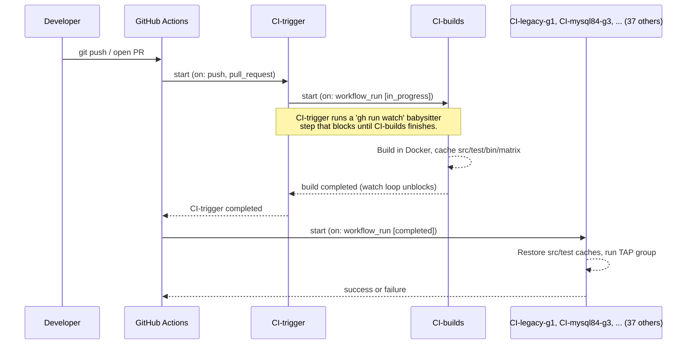

# ProxySQL CI Architecture

**Last updated:** 2026-04-11

This document is the authoritative reference for ProxySQL's GitHub Actions CI
setup. It covers the two-branch workflow split, the trigger chain, the test
groups system, how to add a new test workflow end-to-end, and the common
pitfalls.

If you touch anything under `.github/workflows/` on either `v3.0` or the
`GH-Actions` branch, read this first.

---

## Table of contents

1. [TL;DR](#tldr)
2. [The two-branch architecture](#the-two-branch-architecture)
3. [Execution flow](#execution-flow)
4. [CI-trigger and CI-builds: the entry point](#ci-trigger-and-ci-builds-the-entry-point)
5. [The dedicated-reusable pattern](#the-dedicated-reusable-pattern)
6. [Cache layout produced by CI-builds](#cache-layout-produced-by-ci-builds)
7. [The TAP groups system](#the-tap-groups-system)
8. [Workflow catalogue](#workflow-catalogue)
9. [Adding a new test group end-to-end](#adding-a-new-test-group-end-to-end)
10. [Common pitfalls and historical gotchas](#common-pitfalls-and-historical-gotchas)
11. [Debugging a failing CI run](#debugging-a-failing-ci-run)
12. [Glossary](#glossary)

---

## TL;DR

ProxySQL CI uses a **two-tier, two-branch** workflow split:

| Tier | Branch | Filename case | Role |
|---|---|---|---|
| **Caller** | `v3.0` (the default branch) | `CI-*.yml` (uppercase) | Thin `workflow_run`-triggered wrapper. Does nothing but delegate. |
| **Reusable** | `GH-Actions` (a dedicated branch) | `ci-*.yml` (lowercase) | The actual job body: checkout, cache, docker, tests, cleanup. |

Every test workflow you see in the GitHub Actions UI is a **pair** of files —
one on each branch — that must be kept in sync.

```
branch: v3.0                                 branch: GH-Actions
  .github/workflows/CI-legacy-g1.yml    ──►    .github/workflows/ci-legacy-g1.yml
                 ▲                                         ▲
                 │                                         │
       "caller" (21 lines)                     "reusable workflow" (~120 lines)
       workflow_run trigger                    workflow_call interface
       uses: ci-legacy-g1.yml@GH-Actions       tests job with all the steps
```

**Why two branches?** GitHub Actions only reads `workflow_run`-triggered
workflow files from the **default branch**. Putting heavy test logic directly
on `v3.0` would mean every CI tweak churns `v3.0` history. The split keeps
`v3.0` commits focused on source code and lets CI iteration happen
independently on `GH-Actions`.

**Case matters (by convention only).** Uppercase `CI-*` = caller on `v3.0`;
lowercase `ci-*` = reusable on `GH-Actions`. GitHub itself is
case-insensitive, but the naming lets you tell at a glance which branch a
given filename belongs to.

---

## The two-branch architecture

### The problem the split solves

GitHub's `workflow_run` trigger has a hard rule:

> The workflow file that declares `on: workflow_run: ...` must live on the
> **repository's default branch** for the trigger to fire at all.

ProxySQL's default branch is `v3.0`. So the *thin caller files* that declare
`workflow_run` must live on `v3.0`. But the *body* of each test job — Docker
setup, TAP harness invocation, cleanup, artifact upload — is hundreds of lines
of shell and YAML that would otherwise have to live on `v3.0` too, churning
its commit history for every CI tweak.

Reusable workflows (`workflow_call`) solve this cleanly: the caller on `v3.0`
is a 20-line stub that says *"delegate to `ci-legacy-g1.yml` on the
`GH-Actions` branch"*, and the `GH-Actions` branch owns all the heavy logic.

### The canonical caller (20 lines)

All `CI-*.yml` files on `v3.0` follow this shape. This is
`CI-legacy-g1.yml` verbatim (other callers differ only in name and `uses:`
target):

```yaml
name: CI-legacy-g1
run-name: '${{ github.event.workflow_run && github.event.workflow_run.head_branch || github.ref_name }} ${{ github.workflow }} ${{ github.event.workflow_run && github.event.workflow_run.head_sha || github.sha }}'

on:
  workflow_dispatch:
  workflow_run:
    workflows: [ CI-trigger ]
    types: [ completed ]

concurrency:
  group: ${{ github.workflow }}-${{ github.event.workflow_run && github.event.workflow_run.head_branch || github.ref_name }}
  cancel-in-progress: true

jobs:
  run:
    if: ${{ github.event.workflow_run && github.event.workflow_run.conclusion == 'success' || ! github.event.workflow_run }}
    uses: sysown/proxysql/.github/workflows/ci-legacy-g1.yml@GH-Actions
    secrets: inherit
    with:
      trigger: ${{ toJson(github) }}
```

Breakdown:

* `on.workflow_run.workflows: [ CI-trigger ]` — this caller fires when
  `CI-trigger` completes. `CI-trigger` in turn waits for `CI-builds` to
  finish (see next section), so by the time this caller runs the cache keys
  it needs are guaranteed populated.
* `on.workflow_dispatch` — lets you run the workflow manually from the
  GitHub UI (useful for reruns).
* `concurrency.cancel-in-progress: true` — a new push to the same branch
  cancels any in-flight run. Saves runner minutes.
* `if: … conclusion == 'success'` — skip if `CI-trigger` itself failed;
  still run on `workflow_dispatch`.
* `uses: sysown/proxysql/.github/workflows/ci-legacy-g1.yml@GH-Actions` —
  the umbilical cord. GitHub checks out `GH-Actions`, reads the file, and
  runs its `workflow_call` interface as if inlined here.
* `trigger: ${{ toJson(github) }}` — serialises the entire
  `github` context as JSON and hands it to the reusable, so the reusable
  can pick out `event.workflow_run.head_sha` (the real commit under test)
  and use it as its cache key and checkout ref.

### The canonical reusable (~120 lines)

All `ci-*.yml` files on `GH-Actions` (except `ci-builds.yml` and
`ci-trigger.yml`, which are different) follow the shape of
`ci-legacy-g4.yml`. The pattern is documented in detail in
["The dedicated-reusable pattern"](#the-dedicated-reusable-pattern) below.

The top of any reusable looks like this:

```yaml
name: CI-legacy-g1

on:
  workflow_dispatch:
  workflow_call:        # <-- the important bit: "I can be called by other workflows"
    inputs:
      trigger:
        type: string

env:
  SHA: ${{ inputs.trigger && fromJson(inputs.trigger).event.workflow_run.head_sha || github.sha }}

jobs:
  tests:
    runs-on: ubuntu-22.04
    ...
```

`workflow_call` is the mirror image of the caller's `uses:`. It declares
this file's interface: the inputs it accepts, and implicitly the jobs it
will run. `fromJson(inputs.trigger).event.workflow_run.head_sha` extracts
the commit the caller was triggered on, so the reusable knows which commit
to check out and which cache to restore.

### Why the split looks confusing

The same workflow name (e.g. `CI-legacy-g1`) appears **twice**, on two
branches, at two different paths, with two different file contents:

* `v3.0:.github/workflows/CI-legacy-g1.yml` (uppercase C, 20 lines, caller)
* `GH-Actions:.github/workflows/ci-legacy-g1.yml` (lowercase c, ~120 lines,
  reusable)

They share a `name:` field, which is what the GitHub Actions UI displays,
so runs of either one show up as "CI-legacy-g1" in the Actions tab. The
duplicate naming is deliberate and harmless — you can always tell them
apart by branch or filename case.

---

## Execution flow

### Sequence (high level)



### Sequence (the full cascade)

```
git push / open PR
  │
  ├─► CI-trigger (on: push, pull_request)  ← only this one is push-triggered
  │     │
  │     ├─► CI-builds (on: workflow_run [in_progress])
  │     │     │
  │     │     └─► Build ubuntu22-tap, debian12-dbg, ubuntu24-tap-genai-gcov
  │     │         Cache src/, test/, bin/, tap-matrix*.json
  │     │
  │     └─► (CI-trigger babysitter step `gh run watch` blocks until CI-builds
  │          completes, then CI-trigger itself completes)
  │
  └─► All test workflows fire in parallel
        (on: workflow_run [completed] targeting CI-trigger)

           CI-basictests         CI-selftests        CI-maketest
           CI-legacy-g1          CI-legacy-g2        CI-legacy-g2-genai
           CI-legacy-g3          CI-legacy-g4        CI-legacy-g5
           CI-legacy-clickhouse-g1
           CI-mysql84-g1         CI-mysql84-g2       CI-mysql84-g3
           CI-mysql84-g4         CI-mysql84-g5
           CI-unittests
           CI-repltests          CI-shuntest
           CI-taptests           CI-taptests-ssl     CI-taptests-asan
           CI-taptests-groups    CI-taptests-pgsql-cluster
           CI-codeql
           CI-3p-aiomysql        CI-3p-django-framework
           CI-3p-laravel-framework                    CI-3p-mariadb-connector-c
           CI-3p-mysql-connector-j                    CI-3p-pgjdbc
           CI-3p-php-pdo-mysql   CI-3p-php-pdo-pgsql  CI-3p-postgresql
           CI-3p-sqlalchemy
```

### Why the cascade looks the way it does

A few design choices that are not obvious from reading the YAML alone:

**1. Why do test workflows chain on `CI-trigger` instead of `CI-builds`?**

Because a `workflow_run`-triggered workflow receives
`github.event.workflow_run.head_sha` equal to the SHA of the workflow that
triggered it — and `CI-builds` is itself `workflow_run`-triggered, meaning
it always runs "on the default branch" with `head_sha` pointing at `v3.0`
HEAD, not at the PR commit. Chaining test workflows off `CI-builds` was
tried once (commit `9671a414a3`) and immediately broken: every PR test run
checked out `v3.0` code instead of PR code. It was reverted in
`78b8f5ac6` ("ci: revert test workflows to listen on CI-trigger
completion"). The correct chain is `push → CI-trigger → test workflows`,
with `CI-trigger`'s babysitter step gating the completion on `CI-builds`
so test workflows don't start before the build cache is ready.

**2. Why is `CI-trigger` needed at all?**

It's the only workflow that can fire on `push` / `pull_request` with the
PR's actual `head_sha`. Everything else uses `workflow_run`, which carries
a different SHA. `CI-trigger` captures the PR SHA, blocks on `CI-builds`,
then completes — and downstream workflows pick up the captured SHA from
its context.

**3. Why is `cancel-in-progress: true` safe?**

Every workflow uses a `concurrency.group` scoped to
`${workflow}-${branch}`, so a new push on the same branch cancels the
previous run of the same workflow. Different workflows on the same branch
run in parallel. Different branches of the same workflow run in parallel.

---

## CI-trigger and CI-builds: the entry point

These two workflows are special. The rest of the catalogue is a
fan-out downstream of them.

### `CI-trigger` / `ci-trigger.yml@GH-Actions`

| | |
|---|---|
| **Caller** | `v3.0:.github/workflows/CI-trigger.yml` |
| **Reusable** | `GH-Actions:.github/workflows/ci-trigger.yml` |
| **Triggers** | `pull_request`, `push` to version branches, `workflow_dispatch` |
| **Paths ignored** | `.github/**`, `**.md` (so doc-only PRs don't burn CI minutes) |
| **Does any real work?** | **No.** Its entire purpose is to (a) anchor the PR's `head_sha` in a `workflow_run` chain, and (b) block until `CI-builds` completes, so downstream `workflow_run[completed]` workflows can assume the build cache is ready. |

The reusable (`ci-trigger.yml@GH-Actions`) contains a babysitter step:

```bash
# Wait for CI-builds to start…
RUNID=$(gh -R ${repo} run list -w CI-builds -s in_progress | grep … | awk '{print $X}')
# …then block until it finishes.
gh -R ${repo} run watch -i 30 ${RUNID}
```

When `gh run watch` returns, `CI-trigger` completes, and every workflow
listening for `workflow_run[completed]` on `CI-trigger` fires.

### `CI-builds` / `ci-builds.yml@GH-Actions`

| | |
|---|---|
| **Caller** | `v3.0:.github/workflows/CI-builds.yml` |
| **Reusable** | `GH-Actions:.github/workflows/ci-builds.yml` |
| **Triggers** | `workflow_run` on `CI-trigger` with `types: [in_progress]` (so it starts as soon as `CI-trigger` starts, without waiting for `CI-trigger` to finish) |
| **Purpose** | Compiles ProxySQL inside Docker containers and saves the artifacts into the build cache that all downstream test workflows will restore. |

The build matrix:

| Matrix entry | Docker target | Flags set via `sed` into `docker-compose.yml` | Consumers |
|---|---|---|---|
| `ubuntu22, -tap` | `make ubuntu22-dbg` | debug + TAP test binaries | most test workflows |
| `debian12, -dbg` | `make debian12-dbg` | debug | 3p integration workflows |
| `ubuntu24, -tap-genai-gcov` | `make ubuntu24-dbg` | `PROXYSQLGENAI=1` + `WITHGCOV=1` | `CI-legacy-g2-genai` only |

The flag injection is simple `sed` into `docker-compose.yml` before the
build runs:

```bash
if [[ "${{ matrix.type }}" =~ "-genai" ]]; then
  sed -i "/command/i \      - PROXYSQLGENAI=1" docker-compose.yml
fi
if [[ "${{ matrix.type }}" =~ "-gcov" ]]; then
  sed -i "/command/i \      - WITHGCOV=1" docker-compose.yml
fi
```

---

## The dedicated-reusable pattern

Every test workflow on `GH-Actions` (except `ci-builds.yml`,
`ci-trigger.yml`, and the deprecated generic `ci-taptests-groups.yml`)
follows the **dedicated-reusable** pattern: one file per test group, all
cut from the same template. The canonical template is `ci-legacy-g4.yml`.

### Anatomy of a dedicated reusable

```yaml
name: CI-legacy-g4

on:
  workflow_dispatch:
  workflow_call:
    inputs:
      trigger:
        type: string

env:
  SHA: ${{ inputs.trigger && fromJson(inputs.trigger).event.workflow_run.head_sha || github.sha }}

jobs:
  tests:
    runs-on: ubuntu-22.04
    strategy:
      fail-fast: false
      matrix:
        infradb: [ 'mysql57' ]        # cosmetic — the real infra is decided by TAP_GROUP
    env:
      BLDCACHE: ${{ inputs.trigger && fromJson(inputs.trigger).event.workflow_run.head_sha || github.sha }}_ubuntu22-tap_src
      MATRIX: '(${{ matrix.infradb }})'

    steps:
    # 1. Create an "in_progress" check run so the PR page shows yellow.
    - uses: LouisBrunner/checks-action@v2.0.0
      id: checks
      if: always()
      with:
        token: ${{ secrets.GITHUB_TOKEN }}
        name: '${{ github.workflow }} / ${{ github.job }} ${{ env.MATRIX }}'
        repo: ${{ github.repository }}
        sha: ${{ env.SHA }}
        status: 'in_progress'
        details_url: 'https://github.com/${{ github.repository }}/actions/runs/${{ github.run_id }}'

    # 2. Sparse-checkout just the CI orchestration + group definitions.
    - name: Checkout repository
      uses: actions/checkout@v4
      with:
        repository: ${{ github.repository }}
        ref: ${{ env.SHA }}
        path: 'proxysql'
        sparse-checkout: |
          test/infra
          test/tap/groups
          test/scripts

    # 3. Restore the src/ cache (proxysql binary + deps).
    - name: Cache restore src
      uses: actions/cache/restore@v4
      with:
        key: ${{ env.BLDCACHE }}
        fail-on-cache-miss: true
        path: |
          proxysql/src/

    # 4. Restore the test/ cache (TAP test binaries + infra files).
    - name: Cache restore test
      uses: actions/cache/restore@v4
      with:
        key: ${{ inputs.trigger && fromJson(inputs.trigger).event.workflow_run.head_sha || github.sha }}_ubuntu22-tap_test
        fail-on-cache-miss: true
        path: |
          proxysql/test/

    # 5. Sanity check the binary.
    - name: Verify binary
      run: |
        chmod +x proxysql/src/proxysql
        file proxysql/src/proxysql

    # 6. Build the shared Docker base image used by every infra docker-compose.
    - name: Build CI base image
      run: |
        cd proxysql/test/infra/docker-base
        docker build -t proxysql-ci-base:latest .

    # 7. Start the backends for this group (MySQL / PgSQL / MariaDB / etc.).
    - name: Start infrastructure
      run: |
        cd proxysql
        export INFRA_ID="ci-legacy-g4"
        export TAP_GROUP="legacy-g4"
        export SKIP_CLUSTER_START=1
        test/infra/control/ensure-infras.bash

    # 8. Run the TAP group.
    - name: Run legacy-g4 tests
      run: |
        cd proxysql
        export INFRA_ID="ci-legacy-g4"
        export TAP_GROUP="legacy-g4"
        export SKIP_CLUSTER_START=1
        export TAP_USE_NOISE=1       # (g4 only)
        test/infra/control/run-tests-isolated.bash

    # 9. Teardown — always runs.
    - name: Cleanup
      if: always()
      run: |
        set +e
        cd proxysql
        export INFRA_ID="ci-legacy-g4"
        export TAP_GROUP="legacy-g4"
        docker logs proxysql.ci-legacy-g4 2>&1 | tail -50 || true
        test/infra/control/stop-proxysql-isolated.bash
        test/infra/control/destroy-infras.bash

    # 10. On failure, upload ci_*_logs/ as a workflow artifact.
    - name: Archive artifacts logs
      if: ${{ failure() && !cancelled() }}
      uses: actions/upload-artifact@v4
      with:
        name: ${{ github.workflow }}-${{ env.SHA }}-logs-run#${{ github.run_number }}
        path: |
          proxysql/ci_*_logs/

    # 11. Update the check run to success/failure.
    - uses: LouisBrunner/checks-action@v2.0.0
      if: always()
      with:
        token: ${{ secrets.GITHUB_TOKEN }}
        check_id: ${{ steps.checks.outputs.check_id }}
        repo: ${{ github.repository }}
        sha: ${{ env.SHA }}
        conclusion: ${{ job.status }}
        details_url: 'https://github.com/${{ github.repository }}/actions/runs/${{ github.run_id }}'
```

### What a sibling (e.g. `ci-legacy-g1.yml`) differs in

A new group file is cut from `ci-legacy-g4.yml` by changing **only**:

* `name:` → `CI-<group>`
* `INFRA_ID="ci-<group>"` (in steps 7, 8, 9)
* `TAP_GROUP="<group>"` (in steps 7, 8, 9)
* Step name `Run <group> tests`
* Cleanup `docker logs proxysql.ci-<group>`
* `TAP_USE_NOISE=1` → keep it or drop it (g4 has it for race testing; other
  groups leave it off unless the group has known flakiness that noise
  injection helps surface)

Nothing else. No infrastructure-specific code in the reusable —
`ensure-infras.bash` decides what backends to start by stripping `-gN`
from `TAP_GROUP` and looking up `test/tap/groups/<base-group>/infras.lst`.

### The `ci-unittests.yml` variant

`ci-unittests.yml` is a **slimmed** variant of the template. It drops:

* Step 6 (Build CI base image)
* Step 7 (Start infrastructure)
* Step 9 (Cleanup)

…because the `unit-tests` group sets `SKIP_PROXYSQL=1` in
`test/tap/groups/unit-tests/env.sh`, which makes `run-tests-isolated.bash`
take its host-only branch: it reads the list of `*_unit-t` binaries from
`groups.json`, runs them directly on the runner, and prints a
`PASSED / TOTAL` summary. No Docker, no backends, no cleanup.

### Why not one generic reusable workflow with `TAP_GROUP` as an input?

That was tried (`ci-taptests-groups.yml`) and doesn't work:

1. Its `tests` job matrix is built from `cat proxysql/tap-matrix.json`
   restored from the build cache. If CI-builds produces an empty
   `tap-matrix.json` (as it has recently — `find test/tap/ -name '*-t'`
   returned nothing), the tests job strategy fails to evaluate with
   *"Matrix vector 'testgroup' does not contain any values"* and the run
   wedges for 45+ minutes before timing out.
2. Its `infradb` matrix key is hardcoded to `mysql57`, so it cannot
   actually test `mysql84-*` groups even if the matrix were populated.
3. Its `testgroup` input is declared but never referenced in the file, so
   passing different values from different callers does nothing.

The dedicated pattern is slightly more verbose (one file per group), but
it's self-contained, debuggable step-by-step, and doesn't depend on any
fragile cache-populated JSON. Duplication across ~12 files is tolerable
because the files are stable — changes to the template are rare, and when
they happen they can be replicated with a single `sed`.

---

## Cache layout produced by CI-builds

`CI-builds` produces four separate cache entries per matrix build, each
keyed by `{SHA}_{dist}_{type}_{suffix}`:

| Key suffix | Contents | Who restores it |
|---|---|---|
| `_bin` | `.git/` + `binaries/` (packaging artefacts) | `CI-package-build` |
| `_src` | `proxysql/src/` (the `proxysql` binary + deps linked in) | every test workflow |
| `_test` | `proxysql/test/` (TAP test binaries, `test/infra/`, `test/scripts/`, `test/tap/`) | every test workflow |
| `_matrix` | `tap-matrix*.json` — legacy dynamic-matrix scaffolding | only the deprecated `ci-taptests-groups.yml` |

Example: for commit `abc123` built by matrix entry `ubuntu22, -tap`, the
keys are:

```
abc123_ubuntu22-tap_bin
abc123_ubuntu22-tap_src
abc123_ubuntu22-tap_test
abc123_ubuntu22-tap_matrix
```

Cache entries expire after 7 days of inactivity (GitHub's default policy).

---

## The TAP groups system

TAP tests are split into **groups** declared in
`test/tap/groups/groups.json`. Each group has a short name (`legacy-g1`,
`mysql84-g3`, `unit-tests-g1`, etc.) and a list of test binaries that
belong to it. One test binary may belong to multiple groups.

### `groups.json` shape

```json
{
  "admin_disk_upgrade_unit-t":          [ "unit-tests-g1" ],
  "admin_show_fields_from-t":           [ "legacy-g1", "mysql84-g1", "mysql-multiplexing=false-g1", ... ],
  "ai_error_handling_edge_cases-t":     [ "ai-g1", "@proxysql_min_version:4.0" ],
  "c_tokenizer_unit-t":                 [ "unit-tests-g1" ],
  "charset_unsigned_int-t":             [ "legacy-g1", "mysql84-g1", ... ],
  "clickhouse_php_conn-t":              [ "legacy-clickhouse-g1", ... ],
  "deprecate_eof_cache-t":              [ "legacy-g4", "mysql84-g4", ... ],
  ...
}
```

Tags like `@proxysql_min_version:4.0` in a group array are **not** groups
— they're metadata filters consumed by `run-tests-isolated.bash` to skip
tests that require a newer ProxySQL than is being tested.

### Group directory layout

Each *base group* has a directory under `test/tap/groups/`:

```
test/tap/groups/
  legacy/
    env.sh            # exports DEFAULT_MYSQL_INFRA, DEFAULT_PGSQL_INFRA, …
    infras.lst        # infra-mysql57, infra-mariadb10, docker-pgsql16-single
    pre-proxysql.bash # optional pre-hook
    setup-infras.bash # optional post-hook
  mysql84/
    env.sh            # DEFAULT_MYSQL_INFRA=infra-mysql84
    infras.lst        # infra-mysql84
  unit-tests/
    env.sh            # SKIP_PROXYSQL=1  ← makes run-tests-isolated take the host-only path
  no-infra-g1/
    infras.lst        # (empty or none — tests don't need backends)
  ...
```

**Note:** the directory is named by the **base** group (`legacy`,
`mysql84`, `unit-tests`). Subgroups like `legacy-g1`, `legacy-g3`,
`mysql84-g4`, `unit-tests-g1` do *not* have their own directories. They
share their base group's infrastructure.

### How `TAP_GROUP` is resolved

Inside `ensure-infras.bash` and `run-tests-isolated.bash`, a subgroup like
`legacy-g1` is resolved to its base group `legacy` via a single sed:

```bash
BASE_GROUP=$(echo "${TAP_GROUP}" | sed -E "s/[-_]g[0-9]+.*//")
# Source group env.sh to pick up SKIP_PROXYSQL and other group-level settings
if [ -f "${WORKSPACE}/test/tap/groups/${TAP_GROUP}/env.sh" ]; then
    source "${WORKSPACE}/test/tap/groups/${TAP_GROUP}/env.sh"
elif [ -f "${WORKSPACE}/test/tap/groups/${BASE_GROUP}/env.sh" ]; then
    source "${WORKSPACE}/test/tap/groups/${BASE_GROUP}/env.sh"
fi
```

Then it looks up `infras.lst` the same way. This means `TAP_GROUP=legacy-g1`
and `TAP_GROUP=legacy-g5` both get the *same* backend infrastructure (the
`legacy/infras.lst` contents), but they'll run *different* subsets of
tests because `groups.json` assigns different binaries to each subgroup.

### Relevant environment variables

| Variable | Default | Purpose |
|---|---|---|
| `TAP_GROUP` | — (required) | Which group to run, e.g. `legacy-g1`, `mysql84-g3`, `unit-tests-g1` |
| `INFRA_ID` | `dev-$USER` | Docker-container namespace; allows parallel runs on the same runner |
| `SKIP_PROXYSQL` | `0` | When set (via group `env.sh`), tests run directly on the host — no Docker, no backends |
| `SKIP_CLUSTER_START` | `0` | Skip the optional ProxySQL-cluster bootstrap (set by most group workflows) |
| `TAP_USE_NOISE` | `0` | Inject random delays + stress into tests that opt in (`cl.use_noise`), to surface races |
| `COVERAGE` | `0` | Enable gcov collection in the test runner container |
| `WORKSPACE` | — (auto) | Absolute path to the checkout root |

### SKIP_PROXYSQL: unit tests run on the host, not in Docker

The `unit-tests/env.sh` file contains a single line:

```bash
export SKIP_PROXYSQL=1
```

When `run-tests-isolated.bash` sees `SKIP_PROXYSQL=1` (via the group `env.sh`
sourcing above), it takes a completely different code path: it reads
`groups.json`, filters to all binaries in `TAP_GROUP` that pass the
`@proxysql_min_version` check, looks for each binary under
`test/tap/tests/unit/` or `test/tap/tests/`, and runs it directly on the
GitHub runner. No Docker containers, no backend startup, no
`proxysql-tester.py`. The workflow (`ci-unittests.yml`) accordingly omits
the "Build CI base image", "Start infrastructure", and "Cleanup" steps.

---

## Workflow catalogue

All `CI-*.yml` files on `v3.0` as of 2026-04-11. Status is as observed on
`v3.0` HEAD.

### Orchestration

| Caller (v3.0) | Reusable (GH-Actions) | Trigger | Purpose | Status |
|---|---|---|---|---|
| `CI-trigger.yml` | `ci-trigger.yml` | `push`, `pull_request`, `workflow_dispatch` | Anchor PR `head_sha`, block on `CI-builds` | ✅ |
| `CI-builds.yml` | `ci-builds.yml` | `workflow_run[in_progress]` on `CI-trigger` | Build 3 variants, populate caches | ✅ |
| `CI-lint-groups-json.yml` | *(inline, no reusable)* | `push`, `pull_request` on `groups.json` only | Lint `test/tap/groups/groups.json` format | ✅ |

### TAP test groups (dedicated-reusable pattern)

All chain off `workflow_run[completed]` on `CI-trigger`.

| Caller | Reusable | `TAP_GROUP` | Backends (from `infras.lst`) | Build cache | Status |
|---|---|---|---|---|---|
| `CI-basictests.yml` | `ci-basictests.yml` | `basictests` | mysql57 | `ubuntu22-tap_src` | ✅ |
| `CI-selftests.yml` | `ci-selftests.yml` | — (no group) | — | `ubuntu22-tap_src` | ✅ |
| `CI-maketest.yml` | `ci-maketest.yml` | — (runs `make test` in Docker) | mysql57 | `ubuntu22-tap_src` | ✅ |
| `CI-legacy-g1.yml` | `ci-legacy-g1.yml` | `legacy-g1` | mysql57, mariadb10, pgsql16 | `ubuntu22-tap_src` + `_test` | ✅ (new, PR #5597) |
| `CI-legacy-g2.yml` | `ci-legacy-g2.yml` | `legacy-g2` | mysql57, mariadb10, pgsql16, clickhouse23 | `ubuntu22-tap_src` + `_test` | ✅ |
| `CI-legacy-g2-genai.yml` | `ci-legacy-g2-genai.yml` | `legacy-g2` | mysql57, mariadb10, pgsql16, clickhouse23 | `ubuntu24-tap-genai-gcov_src` + `_test` | ✅ |
| `CI-legacy-g3.yml` | `ci-legacy-g3.yml` | `legacy-g3` | mysql57, mariadb10, pgsql16 | `ubuntu22-tap_src` + `_test` | ✅ (new, PR #5597) |
| `CI-legacy-g4.yml` | `ci-legacy-g4.yml` | `legacy-g4` | mysql57, mariadb10, pgsql16 | `ubuntu22-tap_src` + `_test` | ✅ |
| `CI-legacy-g5.yml` | `ci-legacy-g5.yml` | `legacy-g5` | mysql57, mariadb10, pgsql16 | `ubuntu22-tap_src` + `_test` | ✅ (new, PR #5597) |
| `CI-legacy-clickhouse-g1.yml` | `ci-legacy-clickhouse-g1.yml` | `legacy-clickhouse-g1` | mysql57, clickhouse23 | `ubuntu22-tap_src` + `_test` | ✅ |
| `CI-mysql84-g1.yml` | `ci-mysql84-g1.yml` | `mysql84-g1` | mysql84 | `ubuntu22-tap_src` + `_test` | ✅ (new, PR #5597) |
| `CI-mysql84-g2.yml` | `ci-mysql84-g2.yml` | `mysql84-g2` | mysql84 | `ubuntu22-tap_src` + `_test` | ✅ (new, PR #5597) |
| `CI-mysql84-g3.yml` | `ci-mysql84-g3.yml` | `mysql84-g3` | mysql84 | `ubuntu22-tap_src` + `_test` | ✅ (new, PR #5597) |
| `CI-mysql84-g4.yml` | `ci-mysql84-g4.yml` | `mysql84-g4` | mysql84 | `ubuntu22-tap_src` + `_test` | ✅ (new, PR #5597) |
| `CI-mysql84-g5.yml` | `ci-mysql84-g5.yml` | `mysql84-g5` | mysql84 | `ubuntu22-tap_src` + `_test` | ✅ (new, PR #5597) |
| `CI-unittests.yml` | `ci-unittests.yml` | `unit-tests-g1` | none (`SKIP_PROXYSQL=1`) | `ubuntu22-tap_src` + `_test` | ✅ (new, PR #5597) |
| `CI-taptests-pgsql-cluster.yml` | *(dedicated reusable)* | `pgsql-cluster-sync` | pgsql16 replicated | `ubuntu22-tap_src` + `_test` | ✅ |

### Legacy / deprecated

| Caller | Reusable | Status | Notes |
|---|---|---|---|
| `CI-taptests.yml` | `ci-taptests.yml` | ❌ Disabled manually in the UI | Jenkins-script legacy, #5521 |
| `CI-taptests-ssl.yml` | `ci-taptests-ssl.yml` | ❌ Disabled manually in the UI | Jenkins-script legacy, #5521 |
| `CI-taptests-asan.yml` | `ci-taptests-asan.yml` | ❌ Disabled manually in the UI | Jenkins-script legacy, #5521 |
| `CI-taptests-groups.yml` | `ci-taptests-groups.yml` | ⚠️ Still active, but empty-matrix-wedged; no caller routes through it after PR #5598 | Candidate for deletion |
| `CI-repltests.yml` | `ci-repltests.yml` | ❌ Broken, references `proxysql/jenkins-build-scripts` | #5521 |
| `CI-shuntest.yml` | `ci-shuntest.yml` | ❌ Broken, same as CI-repltests | #5521 |

### CodeQL + packaging

| Caller | Reusable | Trigger | Purpose | Status |
|---|---|---|---|---|
| `CI-codeql.yml` | `ci-codeql.yml` | `workflow_run[completed]` on `CI-trigger` | Security analysis | ✅ |
| `CI-package-build.yml` | `ci-package-build.yml` | `push` | Build `.deb` / `.rpm` / ARM64 packages | ✅ |

### Third-party integration (`CI-3p-*`)

Ten workflows test ProxySQL against external client libraries, independent
of the build cache (they build ProxySQL inline inside the workflow). Each
triggers on `workflow_run[completed]` on `CI-trigger` and reads its matrix
from GitHub repository variables like
`MATRIX_3P_AIOMYSQL_infradb_mysql`.

| Caller | Client | Protocols |
|---|---|---|
| `CI-3p-aiomysql.yml` | Python `aiomysql` (async) | MySQL |
| `CI-3p-django-framework.yml` | Django ORM | MySQL, PostgreSQL |
| `CI-3p-laravel-framework.yml` | Laravel Eloquent | MySQL, PostgreSQL |
| `CI-3p-mariadb-connector-c.yml` | MariaDB C connector | MySQL |
| `CI-3p-mysql-connector-j.yml` | MySQL Connector/J | MySQL |
| `CI-3p-pgjdbc.yml` | PostgreSQL JDBC | PostgreSQL |
| `CI-3p-php-pdo-mysql.yml` | PHP PDO MySQL | MySQL |
| `CI-3p-php-pdo-pgsql.yml` | PHP PDO PostgreSQL | PostgreSQL |
| `CI-3p-postgresql.yml` | libpq (native) | PostgreSQL |
| `CI-3p-sqlalchemy.yml` | SQLAlchemy ORM | MySQL, PostgreSQL |

---

## Adding a new test group end-to-end

Suppose you want to add `CI-mysql90-g1` (a new test group running against
MySQL 9.0). You'll touch four things across both branches.

### 1. Test assignments — `test/tap/groups/groups.json` (on `v3.0`)

Add `"mysql90-g1"` to the group arrays of every test binary that should
run in this group:

```json
{
  "admin_show_fields_from-t": [ "legacy-g1", "mysql84-g1", "mysql90-g1", ... ],
  ...
}
```

The `lint_groups_json.py` script validates the file on PR; `CI-lint-groups-json`
will run it automatically.

### 2. Group directory — `test/tap/groups/mysql90/` (on `v3.0`)

```
test/tap/groups/mysql90/
├── env.sh        # export DEFAULT_MYSQL_INFRA="infra-mysql90"
└── infras.lst    # infra-mysql90
```

`test/infra/infra-mysql90/` must also exist and have a working
`docker-compose.yml` — see `test/infra/infra-mysql84/` as a template.

### 3. Reusable workflow — `ci-mysql90-g1.yml` (on `GH-Actions`)

Cut from `ci-legacy-g4.yml`, change only `name:`, `INFRA_ID`, `TAP_GROUP`,
and `docker logs proxysql.<id>`. Use `sed`:

```bash
# on the GH-Actions branch:
cd .github/workflows
sed "s/legacy-g4/mysql90-g1/g" ci-legacy-g4.yml > ci-mysql90-g1.yml
# then manually drop the TAP_USE_NOISE=1 line unless you want it
python3 -c "import yaml; yaml.safe_load(open('ci-mysql90-g1.yml'))"   # sanity check
```

### 4. Caller — `CI-mysql90-g1.yml` (on `v3.0`)

Cut from `CI-legacy-g4.yml` on `v3.0`:

```bash
# on the v3.0 branch:
cd .github/workflows
sed "s/legacy-g4/mysql90-g1/g; s/ci-legacy-g4/ci-mysql90-g1/" CI-legacy-g4.yml > CI-mysql90-g1.yml
```

### 5. Merge order

**This matters.** `workflow_run`-triggered files are only read from the
default branch, so the caller on `v3.0` will start resolving
`ci-mysql90-g1.yml@GH-Actions` the moment it lands. If that file doesn't
yet exist on `GH-Actions`, the first run errors out with
`Unable to resolve action`.

1. **First**, merge the `GH-Actions` PR that adds `ci-mysql90-g1.yml`.
2. **Then**, merge the `v3.0` PR that adds `CI-mysql90-g1.yml`.

Step 2 can also bundle the `groups.json` and `test/tap/groups/mysql90/`
changes; they don't interact with the merge order.

---

## Common pitfalls and historical gotchas

### 1. Order of merges between caller and reusable

Covered in [Adding a new test group](#adding-a-new-test-group-end-to-end)
above. Bears repeating because every single historical CI breakage has
had this shape:

* **Jan 2026:** `75ce81757` added 8 v3.0 callers without creating the
  matching reusables on `GH-Actions`. The callers pointed at the generic
  `ci-taptests-groups.yml` as a placeholder. The placeholder ran, but
  its tests job was wedged on an empty matrix — every run failed for
  months. Fixed by PRs #5597 (add reusables) and #5598 (rewire callers).

### 2. `workflow_run` chains use the triggering workflow's `head_sha`

When workflow A triggers workflow B via `on: workflow_run`, workflow B
receives `github.event.workflow_run.head_sha` equal to **workflow A's**
`head_sha`, not the push/PR SHA of the user action that kicked everything
off. If workflow A was itself `workflow_run`-triggered, its `head_sha`
points at the default branch HEAD, **not** at the PR commit. Chaining a
test workflow off `CI-builds` instead of `CI-trigger` breaks PR testing
for exactly this reason. **Always chain off `CI-trigger`.**

### 3. The `ci-taptests-groups.yml` empty-matrix wedge

If you see a run where the `select` job completes in 3 seconds, the
`tests` job shows "Waiting for pending jobs", and the whole run sits for
45+ minutes before failing, the matrix came back empty. Check the
`select` job log for:

```
matrix=[ ]
```

and trace back to `CI-builds`'s `>>>tap-matrix.txt<<<` section. If *that*
is empty too, `find test/tap/ -name '*-t'` inside the build step returned
nothing, which means the TAP test binaries weren't compiled for that
build variant. **This is an orthogonal bug in `CI-builds`**; no caller
should route through `ci-taptests-groups.yml` on the current `v3.0`, so
if you see the wedge it means someone accidentally wired a new caller at
the legacy reusable.

### 4. Duplicate workflow names show the same name in the UI

`CI-legacy-g1` appears as *one* workflow in the Actions tab but is
actually two files on two branches. When debugging, always note which
branch the failing file lives on:

* The caller is on `v3.0`: `.github/workflows/CI-legacy-g1.yml`
* The reusable is on `GH-Actions`: `.github/workflows/ci-legacy-g1.yml`

The Actions UI shows the `name:` field. Both files have the same
`name: CI-legacy-g1`. To disambiguate, open the run's raw logs: the first
job step prints
`Uses: sysown/proxysql/.github/workflows/ci-legacy-g1.yml@refs/heads/GH-Actions (<sha>)`
which tells you which version of the reusable it's running.

### 5. `LouisBrunner/checks-action` and `permissions:` blocks

Automated reviewers (CodeRabbit, Sonar) will flag the reusables for not
declaring `permissions: checks: write`. This is a false positive for this
repo: `gh api repos/sysown/proxysql/actions/permissions/workflow` returns
`default_workflow_permissions: "write"`, meaning the default
`GITHUB_TOKEN` already has all scopes. Adding a `permissions:` block
would actually **restrict** unlisted scopes to `none` and risk breaking
`actions/cache`, so don't do it in isolation. If you want to harden
tokens, do it uniformly across **all** workflows in the repo, not just
the new ones.

### 6. SHA pinning of third-party actions

Sonar's quality gate flags all `@v2.0.0` / `@v4` action tags as
hotspots recommending full commit SHAs. The baseline workflows
(`ci-basictests.yml`, `ci-legacy-g2.yml`, `ci-legacy-g4.yml`) all use
tags, not SHAs. If you want to adopt SHA pinning, it should be a single
repo-wide cleanup across all workflows — don't introduce it piecemeal.

---

## Debugging a failing CI run

### Step 1: identify which layer failed

```
push / PR
   │
   ├─ CI-trigger failed?        → the push/PR itself has a problem
   │                               (paths filter, ref filter, branch protection)
   │
   ├─ CI-builds failed?         → compile error, deps issue, Docker issue
   │                               look at: run / builds (ubuntu22, -tap) logs
   │
   └─ a test workflow failed?   → your TAP group or its infra
                                   look at: run / tests (…) logs, artifacts
```

### Step 2: correlate commits across the chain

Because of the `workflow_run` chaining, a single `git push` produces
a *tree* of runs, all linked by the same `head_sha`. To list them:

```bash
gh run list --branch <branch> --commit <sha>
```

The v3.0 branch's runs include a run-name of the form:
`<branch> <workflow> <head_sha>`. Filter on the SHA to find all related
runs.

### Step 3: inspect the reusable version actually used

A workflow_run run records which commit of the reusable was used, under
the `referenced_workflows` field:

```bash
gh api repos/sysown/proxysql/actions/runs/<RUN_ID> \
   --jq '.referenced_workflows'
```

This tells you the exact SHA on `GH-Actions` that supplied the reusable
body. Useful if you suspect a stale cached version or a race with a
`GH-Actions` merge.

### Step 4: get the artifacts

If a test workflow failed, the Cleanup step runs unconditionally and the
next step uploads `proxysql/ci_*_logs/` as a workflow artifact. Download
it:

```bash
gh run download <RUN_ID> -n CI-<group>-<sha>-logs-run#<N>
```

Inside you'll find ProxySQL's own log, the docker-compose project logs,
and each test binary's TAP output.

### Step 5: reproduce locally

Every test group can be run locally with the same scripts the CI uses:

```bash
# in the proxysql checkout, after a successful local build:
export INFRA_ID="local-$USER"
export TAP_GROUP="legacy-g1"
export SKIP_CLUSTER_START=1
test/infra/control/ensure-infras.bash
test/infra/control/run-tests-isolated.bash
test/infra/control/stop-proxysql-isolated.bash
test/infra/control/destroy-infras.bash
```

`INFRA_ID` namespaces the Docker containers so multiple local runs don't
collide.

For unit tests (no Docker needed):

```bash
make build_tap_test_debug
export TAP_GROUP="unit-tests-g1"
test/infra/control/run-tests-isolated.bash
```

The `SKIP_PROXYSQL=1` path inside the script will invoke each unit test
binary directly and print a summary.

---

## Glossary

| Term | Definition |
|---|---|
| **caller** | A thin `CI-*.yml` file on `v3.0` whose only job is to delegate to a reusable on `GH-Actions` via `uses: ...@GH-Actions`. |
| **reusable** | A `ci-*.yml` file on `GH-Actions` that declares `on: workflow_call` and contains the actual job body. |
| **`workflow_run`** | A GitHub Actions trigger that fires when another workflow transitions state (`in_progress`, `completed`, etc.). The triggered file *must* live on the default branch to fire at all. |
| **`workflow_call`** | A GitHub Actions trigger that lets a workflow be invoked by `uses: owner/repo/.github/workflows/x.yml@ref`. This is what makes a file a "reusable workflow". |
| **BASE_GROUP** | The stem of a `TAP_GROUP` with its `-gN` suffix stripped (`legacy-g3` → `legacy`). Used to locate `test/tap/groups/<base>/{env.sh,infras.lst}`. |
| **build cache** | A set of four GitHub Actions cache entries (`_bin`, `_src`, `_test`, `_matrix`) produced by `CI-builds`, keyed by `{head_sha}_{matrix}`, consumed by downstream test workflows. |
| **babysitter** | The `gh run watch` step in `ci-trigger.yml@GH-Actions` that blocks `CI-trigger`'s completion until `CI-builds` has finished. Ensures the build cache is populated before downstream test workflows fire. |
| **Unified CI infra** | The `test/infra/control/*.bash` orchestration introduced in commit `ccf797a8c`. Everything new should route through this — the old `jenkins-build-scripts`-based workflows (CI-repltests, CI-shuntest, …) are legacy. |

---

## See also

* `test/infra/README.md` — details of the Docker-based backend infrastructure
* `test/tap/groups/README.md` — details of the groups system
* `doc/ai-generated/architecture/TEST-PIPELINE.md` — AI-generated narrative overview (older, unmaintained)
* Issue #5521 — jenkins-build-scripts migration tracking
* PR #5597 — introduction of dedicated reusables for legacy-g{1,3,5}, mysql84-g{1..5}, unit-tests
