# ProxySQL Visual Architecture Guide

## Table of Contents

1. [System Overview](#system-overview)
2. [Code Layout Trees](#code-layout-trees)
3. [Class Hierarchy Diagrams](#class-hierarchy-diagrams)
4. [Database Schema ERD](#database-schema-erd)
5. [Data Flow Architecture](#data-flow-architecture)
6. [Protocol Sequence Diagrams](#protocol-sequence-diagrams)
7. [Thread Architecture](#thread-architecture)
8. [Connection Pooling Architecture](#connection-pooling-architecture)
9. [Query Processing Pipeline](#query-processing-pipeline)
10. [Deployment Topologies](#deployment-topologies)

## System Overview

### High-Level Architecture

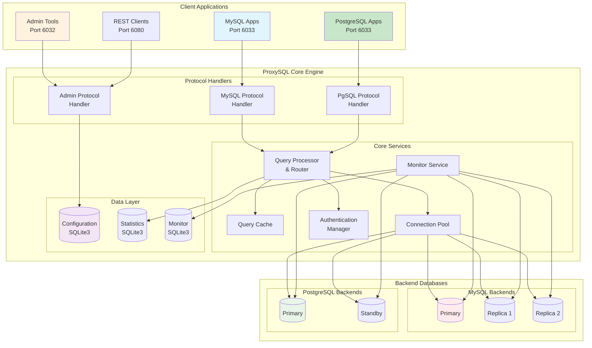
```mermaid
graph TB
    subgraph "Client Applications"
        MA[MySQL Apps<br/>Port 6033]
        PA[PostgreSQL Apps<br/>Port 6033]
        AA[Admin Tools<br/>Port 6032]
        RA[REST Clients<br/>Port 6080]
    end
    
    subgraph "ProxySQL Core Engine"
        subgraph "Protocol Handlers"
            MPH[MySQL Protocol<br/>Handler]
            PPH[PgSQL Protocol<br/>Handler]
            APH[Admin Protocol<br/>Handler]
        end
        
        subgraph "Core Services"
            QP[Query Processor<br/>& Router]
            QC[Query Cache]
            CP[Connection Pool]
            AUTH[Authentication<br/>Manager]
            MON[Monitor Service]
        end
        
        subgraph "Data Layer"
            CONF[(Configuration<br/>SQLite3)]
            STATS[(Statistics<br/>SQLite3)]
            MONDB[(Monitor<br/>SQLite3)]
        end
    end
    
    subgraph "Backend Databases"
        subgraph "MySQL Backends"
            M1[(Primary)]
            M2[(Replica 1)]
            M3[(Replica 2)]
        end
        
        subgraph "PostgreSQL Backends"
            P1[(Primary)]
            P2[(Standby)]
        end
    end
    
    MA --> MPH
    PA --> PPH
    AA --> APH
    RA --> APH
    
    MPH --> QP
    PPH --> QP
    APH --> CONF
    
    QP --> QC
    QP --> CP
    QP --> AUTH
    
    CP --> M1
    CP --> M2
    CP --> M3
    CP --> P1
    CP --> P2
    
    MON --> M1
    MON --> M2
    MON --> M3
    MON --> P1
    MON --> P2
    
    MON --> MONDB
    QP --> STATS
    
    style MA fill:#e1f5fe
    style PA fill:#c8e6c9
    style AA fill:#fff3e0
    style CONF fill:#f3e5f5
    style M1 fill:#ffebee
    style P1 fill:#e8f5e8
```

## Code Layout Trees

### Source Code Directory Structure

```
proxysql/
├── src/                                [Main Entry Points - 4 files]
│   ├── main.cpp                       # Application entry, thread initialization
│   ├── SQLite3_Server.cpp            # Embedded config database server
│   ├── proxy_tls.cpp                 # TLS/SSL implementation
│   └── proxysql_global.cpp           # Global variables and config
│
├── lib/                                [Core Libraries - 86+ files]
│   ├── [MySQL Components - 25+ files]
│   │   ├── MySQL_Session.cpp         # Client session management
│   │   ├── MySQL_Protocol.cpp        # Wire protocol implementation
│   │   ├── MySQL_HostGroups_Manager.cpp  # Backend server management
│   │   ├── MySQL_Monitor.cpp         # Health monitoring
│   │   ├── MySQL_Authentication.cpp  # Auth methods (native, sha256, etc)
│   │   ├── MySQL_Query_Processor.cpp # Query routing logic
│   │   ├── MySQL_Query_Cache.cpp     # Result caching
│   │   ├── MySQL_Thread.cpp          # Thread pool management
│   │   ├── MySQL_Logger.cpp          # Query/error logging
│   │   ├── MySQL_PreparedStatement.cpp # PS protocol handling
│   │   └── MySQL_Variables.cpp       # Session variables
│   │
│   ├── [PostgreSQL Components - 20+ files]
│   │   ├── PgSQL_Session.cpp         # Client session management
│   │   ├── PgSQL_Protocol.cpp        # Wire protocol v3
│   │   ├── PgSQL_HostGroups_Manager.cpp  # Backend management
│   │   ├── PgSQL_Monitor.cpp         # Health checks
│   │   ├── PgSQL_Authentication.cpp  # SASL/SCRAM support
│   │   ├── PgSQL_Query_Processor.cpp # Query routing
│   │   ├── PgSQL_Query_Cache.cpp     # Result caching
│   │   ├── PgSQL_Thread.cpp          # Thread management
│   │   └── PgSQL_Logger.cpp          # Logging
│   │
│   ├── [Base Infrastructure - 10+ files]
│   │   ├── Base_Session.cpp          # Template base for sessions
│   │   ├── Base_Thread.cpp           # Common threading
│   │   ├── Base_HostGroups_Manager.cpp # Template base for HG
│   │   ├── Query_Processor.cpp       # Common query processing
│   │   └── Query_Cache.cpp           # Common caching logic
│   │
│   ├── [Admin & Monitoring - 15+ files]
│   │   ├── ProxySQL_Admin.cpp        # Admin interface (6032)
│   │   ├── ProxySQL_Admin_Stats.cpp  # Statistics collection
│   │   ├── ProxySQL_RESTAPI_Server.cpp # REST API (6080)
│   │   ├── ProxySQL_HTTP_Server.cpp  # HTTP server
│   │   ├── ProxySQL_Cluster.cpp      # Cluster coordination
│   │   └── ProxySQL_Config.cpp       # Configuration management
│   │
│   └── [Supporting Libraries]
│       ├── Standard_Query_Cache.cpp  # Query cache implementation
│       ├── MySQL_ResultSet.cpp       # Result set handling
│       ├── network.cpp               # Network utilities
│       ├── debug.cpp                 # Debug/logging utilities
│       └── libproxysql.a            # Compiled static library (340MB+)
│
├── include/                            [Header Files - 89+ files]
│   ├── [Protocol Headers]
│   │   ├── MySQL_Protocol.h          # MySQL protocol definitions
│   │   ├── PgSQL_Protocol.h          # PostgreSQL protocol defs
│   │   ├── mysql_connection.h        # MySQL connection handling
│   │   └── pgsql_connection.h        # PostgreSQL connections
│   │
│   ├── [Core Headers]
│   │   ├── proxysql.h                # Main header
│   │   ├── proxysql_structs.h        # Core data structures
│   │   ├── Base_Session.h            # Session template base
│   │   ├── Base_Thread.h             # Thread base class
│   │   └── Base_HostGroups_Manager.h # HG template base
│   │
│   └── [Utility Headers]
│       ├── btree_map.h               # B-tree implementation
│       ├── SpookyV2.h                # Hash functions
│       ├── gen_utils.h               # General utilities
│       └── thread.h                  # Threading utilities
│
├── deps/                               [External Dependencies - 23 libraries]
│   ├── mariadb-client-library/       # MySQL/MariaDB connector
│   ├── postgresql/                   # PostgreSQL client library
│   ├── sqlite3/                      # Embedded database
│   ├── libev/                        # Event loop (epoll/kqueue)
│   ├── jemalloc/                     # Memory allocator
│   ├── prometheus-cpp/               # Metrics library
│   ├── re2/                          # Google RE2 regex
│   ├── libinjection/                 # SQL injection detection
│   ├── clickhouse-cpp/               # ClickHouse support
│   ├── libscram/                     # SCRAM authentication
│   ├── curl/                         # HTTP client
│   └── [12 more libraries...]
│
└── test/                               [Test Infrastructure]
    ├── tap/                           # TAP test framework
    │   └── tests/                     # 220+ test files
    │       ├── test_mysql_*.cpp      # MySQL-specific tests
    │       ├── test_pgsql_*.cpp      # PostgreSQL tests
    │       └── test_admin_*.cpp      # Admin interface tests
    ├── cluster/                       # Cluster tests
    └── PrepStmt/                      # Prepared statement tests
```

## Class Hierarchy Diagrams

### Template-Based Class Architecture

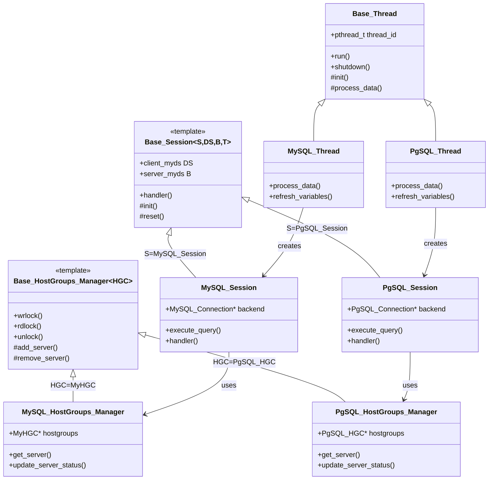
```mermaid
classDiagram
    class Base_Session~S,DS,B,T~ {
        <<template>>
        +handler()
        +client_myds DS
        +server_myds B
        #init()
        #reset()
    }
    
    class Base_HostGroups_Manager~HGC~ {
        <<template>>
        +wrlock()
        +rdlock()
        +unlock()
        #add_server()
        #remove_server()
    }
    
    class Base_Thread {
        +pthread_t thread_id
        +run()
        +shutdown()
        #init()
        #process_data()
    }
    
    class MySQL_Session {
        +MySQL_Connection* backend
        +execute_query()
        +handler()
    }
    
    class PgSQL_Session {
        +PgSQL_Connection* backend
        +execute_query()
        +handler()
    }
    
    class MySQL_HostGroups_Manager {
        +MyHGC* hostgroups
        +get_server()
        +update_server_status()
    }
    
    class PgSQL_HostGroups_Manager {
        +PgSQL_HGC* hostgroups
        +get_server()
        +update_server_status()
    }
    
    class MySQL_Thread {
        +process_data()
        +refresh_variables()
    }
    
    class PgSQL_Thread {
        +process_data()
        +refresh_variables()
    }
    
    Base_Session~S,DS,B,T~ <|-- MySQL_Session : S=MySQL_Session
    Base_Session~S,DS,B,T~ <|-- PgSQL_Session : S=PgSQL_Session
    Base_HostGroups_Manager~HGC~ <|-- MySQL_HostGroups_Manager : HGC=MyHGC
    Base_HostGroups_Manager~HGC~ <|-- PgSQL_HostGroups_Manager : HGC=PgSQL_HGC
    Base_Thread <|-- MySQL_Thread
    Base_Thread <|-- PgSQL_Thread
    
    MySQL_Session --> MySQL_HostGroups_Manager : uses
    PgSQL_Session --> PgSQL_HostGroups_Manager : uses
    MySQL_Thread --> MySQL_Session : creates
    PgSQL_Thread --> PgSQL_Session : creates
```

### Query Processing Class Hierarchy

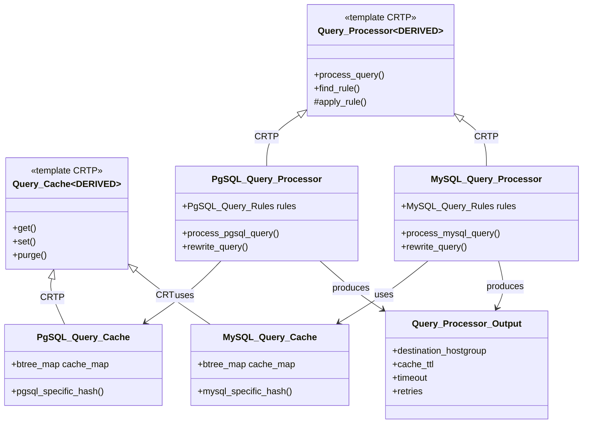
```mermaid
classDiagram
    class Query_Processor~DERIVED~ {
        <<template CRTP>>
        +process_query()
        +find_rule()
        #apply_rule()
    }
    
    class Query_Cache~DERIVED~ {
        <<template CRTP>>
        +get()
        +set()
        +purge()
    }
    
    class MySQL_Query_Processor {
        +MySQL_Query_Rules rules
        +process_mysql_query()
        +rewrite_query()
    }
    
    class PgSQL_Query_Processor {
        +PgSQL_Query_Rules rules
        +process_pgsql_query()
        +rewrite_query()
    }
    
    class MySQL_Query_Cache {
        +btree_map cache_map
        +mysql_specific_hash()
    }
    
    class PgSQL_Query_Cache {
        +btree_map cache_map
        +pgsql_specific_hash()
    }
    
    class Query_Processor_Output {
        +destination_hostgroup
        +cache_ttl
        +timeout
        +retries
    }
    
    Query_Processor~DERIVED~ <|-- MySQL_Query_Processor : CRTP
    Query_Processor~DERIVED~ <|-- PgSQL_Query_Processor : CRTP
    Query_Cache~DERIVED~ <|-- MySQL_Query_Cache : CRTP
    Query_Cache~DERIVED~ <|-- PgSQL_Query_Cache : CRTP
    
    MySQL_Query_Processor --> Query_Processor_Output : produces
    PgSQL_Query_Processor --> Query_Processor_Output : produces
    MySQL_Query_Processor --> MySQL_Query_Cache : uses
    PgSQL_Query_Processor --> PgSQL_Query_Cache : uses
```

## Database Schema ERD

### Core Configuration Tables

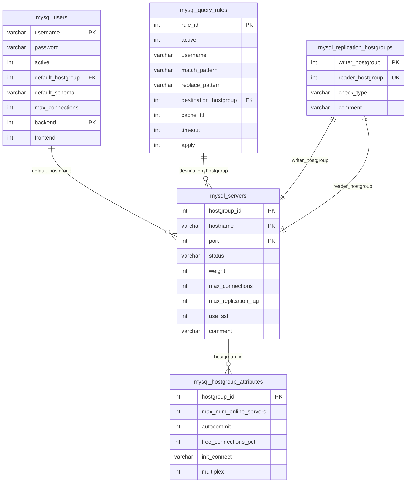
```mermaid
erDiagram
    mysql_servers {
        int hostgroup_id PK
        varchar hostname PK
        int port PK
        varchar status
        int weight
        int max_connections
        int max_replication_lag
        int use_ssl
        varchar comment
    }
    
    mysql_users {
        varchar username PK
        varchar password
        int active
        int default_hostgroup FK
        varchar default_schema
        int max_connections
        int backend PK
        int frontend
    }
    
    mysql_query_rules {
        int rule_id PK
        int active
        varchar username
        varchar match_pattern
        varchar replace_pattern
        int destination_hostgroup FK
        int cache_ttl
        int timeout
        int apply
    }
    
    mysql_replication_hostgroups {
        int writer_hostgroup PK
        int reader_hostgroup UK
        varchar check_type
        varchar comment
    }
    
    mysql_hostgroup_attributes {
        int hostgroup_id PK
        int max_num_online_servers
        int autocommit
        int free_connections_pct
        varchar init_connect
        int multiplex
    }
    
    mysql_servers ||--o{ mysql_hostgroup_attributes : "hostgroup_id"
    mysql_users ||--o{ mysql_servers : "default_hostgroup"
    mysql_query_rules ||--o{ mysql_servers : "destination_hostgroup"
    mysql_replication_hostgroups ||--|| mysql_servers : "writer_hostgroup"
    mysql_replication_hostgroups ||--|| mysql_servers : "reader_hostgroup"
```

### Statistics and Monitoring Tables

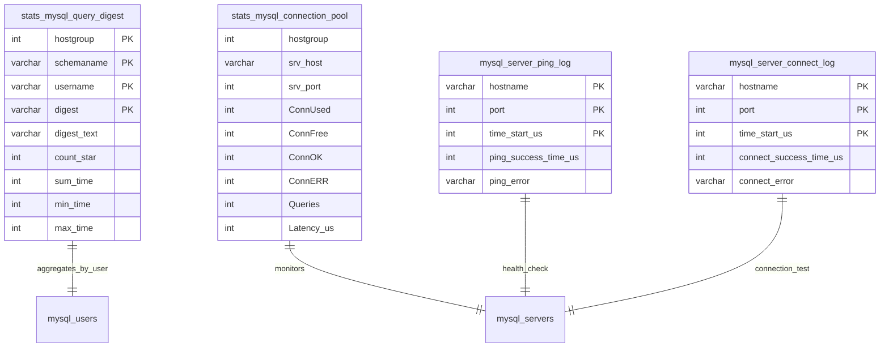
```mermaid
erDiagram
    stats_mysql_query_digest {
        int hostgroup PK
        varchar schemaname PK
        varchar username PK
        varchar digest PK
        varchar digest_text
        int count_star
        int sum_time
        int min_time
        int max_time
    }
    
    stats_mysql_connection_pool {
        int hostgroup
        varchar srv_host
        int srv_port
        int ConnUsed
        int ConnFree
        int ConnOK
        int ConnERR
        int Queries
        int Latency_us
    }
    
    mysql_server_ping_log {
        varchar hostname PK
        int port PK
        int time_start_us PK
        int ping_success_time_us
        varchar ping_error
    }
    
    mysql_server_connect_log {
        varchar hostname PK
        int port PK
        int time_start_us PK
        int connect_success_time_us
        varchar connect_error
    }
    
    stats_mysql_connection_pool ||--|| mysql_servers : "monitors"
    mysql_server_ping_log ||--|| mysql_servers : "health_check"
    mysql_server_connect_log ||--|| mysql_servers : "connection_test"
    stats_mysql_query_digest ||--|| mysql_users : "aggregates_by_user"
```

### Configuration to Runtime Flow

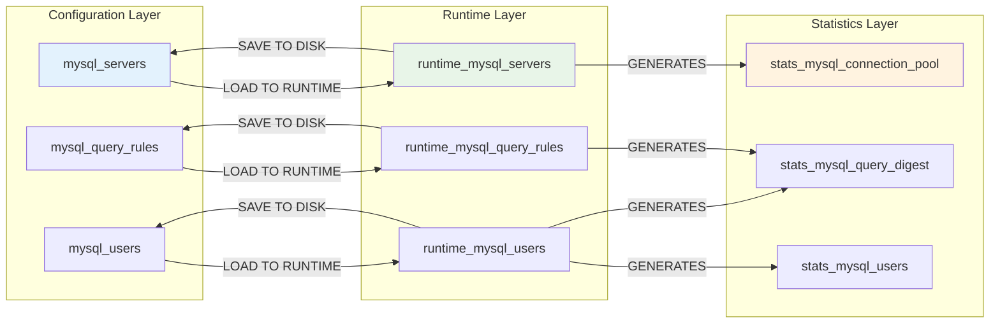
```mermaid
graph LR
    subgraph "Configuration Layer"
        C1[mysql_servers]
        C2[mysql_users]
        C3[mysql_query_rules]
    end
    
    subgraph "Runtime Layer"
        R1[runtime_mysql_servers]
        R2[runtime_mysql_users]
        R3[runtime_mysql_query_rules]
    end
    
    subgraph "Statistics Layer"
        S1[stats_mysql_connection_pool]
        S2[stats_mysql_query_digest]
        S3[stats_mysql_users]
    end
    
    C1 -->|LOAD TO RUNTIME| R1
    C2 -->|LOAD TO RUNTIME| R2
    C3 -->|LOAD TO RUNTIME| R3
    
    R1 -->|GENERATES| S1
    R2 -->|GENERATES| S2
    R3 -->|GENERATES| S2
    R2 -->|GENERATES| S3
    
    R1 -->|SAVE TO DISK| C1
    R2 -->|SAVE TO DISK| C2
    R3 -->|SAVE TO DISK| C3
    
    style C1 fill:#e3f2fd
    style R1 fill:#e8f5e8
    style S1 fill:#fff3e0
```

## Data Flow Architecture

### Query Processing Pipeline


```mermaid
graph TB
    subgraph "1. Connection Phase"
        CLIENT[Client Connection] --> ACCEPT[Accept Thread]
        ACCEPT --> ASSIGN[Assign to Worker Thread]
        ASSIGN --> SESSION[Create Session Object]
    end
    
    subgraph "2. Authentication Phase"
        SESSION --> AUTH_CHECK{Auth Required?}
        AUTH_CHECK -->|Yes| AUTH_MOD[Authentication Module]
        AUTH_MOD --> AUTH_CACHE{Cached?}
        AUTH_CACHE -->|No| AUTH_BACKEND[Backend Auth]
        AUTH_CACHE -->|Yes| AUTH_OK[Auth Success]
        AUTH_BACKEND --> AUTH_OK
        AUTH_CHECK -->|No| QUERY_PHASE
    end
    
    subgraph "3. Query Processing Phase"
        AUTH_OK --> QUERY_PHASE[Receive Query]
        QUERY_PHASE --> PARSE[Parse Query]
        PARSE --> DIGEST[Calculate Digest]
        DIGEST --> RULES{Match Rules?}
        RULES -->|Yes| APPLY_RULE[Apply Rule Actions]
        RULES -->|No| DEFAULT_HG[Use Default Hostgroup]
        APPLY_RULE --> REWRITE{Rewrite?}
        REWRITE -->|Yes| MODIFY[Modify Query]
        REWRITE -->|No| CACHE_CHECK
        MODIFY --> CACHE_CHECK
        DEFAULT_HG --> CACHE_CHECK
    end
    
    subgraph "4. Cache Layer"
        CACHE_CHECK{In Cache?}
        CACHE_CHECK -->|Hit| CACHE_RESULT[Return Cached]
        CACHE_CHECK -->|Miss| BACKEND_EXEC
    end
    
    subgraph "5. Backend Execution"
        BACKEND_EXEC[Get Connection] --> POOL{Available?}
        POOL -->|Yes| USE_CONN[Use Pooled]
        POOL -->|No| CREATE_CONN[Create New]
        USE_CONN --> SEND_QUERY[Send to Backend]
        CREATE_CONN --> SEND_QUERY
        SEND_QUERY --> RECEIVE[Receive Result]
        RECEIVE --> CACHE_STORE{Cacheable?}
        CACHE_STORE -->|Yes| STORE[Store in Cache]
        CACHE_STORE -->|No| RETURN
        STORE --> RETURN
    end
    
    subgraph "6. Response Phase"
        CACHE_RESULT --> CLIENT_RESP[Send to Client]
        RETURN[Return Result] --> CLIENT_RESP
        CLIENT_RESP --> STATS[Update Statistics]
        STATS --> NEXT{More Queries?}
        NEXT -->|Yes| QUERY_PHASE
        NEXT -->|No| CLEANUP[Session Cleanup]
    end
    
    style CLIENT fill:#e1f5fe
    style AUTH_OK fill:#c8e6c9
    style CACHE_RESULT fill:#fff3e0
    style RETURN fill:#e8f5e8
```

## Advanced Authentication Flow

### Multi-Stage Authentication State Machine

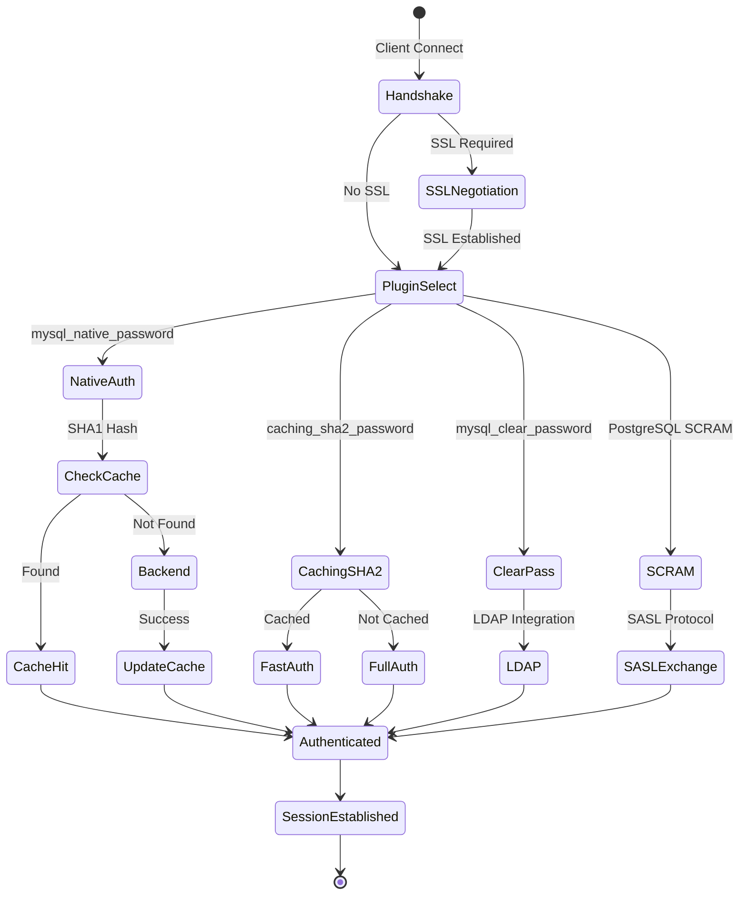
```mermaid
stateDiagram-v2
    [*] --> Handshake: Client Connect
    
    Handshake --> SSLNegotiation: SSL Required
    Handshake --> PluginSelect: No SSL
    
    SSLNegotiation --> PluginSelect: SSL Established
    
    PluginSelect --> NativeAuth: mysql_native_password
    PluginSelect --> CachingSHA2: caching_sha2_password
    PluginSelect --> ClearPass: mysql_clear_password
    PluginSelect --> SCRAM: PostgreSQL SCRAM
    
    NativeAuth --> CheckCache: SHA1 Hash
    CheckCache --> CacheHit: Found
    CheckCache --> Backend: Not Found
    
    CachingSHA2 --> FastAuth: Cached
    CachingSHA2 --> FullAuth: Not Cached
    
    ClearPass --> LDAP: LDAP Integration
    SCRAM --> SASLExchange: SASL Protocol
    
    CacheHit --> Authenticated
    Backend --> UpdateCache: Success
    UpdateCache --> Authenticated
    FastAuth --> Authenticated
    FullAuth --> Authenticated
    LDAP --> Authenticated
    SASLExchange --> Authenticated
    
    Authenticated --> SessionEstablished
    SessionEstablished --> [*]
```

### Query Digest and Rule Processing

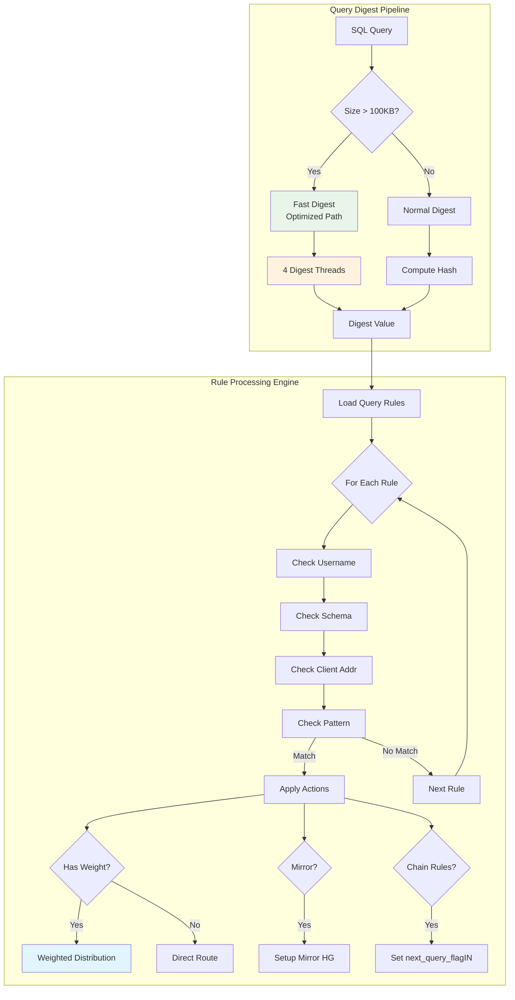
```mermaid
graph TB
    subgraph "Query Digest Pipeline"
        QUERY[SQL Query] --> SIZE{Size > 100KB?}
        SIZE -->|Yes| FAST_PATH[Fast Digest<br/>Optimized Path]
        SIZE -->|No| NORMAL[Normal Digest]
        
        FAST_PATH --> THREAD_POOL[4 Digest Threads]
        NORMAL --> COMPUTE[Compute Hash]
        THREAD_POOL --> DIGEST_RESULT[Digest Value]
        COMPUTE --> DIGEST_RESULT
    end
    
    subgraph "Rule Processing Engine"
        DIGEST_RESULT --> LOAD_RULES[Load Query Rules]
        LOAD_RULES --> RULE_LOOP{For Each Rule}
        
        RULE_LOOP --> MATCH_USER[Check Username]
        MATCH_USER --> MATCH_SCHEMA[Check Schema]
        MATCH_SCHEMA --> MATCH_ADDR[Check Client Addr]
        MATCH_ADDR --> MATCH_PATTERN[Check Pattern]
        
        MATCH_PATTERN -->|Match| APPLY_ACTIONS[Apply Actions]
        MATCH_PATTERN -->|No Match| NEXT_RULE[Next Rule]
        
        APPLY_ACTIONS --> WEIGHT{Has Weight?}
        WEIGHT -->|Yes| WEIGHTED_ROUTE[Weighted Distribution]
        WEIGHT -->|No| DIRECT_ROUTE[Direct Route]
        
        APPLY_ACTIONS --> MIRROR{Mirror?}
        MIRROR -->|Yes| MIRROR_SETUP[Setup Mirror HG]
        
        APPLY_ACTIONS --> CHAIN{Chain Rules?}
        CHAIN -->|Yes| SET_FLAG[Set next_query_flagIN]
        
        NEXT_RULE --> RULE_LOOP
    end
    
    style FAST_PATH fill:#e8f5e8
    style THREAD_POOL fill:#fff3e0
    style WEIGHTED_ROUTE fill:#e1f5fe
```

## Protocol Sequence Diagrams

### MySQL Connection and Query Sequence

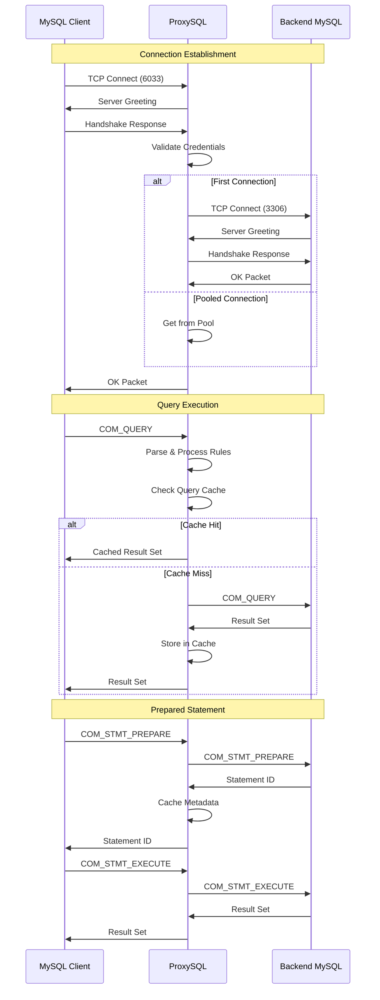
```mermaid
sequenceDiagram
    participant C as MySQL Client
    participant P as ProxySQL
    participant B as Backend MySQL
    
    Note over C,B: Connection Establishment
    C->>P: TCP Connect (6033)
    P->>C: Server Greeting
    C->>P: Handshake Response
    P->>P: Validate Credentials
    
    alt First Connection
        P->>B: TCP Connect (3306)
        B->>P: Server Greeting
        P->>B: Handshake Response
        B->>P: OK Packet
    else Pooled Connection
        P->>P: Get from Pool
    end
    
    P->>C: OK Packet
    
    Note over C,B: Query Execution
    C->>P: COM_QUERY
    P->>P: Parse & Process Rules
    P->>P: Check Query Cache
    
    alt Cache Hit
        P->>C: Cached Result Set
    else Cache Miss
        P->>B: COM_QUERY
        B->>P: Result Set
        P->>P: Store in Cache
        P->>C: Result Set
    end
    
    Note over C,B: Prepared Statement
    C->>P: COM_STMT_PREPARE
    P->>B: COM_STMT_PREPARE
    B->>P: Statement ID
    P->>P: Cache Metadata
    P->>C: Statement ID
    
    C->>P: COM_STMT_EXECUTE
    P->>B: COM_STMT_EXECUTE
    B->>P: Result Set
    P->>C: Result Set
```

### PostgreSQL Extended Query Protocol

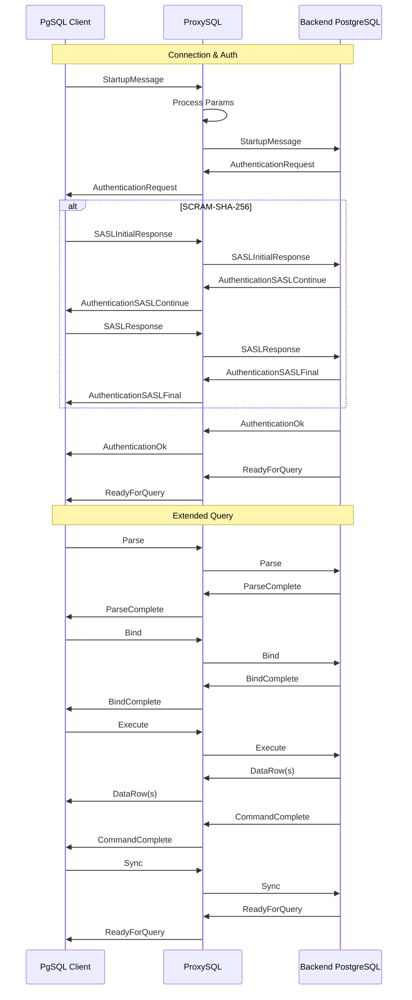
```mermaid
sequenceDiagram
    participant C as PgSQL Client
    participant P as ProxySQL
    participant B as Backend PostgreSQL
    
    Note over C,B: Connection & Auth
    C->>P: StartupMessage
    P->>P: Process Params
    P->>B: StartupMessage
    B->>P: AuthenticationRequest
    P->>C: AuthenticationRequest
    
    alt SCRAM-SHA-256
        C->>P: SASLInitialResponse
        P->>B: SASLInitialResponse
        B->>P: AuthenticationSASLContinue
        P->>C: AuthenticationSASLContinue
        C->>P: SASLResponse
        P->>B: SASLResponse
        B->>P: AuthenticationSASLFinal
        P->>C: AuthenticationSASLFinal
    end
    
    B->>P: AuthenticationOk
    P->>C: AuthenticationOk
    B->>P: ReadyForQuery
    P->>C: ReadyForQuery
    
    Note over C,B: Extended Query
    C->>P: Parse
    P->>B: Parse
    B->>P: ParseComplete
    P->>C: ParseComplete
    
    C->>P: Bind
    P->>B: Bind
    B->>P: BindComplete
    P->>C: BindComplete
    
    C->>P: Execute
    P->>B: Execute
    B->>P: DataRow(s)
    P->>C: DataRow(s)
    B->>P: CommandComplete
    P->>C: CommandComplete
    
    C->>P: Sync
    P->>B: Sync
    B->>P: ReadyForQuery
    P->>C: ReadyForQuery
```

## Thread Architecture

### Multi-Threaded Processing Model

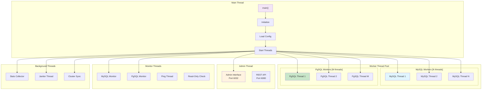
```mermaid
graph TB
    subgraph "Main Thread"
        MAIN["main()"]
        INIT[Initialize]
        CONFIG[Load Config]
        START[Start Threads]
    end
    
    subgraph "Worker Thread Pool"
        subgraph "MySQL Workers [N threads]"
            MW1[MySQL Thread 1]
            MW2[MySQL Thread 2]
            MWN[MySQL Thread N]
        end
        
        subgraph "PgSQL Workers [M threads]"
            PW1[PgSQL Thread 1]
            PW2[PgSQL Thread 2]
            PWM[PgSQL Thread M]
        end
    end
    
    subgraph "Admin Thread"
        ADMIN[Admin Interface<br/>Port 6032]
        REST[REST API<br/>Port 6080]
    end
    
    subgraph "Monitor Threads"
        MMON[MySQL Monitor]
        PMON[PgSQL Monitor]
        PING[Ping Thread]
        READONLY[Read-Only Check]
    end
    
    subgraph "Background Threads"
        STATS[Stats Collector]
        JANITOR[Janitor Thread]
        CLUSTER[Cluster Sync]
    end
    
    MAIN --> INIT
    INIT --> CONFIG
    CONFIG --> START
    
    START --> MW1
    START --> MW2
    START --> MWN
    START --> PW1
    START --> PW2
    START --> PWM
    START --> ADMIN
    START --> MMON
    START --> PMON
    START --> STATS
    START --> JANITOR
    START --> CLUSTER
    
    style MAIN fill:#f3e5f5
    style MW1 fill:#e1f5fe
    style PW1 fill:#c8e6c9
    style ADMIN fill:#fff3e0
```

### Thread Communication

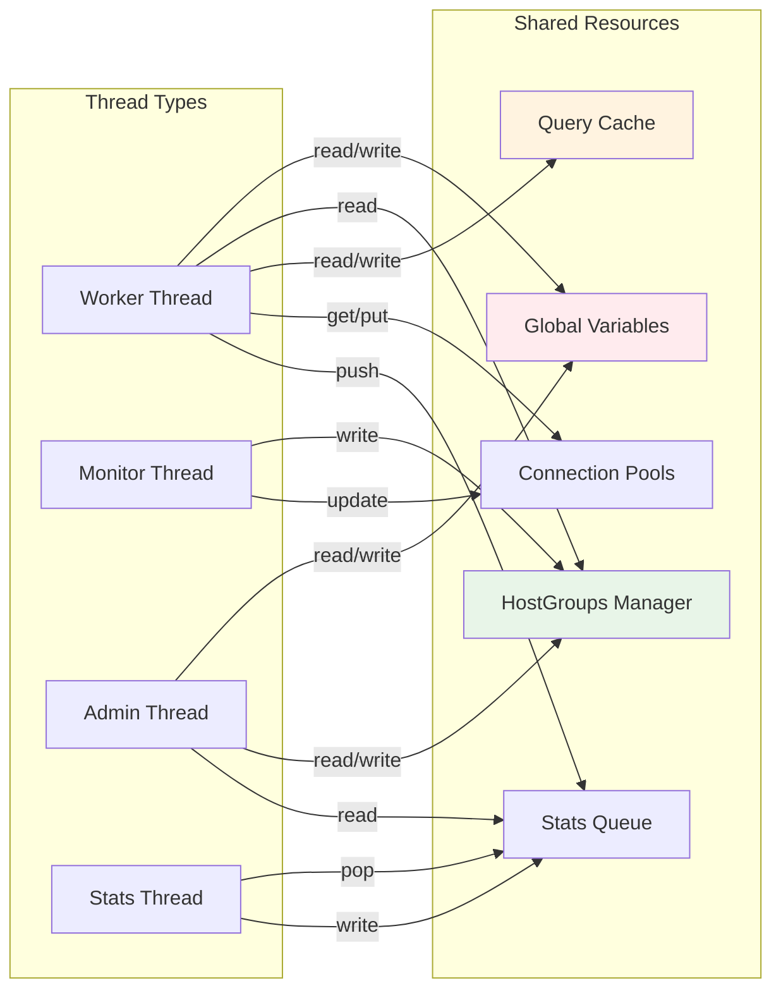
```mermaid
graph LR
    subgraph "Shared Resources"
        GV[Global Variables]
        HGM[HostGroups Manager]
        QC[Query Cache]
        CP[Connection Pools]
        STATS_Q[Stats Queue]
    end
    
    subgraph "Thread Types"
        WT[Worker Thread]
        MT[Monitor Thread]
        AT[Admin Thread]
        ST[Stats Thread]
    end
    
    WT -->|read/write| GV
    WT -->|read| HGM
    WT -->|read/write| QC
    WT -->|get/put| CP
    WT -->|push| STATS_Q
    
    MT -->|write| HGM
    MT -->|update| CP
    
    AT -->|read/write| GV
    AT -->|read/write| HGM
    AT -->|read| STATS_Q
    
    ST -->|pop| STATS_Q
    ST -->|write| STATS_Q
    
    style GV fill:#ffebee
    style HGM fill:#e8f5e8
    style QC fill:#fff3e0
```

## Connection Pooling Architecture

### Advanced Pool Management

```mermaid
graph TB
    subgraph "Connection Pool Internals"
        subgraph "Pool Selection Criteria"
            REQ[Connection Request] --> CRITERIA{Selection Criteria}
            CRITERIA --> LAG[Max Lag Check]
            CRITERIA --> GTID[GTID Position]
            CRITERIA --> LATENCY[Latency Score]
            CRITERIA --> WARM[Connection Warming]
        end
        
        subgraph "Connection States"
            FREE[Free Pool<br/>ConnectionsFree]
            USED[Used Pool<br/>ConnectionsUsed]
            WARMING[Warming Pool<br/>Pre-established]
            EXPIRED[Expired<br/>To be closed]
        end
        
        subgraph "Pool Algorithms"
            ALG1[get_MyConn_from_pool()]
            ALG1 --> CHECK_LAG{Lag < max_lag_ms?}
            CHECK_LAG -->|Yes| CHECK_GTID{GTID Match?}
            CHECK_LAG -->|No| REJECT1[Reject Connection]
            CHECK_GTID -->|Yes| CHECK_LATENCY{Latency OK?}
            CHECK_GTID -->|No| FIND_NEXT[Find Next]
            CHECK_LATENCY -->|Yes| ASSIGN[Assign Connection]
            CHECK_LATENCY -->|No| CREATE_NEW[Create New]
        end
        
        LAG --> FREE
        GTID --> FREE
        LATENCY --> FREE
        WARM --> WARMING
        
        FREE --> USED
        USED --> FREE
        WARMING --> FREE
        FREE --> EXPIRED
        USED --> EXPIRED
    end
    
    style REQ fill:#e1f5fe
    style FREE fill:#e8f5e8
    style USED fill:#ffebee
    style ASSIGN fill:#c8e6c9
```

### Pool Statistics and Metrics

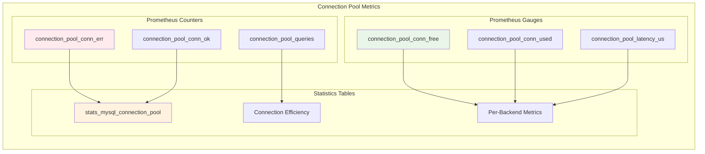
```mermaid
graph LR
    subgraph "Connection Pool Metrics"
        subgraph "Prometheus Counters"
            PC1[connection_pool_conn_err]
            PC2[connection_pool_conn_ok]
            PC3[connection_pool_queries]
        end
        
        subgraph "Prometheus Gauges"
            PG1[connection_pool_conn_free]
            PG2[connection_pool_conn_used]
            PG3[connection_pool_latency_us]
        end
        
        subgraph "Statistics Tables"
            ST1[stats_mysql_connection_pool]
            ST2[Connection Efficiency]
            ST3[Per-Backend Metrics]
        end
    end
    
    PC1 --> ST1
    PC2 --> ST1
    PC3 --> ST2
    PG1 --> ST3
    PG2 --> ST3
    PG3 --> ST3
    
    style PC1 fill:#ffebee
    style PG1 fill:#e8f5e8
    style ST1 fill:#fff3e0
```

## Connection Pooling Architecture

### Pool Management Strategy

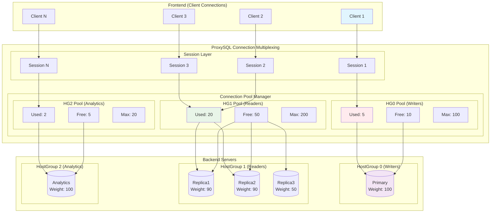
```mermaid
graph TB
    subgraph "Frontend (Client Connections)"
        C1[Client 1]
        C2[Client 2]
        C3[Client 3]
        CN[Client N]
    end
    
    subgraph "ProxySQL Connection Multiplexing"
        subgraph "Session Layer"
            S1[Session 1]
            S2[Session 2]
            S3[Session 3]
            SN[Session N]
        end
        
        subgraph "Connection Pool Manager"
            subgraph "HG0 Pool (Writers)"
                HG0_FREE[Free: 10]
                HG0_USED[Used: 5]
                HG0_MAX[Max: 100]
            end
            
            subgraph "HG1 Pool (Readers)"
                HG1_FREE[Free: 50]
                HG1_USED[Used: 20]
                HG1_MAX[Max: 200]
            end
            
            subgraph "HG2 Pool (Analytics)"
                HG2_FREE[Free: 5]
                HG2_USED[Used: 2]
                HG2_MAX[Max: 20]
            end
        end
    end
    
    subgraph "Backend Servers"
        subgraph "HostGroup 0 (Writers)"
            W1[(Primary<br/>Weight: 100)]
        end
        
        subgraph "HostGroup 1 (Readers)"
            R1[(Replica1<br/>Weight: 90)]
            R2[(Replica2<br/>Weight: 90)]
            R3[(Replica3<br/>Weight: 50)]
        end
        
        subgraph "HostGroup 2 (Analytics)"
            A1[(Analytics<br/>Weight: 100)]
        end
    end
    
    C1 --> S1
    C2 --> S2
    C3 --> S3
    CN --> SN
    
    S1 --> HG0_USED
    S2 --> HG1_USED
    S3 --> HG1_USED
    SN --> HG2_USED
    
    HG0_FREE --> W1
    HG0_USED --> W1
    
    HG1_FREE --> R1
    HG1_FREE --> R2
    HG1_FREE --> R3
    HG1_USED --> R1
    HG1_USED --> R2
    
    HG2_FREE --> A1
    HG2_USED --> A1
    
    style C1 fill:#e1f5fe
    style HG0_USED fill:#ffebee
    style HG1_USED fill:#e8f5e8
    style W1 fill:#f3e5f5
```

### Connection Lifecycle

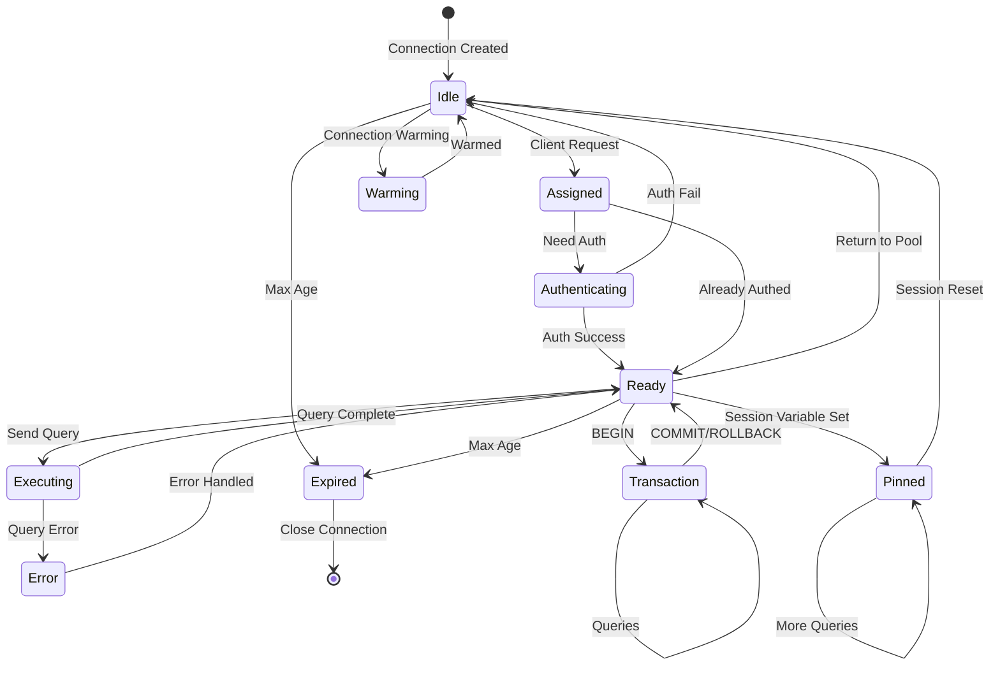
```mermaid
stateDiagram-v2
    [*] --> Idle: Connection Created
    
    Idle --> Assigned: Client Request
    Assigned --> Authenticating: Need Auth
    Authenticating --> Ready: Auth Success
    Authenticating --> Idle: Auth Fail
    Assigned --> Ready: Already Authed
    
    Ready --> Executing: Send Query
    Executing --> Ready: Query Complete
    Executing --> Error: Query Error
    Error --> Ready: Error Handled
    
    Ready --> Transaction: BEGIN
    Transaction --> Transaction: Queries
    Transaction --> Ready: COMMIT/ROLLBACK
    
    Ready --> Idle: Return to Pool
    Idle --> Warming: Connection Warming
    Warming --> Idle: Warmed
    
    Idle --> Expired: Max Age
    Ready --> Expired: Max Age
    Expired --> [*]: Close Connection
    
    Ready --> Pinned: Session Variable Set
    Pinned --> Pinned: More Queries
    Pinned --> Idle: Session Reset
```

## Query Processing Pipeline

### Rule Evaluation Flow

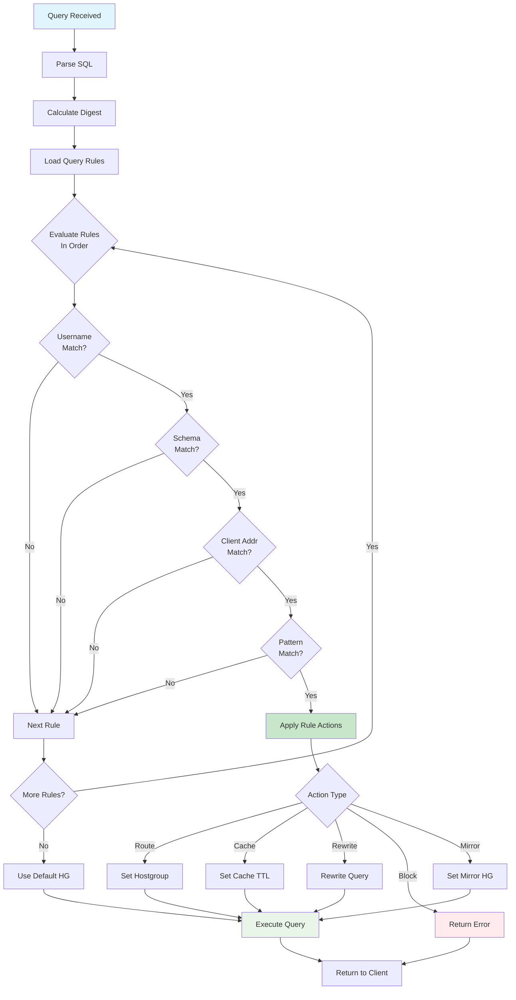
```mermaid
graph TB
    START[Query Received] --> PARSE[Parse SQL]
    PARSE --> DIGEST[Calculate Digest]
    
    DIGEST --> RULES[Load Query Rules]
    RULES --> EVAL{Evaluate Rules<br/>In Order}
    
    EVAL --> CHECK_USER{Username<br/>Match?}
    CHECK_USER -->|No| NEXT_RULE[Next Rule]
    CHECK_USER -->|Yes| CHECK_SCHEMA{Schema<br/>Match?}
    
    CHECK_SCHEMA -->|No| NEXT_RULE
    CHECK_SCHEMA -->|Yes| CHECK_ADDR{Client Addr<br/>Match?}
    
    CHECK_ADDR -->|No| NEXT_RULE
    CHECK_ADDR -->|Yes| CHECK_PATTERN{Pattern<br/>Match?}
    
    CHECK_PATTERN -->|No| NEXT_RULE
    CHECK_PATTERN -->|Yes| APPLY[Apply Rule Actions]
    
    NEXT_RULE --> MORE{More Rules?}
    MORE -->|Yes| EVAL
    MORE -->|No| DEFAULT[Use Default HG]
    
    APPLY --> ACTION{Action Type}
    ACTION -->|Route| SET_HG[Set Hostgroup]
    ACTION -->|Cache| SET_CACHE[Set Cache TTL]
    ACTION -->|Rewrite| REWRITE[Rewrite Query]
    ACTION -->|Block| ERROR[Return Error]
    ACTION -->|Mirror| MIRROR[Set Mirror HG]
    
    SET_HG --> EXECUTE
    SET_CACHE --> EXECUTE
    REWRITE --> EXECUTE
    MIRROR --> EXECUTE
    DEFAULT --> EXECUTE
    
    EXECUTE[Execute Query]
    ERROR --> RETURN[Return to Client]
    EXECUTE --> RETURN
    
    style START fill:#e1f5fe
    style APPLY fill:#c8e6c9
    style EXECUTE fill:#e8f5e8
    style ERROR fill:#ffebee
```

## Deployment Topologies

### Single ProxySQL Instance

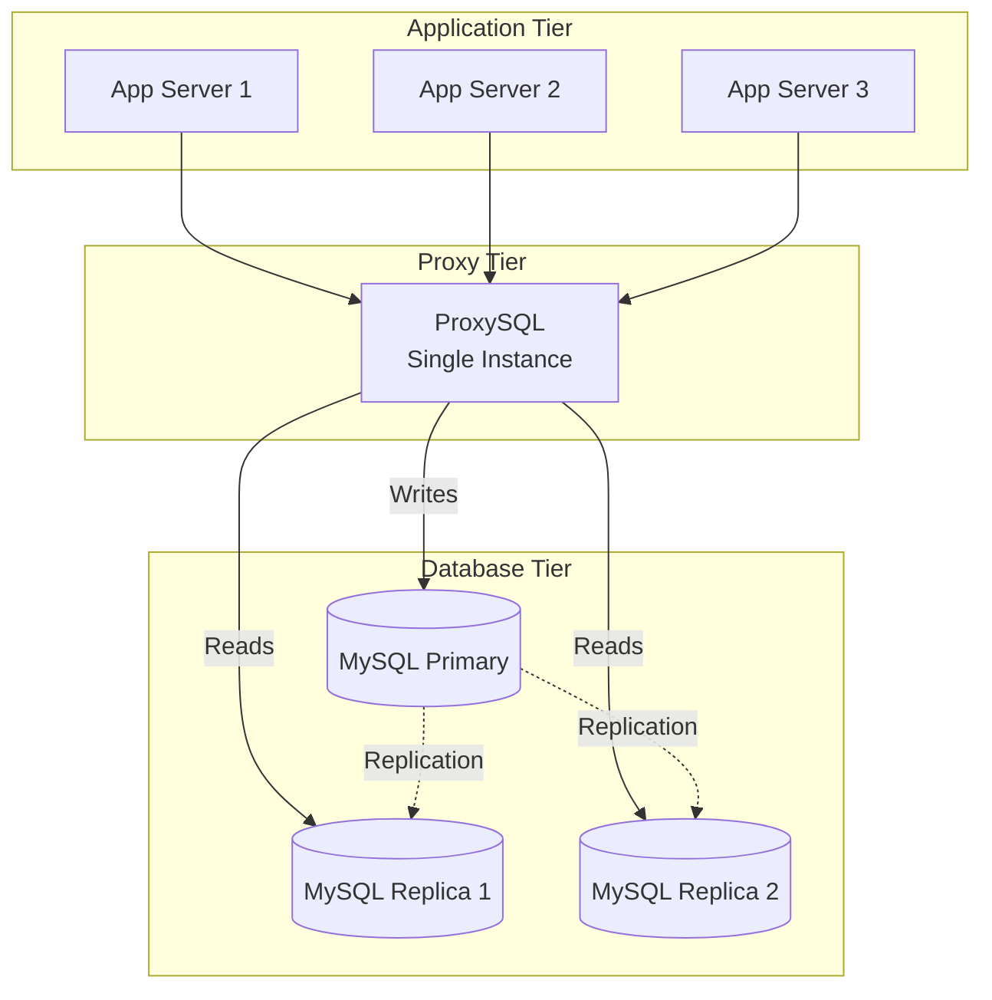
```mermaid
graph TB
    subgraph "Application Tier"
        APP1[App Server 1]
        APP2[App Server 2]
        APP3[App Server 3]
    end
    
    subgraph "Proxy Tier"
        PROXY[ProxySQL<br/>Single Instance]
    end
    
    subgraph "Database Tier"
        PRIMARY[(MySQL Primary)]
        REPLICA1[(MySQL Replica 1)]
        REPLICA2[(MySQL Replica 2)]
    end
    
    APP1 --> PROXY
    APP2 --> PROXY
    APP3 --> PROXY
    
    PROXY -->|Writes| PRIMARY
    PROXY -->|Reads| REPLICA1
    PROXY -->|Reads| REPLICA2
    
    PRIMARY -.->|Replication| REPLICA1
    PRIMARY -.->|Replication| REPLICA2
```

### ProxySQL Cluster (HA)

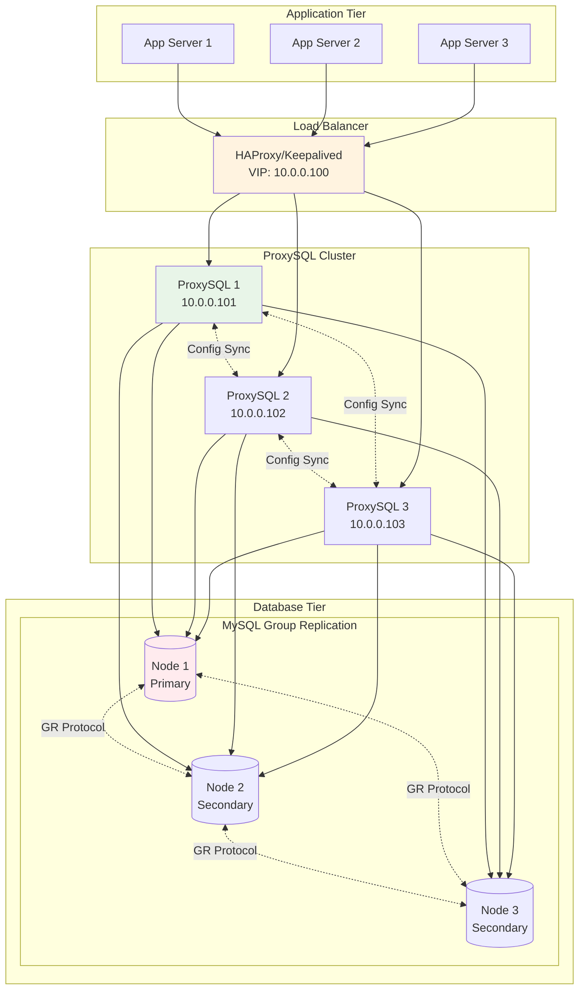
```mermaid
graph TB
    subgraph "Application Tier"
        APP1[App Server 1]
        APP2[App Server 2]
        APP3[App Server 3]
    end
    
    subgraph "Load Balancer"
        LB[HAProxy/Keepalived<br/>VIP: 10.0.0.100]
    end
    
    subgraph "ProxySQL Cluster"
        P1[ProxySQL 1<br/>10.0.0.101]
        P2[ProxySQL 2<br/>10.0.0.102]
        P3[ProxySQL 3<br/>10.0.0.103]
        
        P1 <-.->|Config Sync| P2
        P2 <-.->|Config Sync| P3
        P1 <-.->|Config Sync| P3
    end
    
    subgraph "Database Tier"
        subgraph "MySQL Group Replication"
            GR1[(Node 1<br/>Primary)]
            GR2[(Node 2<br/>Secondary)]
            GR3[(Node 3<br/>Secondary)]
            
            GR1 <-.->|GR Protocol| GR2
            GR2 <-.->|GR Protocol| GR3
            GR1 <-.->|GR Protocol| GR3
        end
    end
    
    APP1 --> LB
    APP2 --> LB
    APP3 --> LB
    
    LB --> P1
    LB --> P2
    LB --> P3
    
    P1 --> GR1
    P1 --> GR2
    P1 --> GR3
    
    P2 --> GR1
    P2 --> GR2
    P2 --> GR3
    
    P3 --> GR1
    P3 --> GR2
    P3 --> GR3
    
    style LB fill:#fff3e0
    style GR1 fill:#ffebee
    style P1 fill:#e8f5e8
```

### Multi-Region Deployment

```mermaid
graph TB
    subgraph "Region 1 (Primary)"
        subgraph "Apps R1"
            R1_APP[Applications]
        end
        
        subgraph "ProxySQL R1"
            R1_P1[ProxySQL 1]
            R1_P2[ProxySQL 2]
        end
        
        subgraph "Database R1"
            R1_DB[(Primary DB)]
            R1_R1[(Local Replica)]
        end
    end
    
    subgraph "Region 2 (DR)"
        subgraph "Apps R2"
            R2_APP[Applications]
        end
        
        subgraph "ProxySQL R2"
            R2_P1[ProxySQL 1]
            R2_P2[ProxySQL 2]
        end
        
        subgraph "Database R2"
            R2_DB[(DR Replica)]
            R2_R1[(Local Replica)]
        end
    end
    
    R1_APP --> R1_P1
    R1_APP --> R1_P2
    
    R1_P1 -->|Writes| R1_DB
    R1_P1 -->|Reads| R1_R1
    R1_P2 -->|Writes| R1_DB
    R1_P2 -->|Reads| R1_R1
    
    R2_APP --> R2_P1
    R2_APP --> R2_P2
    
    R2_P1 -->|Reads Only| R2_DB
    R2_P1 -->|Reads| R2_R1
    R2_P2 -->|Reads Only| R2_DB
    R2_P2 -->|Reads| R2_R1
    
    R1_DB -.->|Async Replication| R2_DB
    R1_DB -.->|Sync Replication| R1_R1
    R2_DB -.->|Sync Replication| R2_R1
    
    R1_P1 <-.->|Config Sync| R2_P1
    R1_P2 <-.->|Config Sync| R2_P2
    
    style R1_DB fill:#ffebee
    style R2_DB fill:#e8f5e8
```

### Container Orchestration (Kubernetes)

```mermaid
graph TB
    subgraph "Kubernetes Cluster"
        subgraph "Application Namespace"
            subgraph "App Deployment"
                POD1[App Pod 1]
                POD2[App Pod 2]
                POD3[App Pod 3]
            end
        end
        
        subgraph "ProxySQL Namespace"
            subgraph "ProxySQL StatefulSet"
                PS1[proxysql-0<br/>ConfigMap Mount]
                PS2[proxysql-1<br/>ConfigMap Mount]
                PS3[proxysql-2<br/>ConfigMap Mount]
            end
            
            SVC[ProxySQL Service<br/>ClusterIP]
            CM[ConfigMap<br/>proxysql.cnf]
            SECRET[Secret<br/>Credentials]
        end
        
        subgraph "Database Namespace"
            subgraph "MySQL Operator"
                IDB[InnoDB Cluster<br/>3 Nodes]
            end
        end
    end
    
    POD1 --> SVC
    POD2 --> SVC
    POD3 --> SVC
    
    SVC --> PS1
    SVC --> PS2
    SVC --> PS3
    
    CM --> PS1
    CM --> PS2
    CM --> PS3
    
    SECRET --> PS1
    SECRET --> PS2
    SECRET --> PS3
    
    PS1 --> IDB
    PS2 --> IDB
    PS3 --> IDB
    
    PS1 <-.->|Cluster Sync| PS2
    PS2 <-.->|Cluster Sync| PS3
    PS1 <-.->|Cluster Sync| PS3
    
    style SVC fill:#e1f5fe
    style CM fill:#fff3e0
    style SECRET fill:#ffebee
```

## Monitor Module Architecture

### Work Queue Pattern

```mermaid
graph TB
    subgraph "Monitor Thread Pool"
        subgraph "Work Queue System"
            QUEUE[wqueue<WorkItem>]
            WT1[Worker Thread 1]
            WT2[Worker Thread 2]
            WTN[Worker Thread N]
        end
        
        subgraph "Monitor Tasks"
            CONNECT[Connect Check]
            PING[Ping Check]
            READONLY[Read-Only Check]
            REPLAG[Replication Lag]
            GALERA[Galera Status]
            GROUP_REP[Group Replication]
        end
        
        subgraph "Task Processing"
            CONNECT --> QUEUE
            PING --> QUEUE
            READONLY --> QUEUE
            REPLAG --> QUEUE
            GALERA --> QUEUE
            GROUP_REP --> QUEUE
            
            QUEUE --> WT1
            QUEUE --> WT2
            QUEUE --> WTN
        end
    end
    
    subgraph "Results Processing"
        WT1 --> UPDATE[Update Server Status]
        WT2 --> UPDATE
        WTN --> UPDATE
        
        UPDATE --> SHUN{Shun Server?}
        SHUN -->|Yes| SET_SHUNNED[Mark SHUNNED]
        SHUN -->|No| SET_ONLINE[Keep ONLINE]
    end
    
    style QUEUE fill:#e1f5fe
    style UPDATE fill:#e8f5e8
```

### Health Check State Machine

```mermaid
stateDiagram-v2
    [*] --> ONLINE: Initial State
    
    ONLINE --> CHECKING: Monitor Interval
    
    CHECKING --> CONNECT_TEST: Perform Check
    CONNECT_TEST --> PING_TEST: Connect OK
    CONNECT_TEST --> SHUNNED: Connect Fail
    
    PING_TEST --> LAG_CHECK: Ping OK
    PING_TEST --> SHUNNED: Ping Fail
    
    LAG_CHECK --> ONLINE: Lag < Threshold
    LAG_CHECK --> SHUNNED_LAG: Lag > Threshold
    
    SHUNNED --> RECOVERY: Retry Interval
    SHUNNED_LAG --> RECOVERY: Retry Interval
    
    RECOVERY --> CONNECT_TEST: Retry Check
    
    SHUNNED_LAG --> ONLINE: Lag Resolved
    SHUNNED --> ONLINE: Connection Restored
    
    ONLINE --> OFFLINE_SOFT: Admin Command
    OFFLINE_SOFT --> ONLINE: Admin Command
    
    ONLINE --> OFFLINE_HARD: Admin Command
    OFFLINE_HARD --> [*]: Removed
```

## Cluster Synchronization Architecture

### Checksum-Based Sync Mechanism

```mermaid
graph TB
    subgraph "Node A"
        A_CONFIG[Configuration]
        A_CHECKSUM[Calculate Checksum]
        A_EPOCH[Epoch: 100]
        A_VERSION[Version: 2]
        
        A_CONFIG --> A_CHECKSUM
        A_CHECKSUM --> A_CS[Checksum: 0xABCD]
    end
    
    subgraph "Node B"
        B_CONFIG[Configuration]
        B_CHECKSUM[Calculate Checksum]
        B_EPOCH[Epoch: 101]
        B_VERSION[Version: 2]
        
        B_CONFIG --> B_CHECKSUM
        B_CHECKSUM --> B_CS[Checksum: 0xEF01]
    end
    
    subgraph "Sync Decision"
        COMPARE{Compare Checksums}
        A_CS --> COMPARE
        B_CS --> COMPARE
        
        COMPARE -->|Different| CHECK_EPOCH{Check Epoch}
        COMPARE -->|Same| NO_SYNC[No Sync Needed]
        
        CHECK_EPOCH -->|B > A| SYNC_FROM_B[A syncs from B]
        CHECK_EPOCH -->|A > B| SYNC_FROM_A[B syncs from A]
        
        SYNC_FROM_B --> APPLY_B[Apply B's Config to A]
        SYNC_FROM_A --> APPLY_A[Apply A's Config to B]
    end
    
    style A_EPOCH fill:#e1f5fe
    style B_EPOCH fill:#e8f5e8
    style SYNC_FROM_B fill:#fff3e0
```

### Cluster Module Synchronization

```mermaid
graph LR
    subgraph "Configuration Modules"
        M1[mysql_servers]
        M2[mysql_users]
        M3[mysql_query_rules]
        M4[mysql_variables]
        M5[proxysql_servers]
    end
    
    subgraph "Checksum Calculation"
        M1 --> CS1[Checksum 1]
        M2 --> CS2[Checksum 2]
        M3 --> CS3[Checksum 3]
        M4 --> CS4[Checksum 4]
        M5 --> CS5[Checksum 5]
    end
    
    subgraph "Sync Decision per Module"
        CS1 --> DIFF1{Diff Count}
        CS2 --> DIFF2{Diff Count}
        CS3 --> DIFF3{Diff Count}
        
        DIFF1 -->|>= threshold| SYNC1[Sync Module 1]
        DIFF2 -->|>= threshold| SYNC2[Sync Module 2]
        DIFF3 -->|>= threshold| SYNC3[Sync Module 3]
    end
    
    subgraph "Global Checksum"
        CS1 --> GLOBAL[Global Checksum]
        CS2 --> GLOBAL
        CS3 --> GLOBAL
        CS4 --> GLOBAL
        CS5 --> GLOBAL
    end
    
    style M1 fill:#e1f5fe
    style GLOBAL fill:#fff3e0
```

## Performance Optimization Points

### Critical Path Optimizations

```mermaid
graph LR
    subgraph "Performance Critical Components"
        subgraph "Lock-Free Structures"
            LF1[Statistics Counters]
            LF2[Query Digest Map]
            LF3[Connection Pool Stats]
        end
        
        subgraph "Caching Layers"
            C1[Query Result Cache]
            C2[Authentication Cache]
            C3[Prepared Statement Cache]
            C4[DNS Cache]
        end
        
        subgraph "Connection Pooling"
            CP1[Connection Reuse]
            CP2[Multiplexing]
            CP3[Persistent Connections]
        end
        
        subgraph "Memory Management"
            MM1[jemalloc Allocator]
            MM2[Memory Pools]
            MM3[Buffer Reuse]
        end
    end
    
    style LF1 fill:#e8f5e8
    style C1 fill:#e1f5fe
    style CP1 fill:#fff3e0
    style MM1 fill:#ffebee
```

