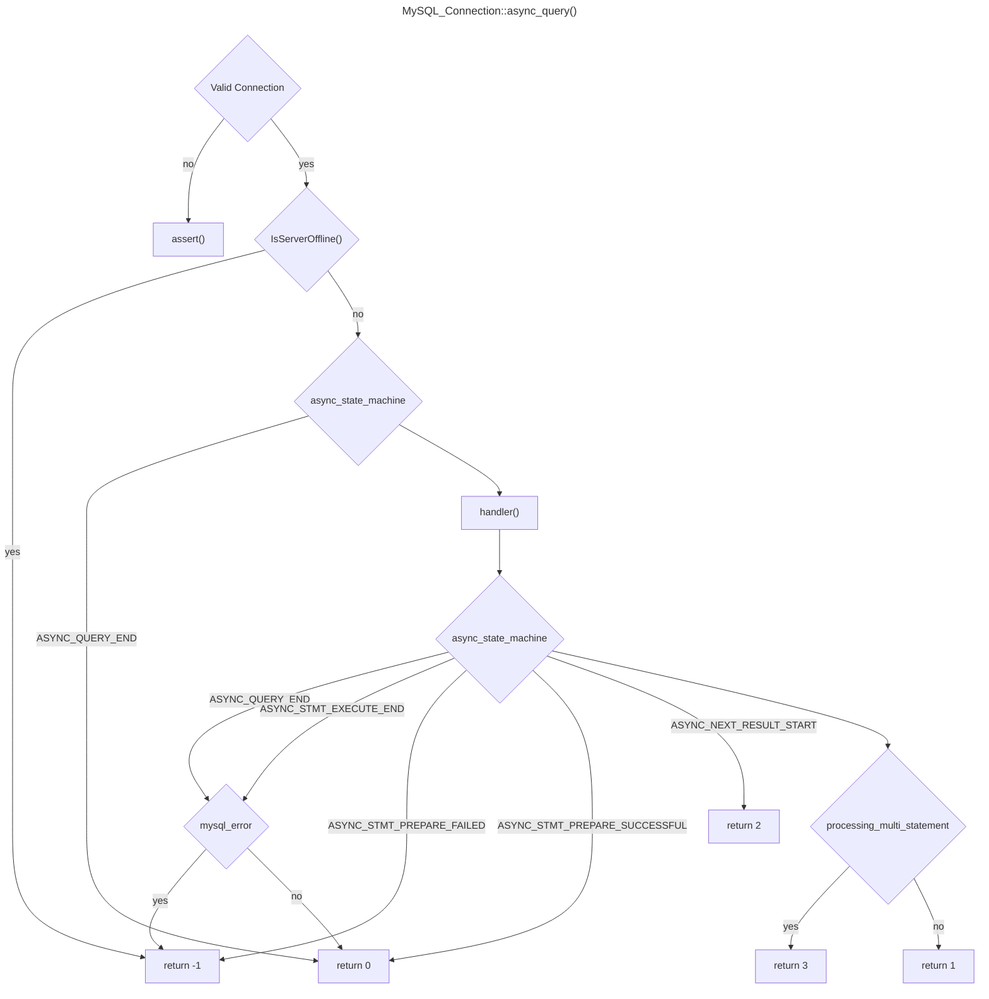
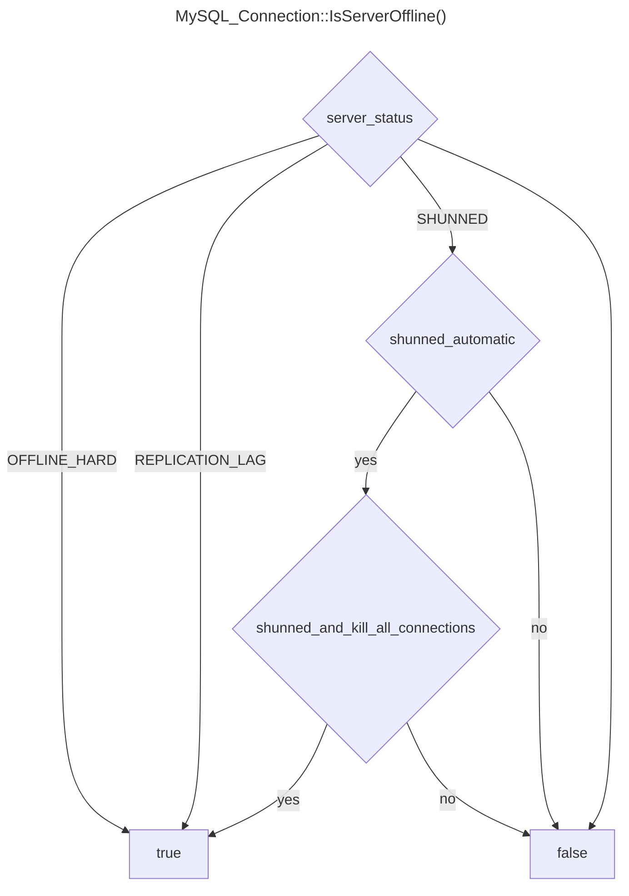

### Flowchart of `MySQL_Connection::async_query()`

This function asynchronously executes a query on the MySQL connection.  
It handles various states of the asynchronous query execution process and returns appropriate status codes indicating the result of the execution.

Returns an integer status code indicating the result of the query execution:
- 0: Query execution completed successfully.
- -1: Query execution failed.
- 1: Query execution in progress.
- 2: Processing a multi-statement query, control needs to be transferred to MySQL_Session.
- 3: In the middle of processing a multi-statement query.

### Flowchart of `MySQL_Connection::IsServerOffline()`

