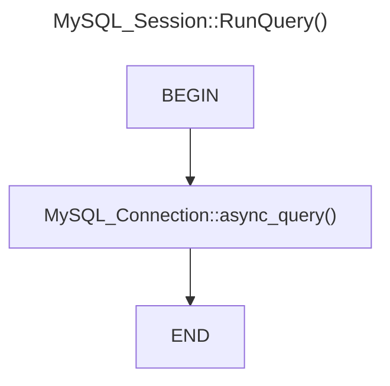
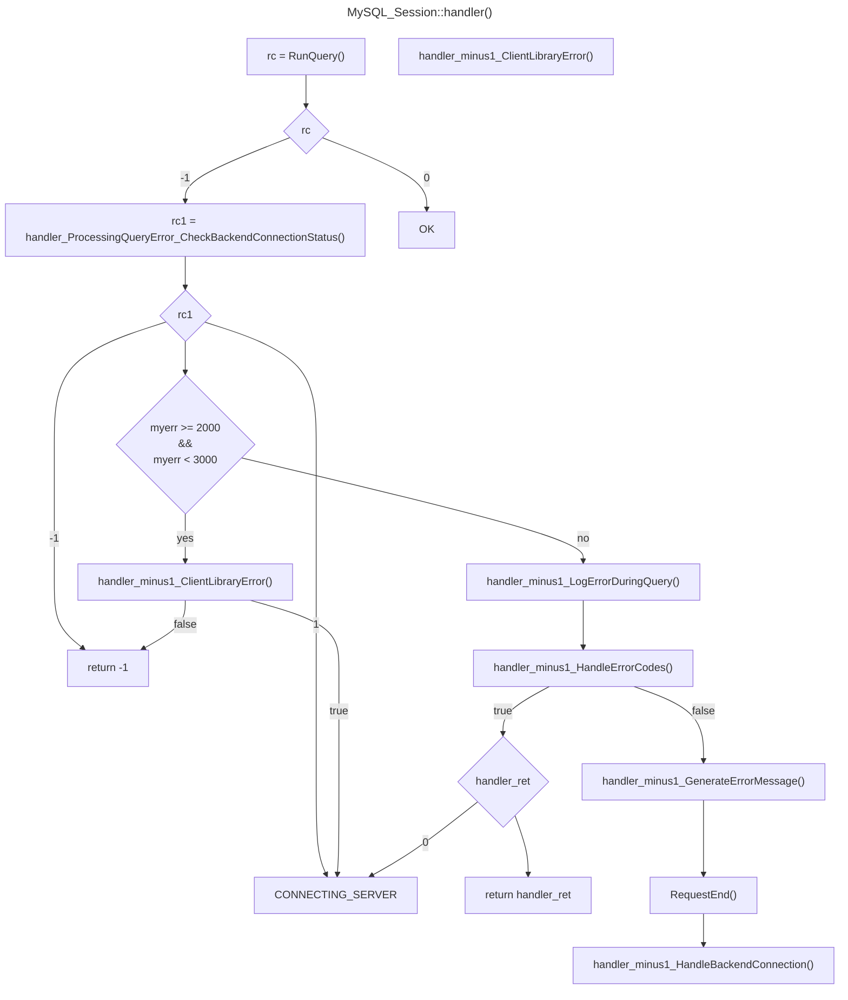

### Flowchart of `MySQL_Session::RunQuery()`

This function mostly calls `MySQL_Connection::async_query()` with the right arguments.  
Returns an integer status code indicating the result of the query execution:
- 0: Query execution completed successfully.
- -1: Query execution failed.
- 1: Query execution in progress.
- 2: Processing a multi-statement query, control needs to be transferred to MySQL_Session.
- 3: In the middle of processing a multi-statement query.

### Flowchart of `MySQL_Session::handler()`

WORK IN PROGRESS

### Flowchart of `MySQL_Session::handler_ProcessingQueryError_CheckBackendConnectionStatus()`
TODO
