# Sequence Diagrams during authentication

The initial handshake is what described in the MySQL protocol.

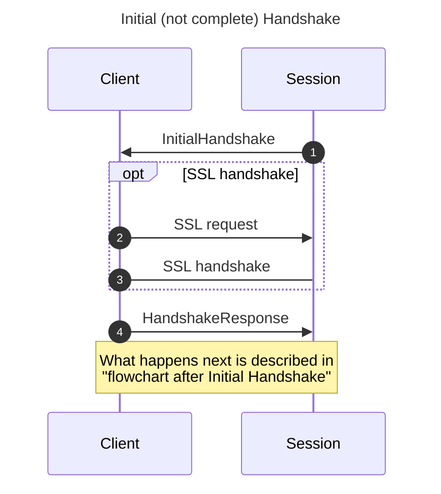

1. implemented in `MySQL_Protocol::generate_pkt_initial_handshake()`
2. performed by the client
3. implemented in `handler___status_CONNECTING_CLIENT___STATE_SERVER_HANDSHAKE()` and `MySQL_Protocol::process_pkt_handshake_response()` 
4. performed by the client

## flowchart after Initial Handshake

After the Initial Handshake (described above) different sequences are possible. In here we can distinguish sequences based on the authentication plugin based by ProxySQL and the Client, resulting in 4 different sequences.

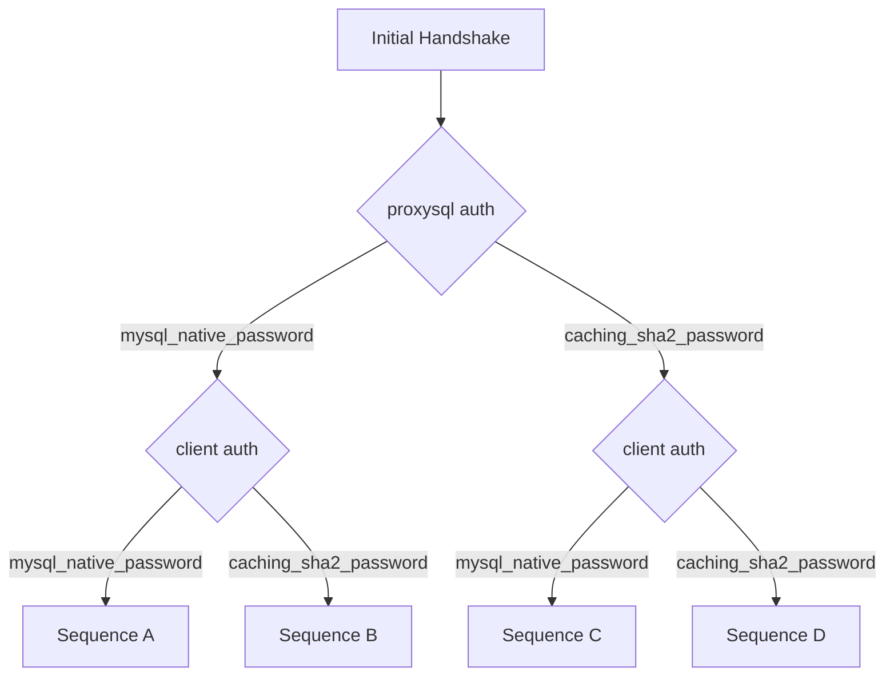

## Sequence A
ProxySQL: mysql_native_password
 
client: mysql_native_password
 
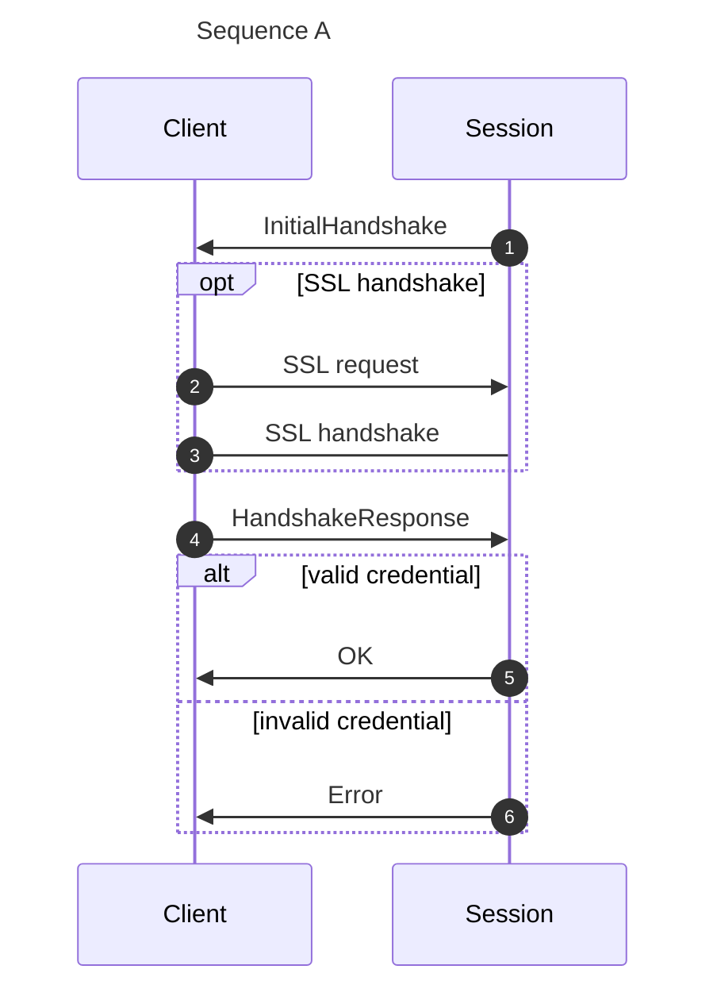

 

## Sequence B
ProxySQL: mysql_native_password
 
client: caching_sha2_password
 

When ProxySQL uses `mysql_native_password` but client uses `caching_sha2_password` , ProxySQL askes the client to switch to `mysql_native_password`.
The client can either:
* perform the authentication using `mysql_native_password` (point 6)
* disconnect (point 9)

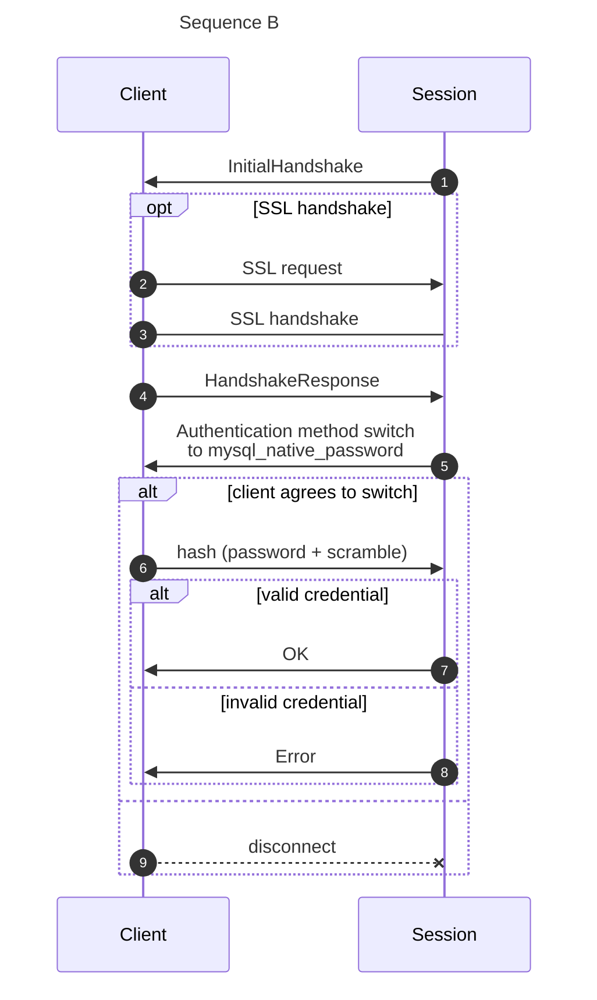

 
 

## State Diagram of MySQL_Session during authentication

When a new session is created the status `session_status___NONE` is assigned by default.  
After the initial handshake is sent, the status is set to `CONNECTING_CLIENT`.  
The status is finally changed to `WAITING_CLIENT_DATA` if the authentication is completed. If the authentication is not successful the session is simply destroyed.
 
 
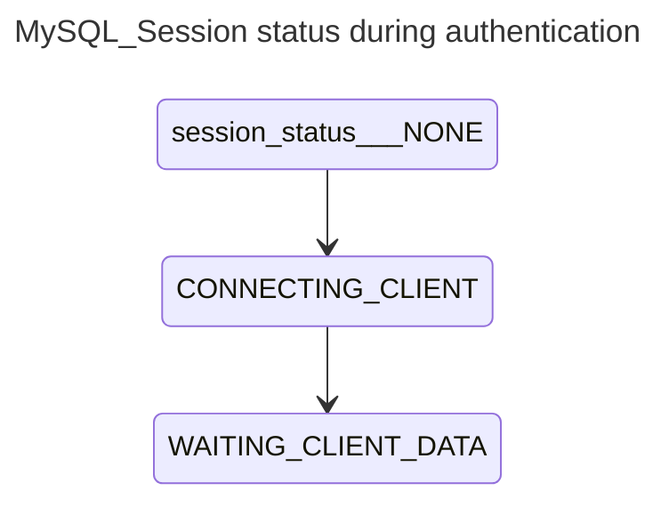

 
 

## Generic flowchart of authentication (without subgraphs)
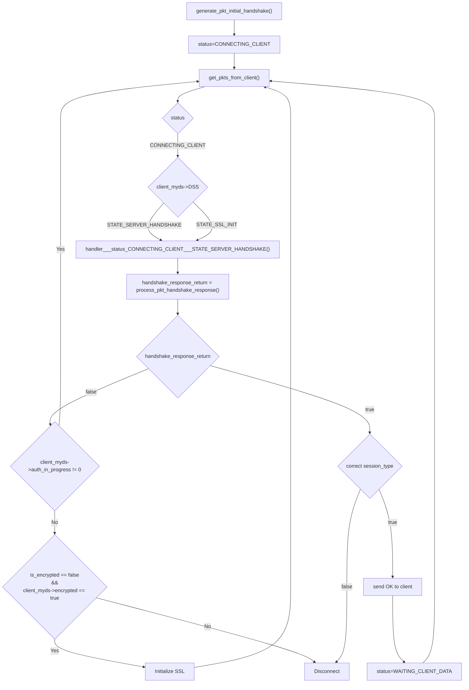
 

After the initial handshake is sent and , `status` is set to `CONNECTING_CLIENT`.  
The main routine in `MySQL_Session` is `handler()` , and one of the main function it calls is `get_pkts_from_client()`.  
As the name suggests, `get_pkts_from_client()` is responsible from retrieving packets sent by the client: then it performs actions based on `status`.  
During authentication only `status==CONNECTING_CLIENT` is relevant.  
If `status==CONNECTING_CLIENT` and `client_myds->DSS` (`client_myds` represents the Client `MySQL_Data_Stream` , and `DSS` respesents its status) is either `STATE_SERVER_HANDSHAKE` or `STATE_SSL_INIT` , then `handler___status_CONNECTING_CLIENT___STATE_SERVER_HANDSHAKE()` is executed.  
`handler___status_CONNECTING_CLIENT___STATE_SERVER_HANDSHAKE()` calls `process_pkt_handshake_response()` and performs actions based on its return code.

`process_pkt_handshake_response()` historically was responsible for only processing **HandshakeResponse** packet, but over time became more complex to also handle **SSL Handshake** , **Authentication method switch** , **Fast Authentication** and **Full Authentication** . The details of `process_pkt_handshake_response()` will be described in more detailed flowcharts and diagrams.  
For now it is worth to note that `process_pkt_handshake_response()` returns:
*  `true` when authentication succeeded
* `false` when authentication failed or it is not completed yet (other status variables needs to ne evaluated)

If `handshake_response_return`:
* `true` : if `session_type` is correct (for example, a user defined in `mysql_users` table is not trying to connect to Admin, or viceversa) , the authentication succeeded, an OK packet is sent to the client, and status is changed to `WAITING_CLIENT_DATA` 
* `false` :
    * if authentication is still in progress : continue
    * if SSL has been required: initialize SSL and: continue
    * else: wrong credentials, disconnect

Below is the same flowchart with subgraphs.

## Generic flowchart of authentication (with subgraphs)
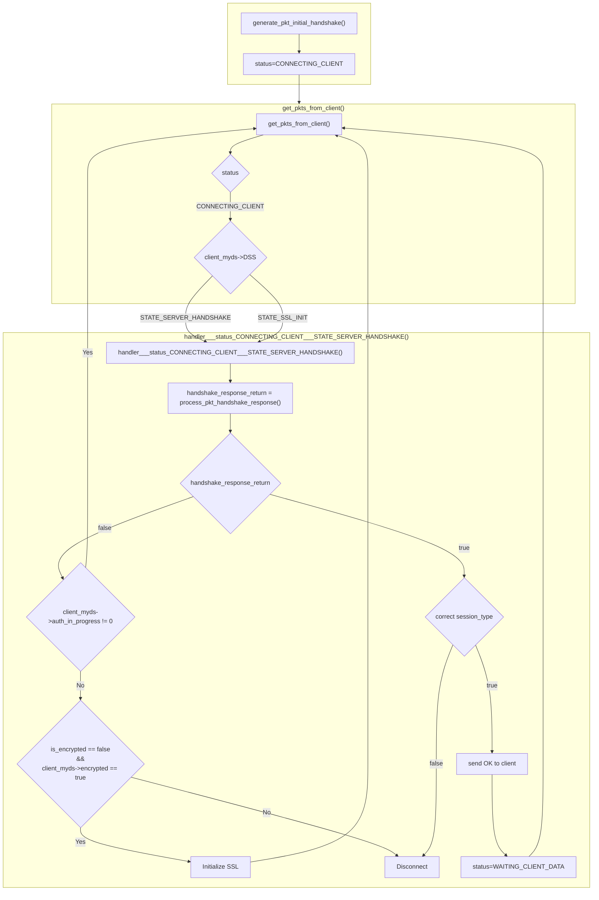

See description in previous flowchart.  

## Details about `MySQL_Protocol::process_pkt_handshake_response()`

Because `MySQL_Protocol::process_pkt_handshake_response()` grew over time and was then split into multiple methods, variables are passed to and from methods using 2 objects of the following 2 classes:

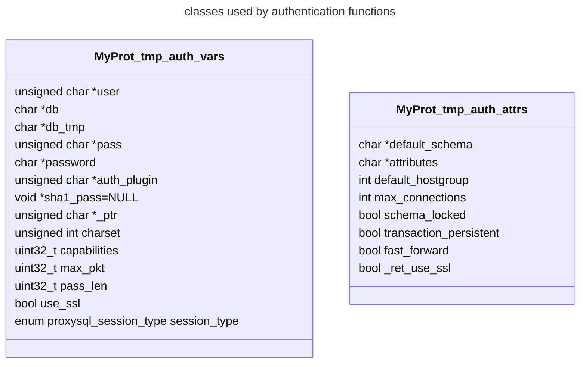

### Flowchart of `MySQL_Protocol::process_pkt_handshake_response()`

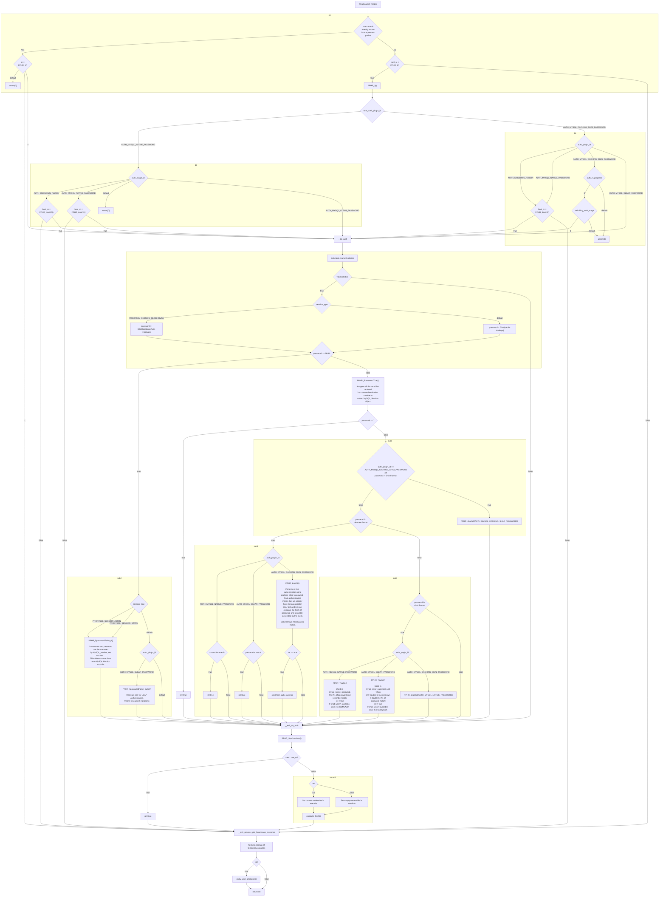

### Flowchart of `MySQL_Protocol::PPHR_1()`

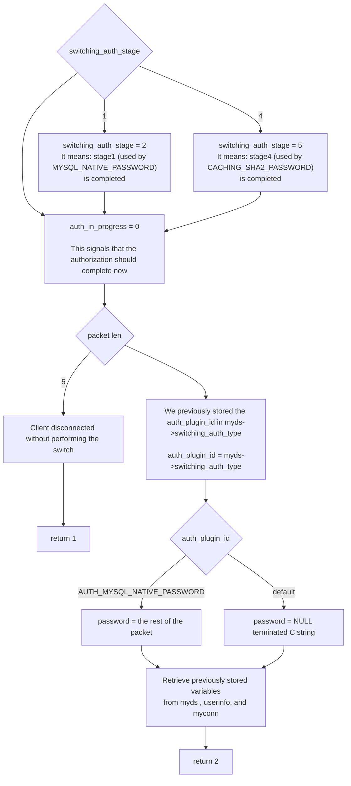

### Flowchart of `MySQL_Protocol::PPHR_2()`

This method is the one responsible for parsing the very first Handshake Response from the client.

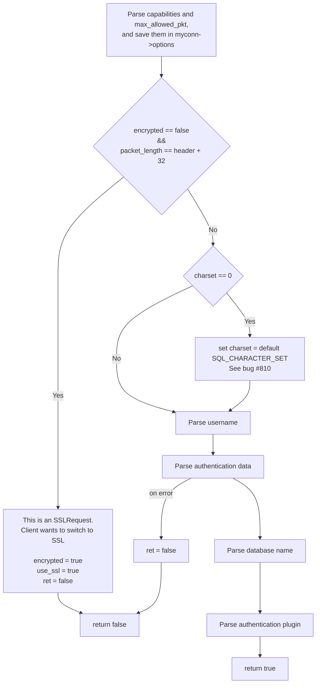

### Flowchart of `MySQL_Protocol::PPHR_3()`

This method is the one responsible for detecting the authentication plugin to use .  
It opererates on three variables with similar names:
* `vars1.auth_plugin` : the plugin that the client wish to use
* `sent_auth_plugin_id` : member of `MySQL_Protocol` . It defines which default plugin was sent by ProxySQL to the client
* `auth_plugin_id` : member of `MySQL_Protocol` . It defines which plugin is being used

It is worth noticing that any unknown plugin is threated as unknown.  
Also, if ProxySQL sends `mysql_native_password` and the client sends `caching_sha2_password` , ProxySQL will threat it as unknown, then forcing the client to switch to `mysql_native_password`.

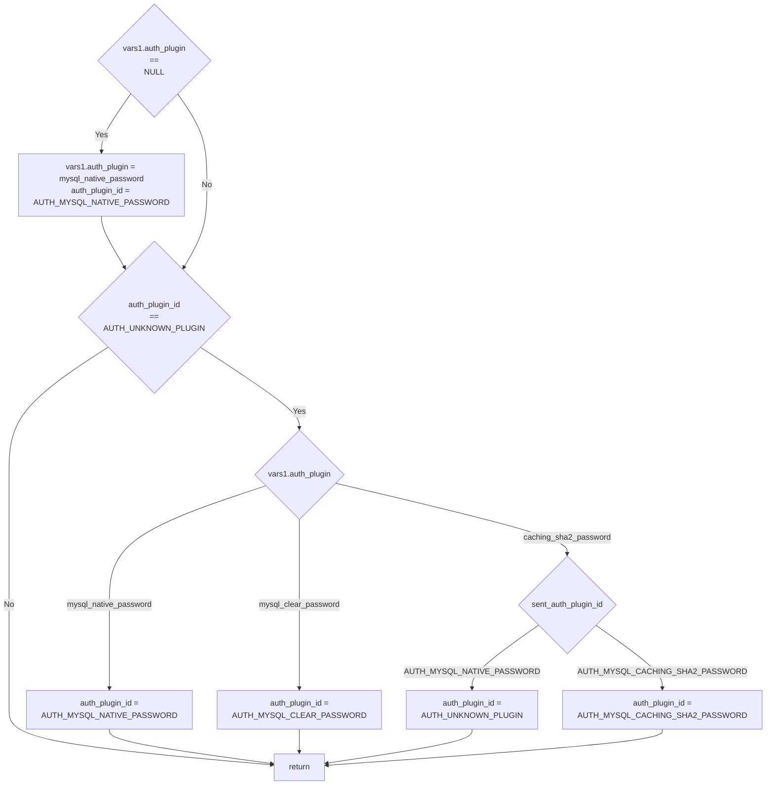

### Flowchart of `MySQL_Protocol::PPHR_4auth0()`

TODO

### Flowchart of `MySQL_Protocol::PPHR_4auth1()`

This method is the one responsible for determining if ProxySQL can switch authentication to `mysql_clear_password` for LDAP plugin.  
At its core, it verify that the requested user doesn't exist.

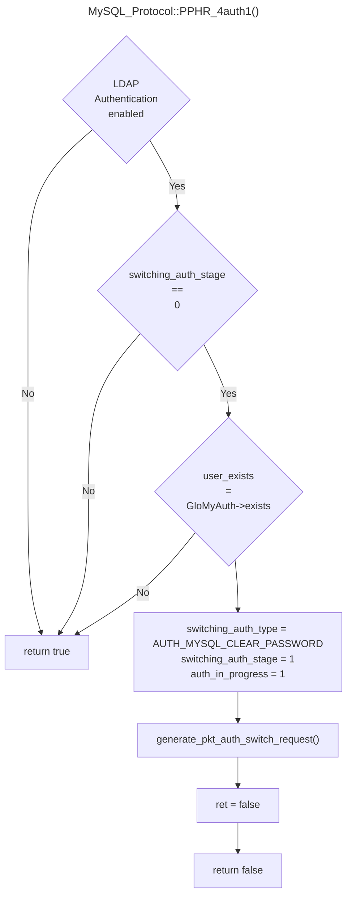

### `MySQL_Protocol::PPHR_5passwordTrue()`

Give all the attributes received from the Authentication module in `MyProt_tmp_auth_attrs& attr1` , `MySQL_Protocol::PPHR_5passwordTrue()` is responsible for assigning all the variables to related `MySQL_Session` object.

### `MySQL_Protocol::PPHR_5passwordFalse_0()`

If `username` and `password` are the one used by `MySQL_Monitor` , set `ret=true` .  
This allows connections from MySQL Monitor module.

### `MySQL_Protocol::PPHR_5passwordFalse_auth2()`

TODO: document

### `MySQL_Protocol::PPHR_6auth2()`

Documented in the flowchart

### `MySQL_Protocol::PPHR_7auth1()`

Used for `mysql_native_password` authentication.
If SHA1 of password and scramble match, then sets `ret=true`.  
If sha1 wasn't previous available, save it in `GloMyAuth` calling `GloMyAuth->set_SHA1()` .
Also set it in `userinfo->sha1_pass`.

### `MySQL_Protocol::PPHR_7auth2()`

Used for `mysql_clear_password` authentication when password is saved as double SHA1.
If the double SHA1 password match then sets `ret=true`.  
If sha1 wasn't previous available, save it in `GloMyAuth` calling `GloMyAuth->set_SHA1()` .
Also set it in `userinfo->sha1_pass`.

### Flowchart of `MySQL_Protocol::PPHR_sha2full()`

This method is the one responsible to perform (start, or continue/complete) `caching_sha2_password` full authentication.  
If `switching_auth_stage`:
* 0 : set it to 4, and **start** full authentication
* 5 : **continue/complete** full authentication

This function receives in `passformat` the format of the known password.

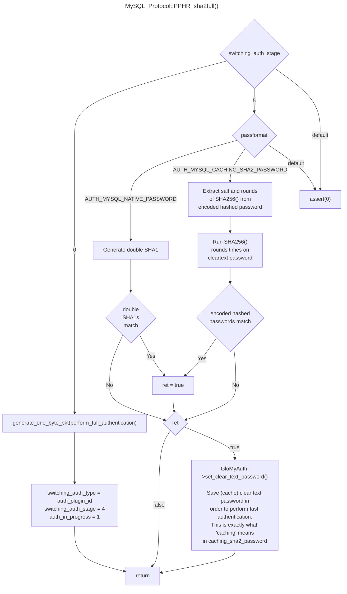
