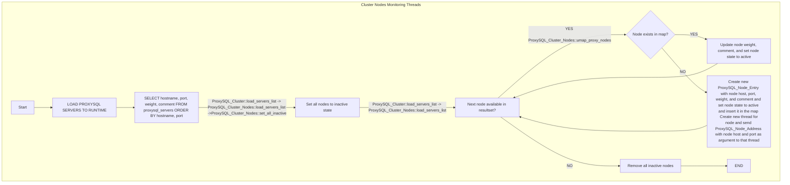
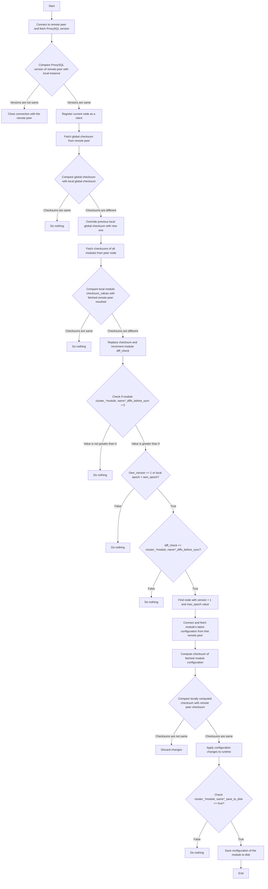

# Introduction
This documentation provides an in-depth look at the internal workings of the ProxySQL Cluster feature. It is intended for readers who are already familiar with the basic concepts and functionality of ProxySQL Cluster.

# Prerequisites
Before reading this documentation, it is mandatory that the reader has gone through the official ProxySQL Cluster documentation available at [https://proxysql.com/documentation/proxysql-cluster/](https://proxysql.com/documentation/proxysql-cluster/). This will provide the necessary background knowledge and understanding of terminologies to understand the internal workings of the feature.

# Important classes used by ProxySQL Cluster
This section describes the classes that are used by the ProxySQL Cluster feature.

## ProxySQL_Cluster
The `ProxySQL_Cluster` class is the core component for managing ProxySQL clusters. It provides a wide range of operations and functionalities to handle and manage the cluster effectively. With `ProxySQL_Cluster`, you can add or remove nodes, manage node weights, monitor cluster status, and perform other essential tasks.

## ProxySQL_Node_Entry
The `ProxySQL_Node_Entry` class represents an individual node within a ProxySQL cluster. It serves as a container for storing information and provides convenient methods to access node-specific details. It consists of important node attributes such as its status, weight, connection statistics, and contains global_checksum and checksum, epoch and version of individual modules of that node.

## ProxySQL_Cluster_Nodes
The `ProxySQL_Cluster_Nodes` class serves as a centralized manager for all the nodes within a ProxySQL cluster. It provides a cohesive interface to handle operations related to the entire cluster's nodes efficiently. Through the `ProxySQL_Cluster_Nodes` class, you can easily manage and manipulate various node-specific actions within the cluster context. It consists of an unordered map that contains all the nodes.

## ProxySQL_Node_Address
The `ProxySQL_Node_Address` class represents a ProxySQL node's address and encapsulates the hostname, port, node UUID, admin_mysql_ifaces, and optional IP address.

## ProxySQL_GlobalVariables
The `ProxySQL_GlobalVariables` class contains checksum, epoch, and version of individual modules of the current ProxySQL instance. It provides a way to access and manage the global variables related to the ProxySQL Cluster.

## ProxySQL_Checksum_Value
The `ProxySQL_Checksum_Value` class is used to store checksum values for modules. It includes member variables such as version and epoch to keep track of the version and epoch of the checksum value.

# Initializing Monitoring Threads
Each node within the ProxySQL cluster monitors core nodes to identify any updates in module configuration. This is achieved by dedicating a separate thread for each core node, for continuous monitoring for changes.

## Load ProxySQL Servers
When the ProxySQL instance is started or the `LOAD PROXYSQL SERVERS TO RUNTIME` command is executed, the latest `proxysql_servers` table records are fetched from the database. This result set is passed to the ProxySQL Cluster's `load_servers_list` method.

## Initialize ProxySQL Cluster Nodes
The retrieved result set is used to initialize the ProxySQL Cluster Nodes. The `load_servers_list` method of `ProxySQL_Cluster_Nodes` creates a map of all the nodes by utilizing the `ProxySQL_Node_Entry` objects. Each `ProxySQL_Node_Entry` object represents a node in the cluster and holds information such as the host, port, weight, and comment of the node.

## Mark all nodes Inactive
Mark all the nodes in the `ProxySQL_Cluster_Nodes` map as inactive.

## Check Node Existence and Update
For each node in the retrieved result set, the existence of the node is checked within the `ProxySQL_Cluster_Nodes` map. If the node already exists in the map, it is marked as active, and any changes in the weights and comments are updated accordingly.

## Create New Node Entry
If a node does not exist in the map, a new `ProxySQL_Node_Entry` object is created for that node. The `ProxySQL_Node_Entry` is initialized with the host, port, weight, and comment of the node. This new entry is then inserted into the ProxySQL Cluster Nodes map.

## Create Monitoring Thread
Subsequently, a monitoring thread is created for each node in the ProxySQL cluster. These monitoring threads are responsible for effectively managing and monitoring the status and performance of each node. The `ProxySQL_Node_Address`, containing the host and port of the node, is passed as an argument to the monitoring thread.

## Remove Inactive Nodes
After iterating through all the entries in the result set and performing the necessary operations, any inactive nodes present in the `ProxySQL_Cluster_Nodes` map are deleted. This ensures that only active and relevant nodes remain within the cluster.

## Flowchart:

# Monitoring Thread Working
This section describes how each monitoring thread representing a specific ProxySQL cluster node performs its operations.

## Check ProxySQL Version
The thread compares the ProxySQL version of the node with the local instance's ProxySQL version by executing the `SELECT @@version` query. If the versions do not match, the connection with the remote peer is terminated.

## Register Node
If the versions match, `PROXYSQL CLUSTER_NODE_UUID ProxySQL_GlobalVariables::uuid ProxySQL_Cluster::admin_mysql_ifaces` command is sent to the remote peer to register current node as a client.

## Global Checksum
Global checksum is fetched from the remote peer by sending `SELECT GLOBAL_CHECKSUM()` query. The resultset is passed to the `ProxySQL_Cluster::Update_Global_Checksum` method, which finds the corresponding `ProxySQL_Node_Entry` in the `ProxySQL_Cluster_Nodes` map. If the new global checksum is different from the previously saved one, the global checksum is updated in the `ProxySQL_Node_Entry`.

## Module Checksum
If the global checksum is updated, indicating changes in one or more modules. `SELECT * FROM runtime_checksums_values ORDER BY name` query is sent to the remote peer to fetch the latest checksums of all modules, including epoch and version.

## Compare and Update Checksums
The resultset of the query is passed to the `ProxySQL_Cluster::Update_Node_Checksums` method, which finds the corresponding `ProxySQL_Node_Entry` in the `ProxySQL_Cluster_Nodes` map. The method then compares the checksum values of each module with the recently fetched resultset. If a checksum value is different, it is replaced with the latest one in the `ProxySQL_Node_Entry`, and the diff_check of that module is incremented.

## Sync Configuration
For each module that has a `ProxySQL_Cluster::cluster_<i>*module_name*</i>_diffs_before_sync` value greater than zero, indicating that the module is enabled for syncing, the thread proceeds to check the node's version and epoch. If the node's version is greater than 1 and own_version is equal to 1 (means instance is just booted) or node's epoch is greater than own_epoch, then it checks diff_check. If diff_check is greater than `ProxySQL_Cluster::cluster_<i>*module_name*</i>_diffs_before_sync`, it fetches latest configuration of that module using `ProxySQL_Cluster::pull_<i>*module_name*</i>_from_peer` method.

## Select Sync Source
The thread calls `ProxySQL_Cluster_Nodes::get_peer_to_sync_<i>*module_name*</i>` to iterate over `ProxySQL_Cluster_Nodes` map and find a node with a version greater than 1 and maximum epoch value among all nodes. This node is selected as source of truth for syncing.

## Fetch and Apply Configuration
Connection is created to selected node using credentials obtained from `ProxySQL_Cluster::get_credentials` and fetches latest configuration for the module. After fetching configuration, it computes checksum locally and compares it with checksum received from node. If checksums match, changes are applied to runtime. Otherwise changes are discarded.

## Save Configuration
If "save to disk" variable is set to true, configuration of that module is saved to disk ensuring persistence.

## Flowchart (Simplified):

## Flowchart (Detailed):

```mermaid
graph TD
    subgraph ProxySQL_Cluster_Monitor_thread[ProxySQL_Cluster_Monitor_thread]
        direction TB
        A[Start] -- "ProxySQL_Cluster_Monitor_thread <br> ProxySQL_Node_Address -> host, port" --> B
        B[Connect to remote peer using host and port] --> C
        C["Send `SELECT @@version`"] -- "resultset contains remote peer ProxySQL version" --> D
        D{Remote peer ProxySQL version == Local PROXYSQL_VERSION?}
        D -- "No" --> CLOSE_CONNECTION
        D -- "Yes <br> Register yourself with a remote peer" --> E
        E["Send `PROXYSQL CLUSTER_NODE_UUID ProxySQL_GlobalVariables::uuid ProxySQL_Cluster::admin_mysql_ifaces`"] --> F 
        F{ProxySQL_GlobalVariables::shutdown == 0} 
        F -- "Yes <br> Fetch Global Checksum from remote peer" --> G
        F -- "No" --> CLOSE_CONNECTION
        G["Send `SELECT GLOBAL_CHECKSUM()`"] -- "resultset contains global checksum of remote peer <br> ProxySQL_Cluster::Update_Global_Checksum" --> I
        I{Local global checksum == Remote peer global checksum?} 
        I -- "Yes" --> AAA
        I -- "No" --> J
        J[Update local global checksum with remote peer global checksum value] -- "return checksum_updated = true <br> ProxySQL_Cluster_Monitor_thread <br><br> one or more module configuration had been changed. Fetching all the modules checksum, version and epoch from remote peer" --> K
        K["Send `SELECT * FROM runtime_checksums_values ORDER BY name`"] -- "resultset contains module name, checksum, version and epoch <br> ProxySQL_Cluster_Nodes::Update_Node_Checksums <br> ProxySQL_Node_Entry::set_checksums" --> M
        subgraph set_checksum[ProxySQL_Node_Entry::set_checksums]
            direction TB
            M[Load cluster_<i>*module_name*</i>_diffs_before_sync variables] --> N
            N{resultset != NULL && record availabe in resultset?} -- "Yes <br><br> **logic is same for all module: module name == admin_variables <br> module name == mysql_query_rules <br> module name == mysql_servers <br> module name == mysql_users <br> module name == mysql_variables <br> module name == proxysql_servers <br> module name == ldap_variables**" --> O
            O["Update local module version, epoch and last_updated value with the remote peer value"] --> P
            P{Local module checksum == Remote peer module checksum?} 
            P -- "Yes" --> Q
            P -- "No" --> S
            Q[Set local module diff_check += 1] --> T
            S[Update local module checksum with remote peer checksum value, last_changed to current time and diff_check = 1] --> T
            T{Own module checksum == Local module checksum?} 
            T -- "Yes" --> U
            T -- "No" --> N
            U[Set local module diff_check = 0] --> N
            N -- "No <br> cluster_<i>*module_name*</i>_diffs_before_sync variables" --> R
            R{resultset == NULL?} 
            R -- "Yes <br> For every module" --> YY
            YY[Set local module last_updated = current time] --> XX
            XX{Local module checksum == Own module version?} 
            XX -- "Yes" --> WW
            WW[Set local module diff_check = 0] --> V
            XX -- "No" --> VV
            VV[Set local module diff_check += 1] --> V
            V{cluster_<i>*module_name*</i>_diffs_before_sync variables != 0?} 
            V -- "Yes" --> W
            V -- "No" --> DELAY
            W{Local module version > 1?} 
            W -- "Yes" --> X
            W -- "No" --> V
            X{"Own module version == 1 || Local module epoch > Own module epoch?"} 
            X -- "Yes" --> Y
            X -- "No" --> V
            Y{Local module diff_check >= cluster_<i>*module_name*</i>_diffs_before_sync?}
            Y -- "No" --> V
            Y -- "Yes <br> ProxySQL_Cluster_Nodes::umap_proxy_nodes" --> Y1
            Y1["Find local node with version > 1 and max_epoch"] -- "ProxySQL_Cluster::pull_<i>*module_name*</i>_from_peer" --> Z
            Z["Connect to that remote peer and fetch latest module configuration"] --> AA
            AA["Locally compute checksum of fetched configuration"] --> BB
            BB{"Locally computed checksum == Remote peer checksum?"} 
            BB -- "Yes" --> DD
            BB -- "No" --> DELAY
            DD["Delete records in local module configuration table(s)"] --> EE
            EE["Insert retrieved data from remote peer into local module configuration table(s)"] --> FF
            FF["Issue internal `LOAD <i>*module_name*</i> TO RUNTIME`"] --> GG
            GG{"Check cluster_<i>*module_name*</i>_save_to_disk == true?"}
            GG -- "Yes" --> II
            GG -- "No" --> AAA
            II[Issue internal `SAVE <i>*module_name*</i> TO DISK`]
            II --> AAA
        end
        AAA{"Local cluster_check_status_frequency_count >= cluster_check_status_frequency?"}
        AAA -- "No" --> BBB
        AAA -- Yes --> DDD
        BBB[Set cluster_check_status_frequency_count += 1] --> DELAY
        DDD[Set cluster_check_status_frequency_count = 0] --> EEE
        EEE[Send `SELECT * FROM stats_mysql_global ORDER BY Variable_Name`] 
        EEE -- "resultset contains Client_Connections_connected, Client_Connections_created, ProxySQL_Uptime, Questions, Servers_table_version of remote peer <br> ProxySQL_Cluster_Nodes::Update_Node_Metrics <br> ProxySQL_Node_Entry::set_metrics" --> FFF
        subgraph set_metrics[ProxySQL_Node_Entry::set_metrics]
            direction TB
            FFF[Update local metrices with values from resultset] --> DELAY
        end
    DELAY[Sleep cluster_check_interval_ms] --> F
    CLOSE_CONNECTION[Close Connection] --> END
    END[End]
end
```
