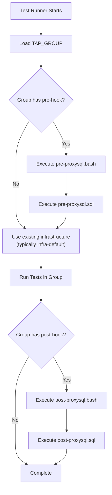
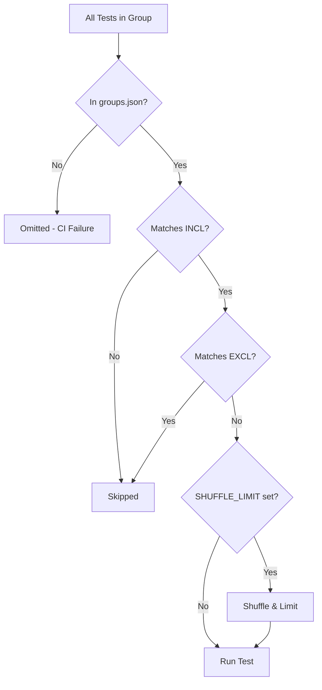

# TAP Test Groups

This document provides detailed information about the ProxySQL TAP test group system, including group configuration, hooks, and filtering mechanisms.

## 1. Overview

Test groups organize TAP tests by:
- **Infrastructure requirements** (MySQL version, PostgreSQL, ClickHouse)
- **ProxySQL configuration** (multiplexing, query digests)
- **Execution strategy** (parallel execution, randomized selection)

The group system enables:
- Running tests against specific database backends
- Testing ProxySQL behavior under different configurations
- Parallel execution in CI for faster feedback
- Selective test execution for focused testing

## 2. groups.json Structure

### 2.1 File Location

```
test/tap/groups/groups.json
```

### 2.2 Format

The file is a JSON object mapping test names to arrays of group names:

```json
{
  "test-name-t": ["group1-g1", "group2-g1", ...],
  "another-test-t": ["default-g1"],
  ...
}
```

### 2.3 Rules

1. **Every test MUST be registered** - Tests not in `groups.json` cause CI failure
2. **Test names include `-t` suffix** - Matches the executable name
3. **Group names use specific patterns** - See naming conventions below
4. **Tests can belong to multiple groups** - Enables testing across configurations

### 2.4 Example Entry

```json
{
  "basic-t": [
    "default-g1",
    "mysql-auto_increment_delay_multiplex=0-g1",
    "mysql-multiplexing=false-g1",
    "mysql-query_digests=0-g1",
    "mysql-query_digests_keep_comment=1-g1",
    "mysql84-g1",
    "mysql84-gr-g1",
    "mysql90-g1",
    "mysql90-gr-g1"
  ]
}
```

This test runs in:
- Default infrastructure (multi-backend)
- With various ProxySQL configuration variations
- Against MySQL 8.4 and 9.0 (standalone and Group Replication)

## 3. Group Types

### 3.1 Default Groups

Run tests against the standard multi-backend infrastructure (`infra-default`), which includes MySQL replication, Group Replication, Galera, ClickHouse, and PostgreSQL. See [Test Infrastructure, Section 2.2](tap_test_infra.md#22-default-infrastructure-components) for details.

| Group | Purpose |
|-------|---------|
| `default-g1` | Parallel batch 1 |
| `default-g2` | Parallel batch 2 |
| `default-g3` | Parallel batch 3 |
| `default-g4` | Parallel batch 4 |

### 3.2 MySQL Version Groups

Test against specific MySQL versions. Each infrastructure runs a 3-node replication cluster. See [Test Infrastructure, Section 2.1](tap_test_infra.md#21-infrastructure-types) for details.

| Group | Infrastructure | MySQL Version |
|-------|----------------|---------------|
| `mysql84-g1` | `infra-mysql84` | 8.4.x |
| `mysql84-gr-g1` | `infra-mysql84-gr` | 8.4.x (Group Replication) |
| `mysql90-g1` | `infra-mysql90` | 9.0.x |
| `mysql90-gr-g1` | `infra-mysql90-gr` | 9.0.x (Group Replication) |
| `mysql91-g1` | `infra-mysql91` | 9.1.x |
| `mysql91-gr-g1` | `infra-mysql91-gr` | 9.1.x (Group Replication) |
| `mysql92-g1` | `infra-mysql92` | 9.2.x |
| `mysql92-gr-g1` | `infra-mysql92-gr` | 9.2.x (Group Replication) |
| `mysql93-g1` | `infra-mysql93` | 9.3.x |
| `mysql93-gr-g1` | `infra-mysql93-gr` | 9.3.x (Group Replication) |

### 3.3 Configuration Groups

Test ProxySQL behavior with specific variable settings. These groups run on `infra-default` and only modify ProxySQL configuration via SQL hooks.

| Group | Setting | Purpose |
|-------|---------|---------|
| `mysql-multiplexing=false-g1` | `mysql-multiplexing='false'` | Test without connection multiplexing |
| `mysql-query_digests=0-g1` | `mysql-query_digests=0` | Test with query digests disabled |
| `mysql-query_digests_keep_comment=1-g1` | `mysql-query_digests_keep_comment=1` | Test with comments preserved in digests |
| `mysql-auto_increment_delay_multiplex=0-g1` | `mysql-auto_increment_delay_multiplex=0` | Test without auto-increment multiplex delay |

These groups have parallel variants (`-g2`, `-g3`, `-g4`) for load distribution.

### 3.4 Randomized/Filtered Groups

These groups run on `infra-default` and filter or shuffle tests using environment variables.

| Group | Behavior |
|-------|----------|
| `rand10_1` through `rand10_4` | Run 10 random tests (excluding AI tests) |
| `rand10_pg_1` | Run 10 random PostgreSQL tests |
| `rand5_admin_1` | Run 5 random admin tests |
| `ai-g1` | Run only AI/ML related tests |

The randomization happens at runtime via `TEST_PY_TAP_SHUFFLE_LIMIT`.

### 3.5 Unit Test Group

| Group | Purpose |
|-------|---------|
| `unit-tests-g1` | Self-contained unit tests requiring no infrastructure |

## 4. Group Naming Conventions

### 4.1 Pattern

```
{base-name}[-variant]-g{number}
```

Components:
- **base-name**: Infrastructure or configuration type
- **variant**: Optional modifier (e.g., `-gr` for Group Replication)
- **g{number}**: Parallel execution instance (g1, g2, g3, g4)

### 4.2 Examples

| Group Name | Base | Variant | Instance |
|------------|------|---------|----------|
| `default-g1` | default | - | 1 |
| `mysql84-gr-g1` | mysql84 | gr | 1 |
| `mysql-multiplexing=false-g2` | mysql-multiplexing=false | - | 2 |

### 4.3 Deriving Infrastructure from Group Name

The infrastructure directory is derived from the group name by:

1. Removing the parallel instance suffix (`-g1`, `-g2`, etc.)
2. Removing any underscore suffix (e.g., `_1`, `_2`)
3. Prefixing with `infra-`

| Group Name | Infrastructure Directory |
|------------|-------------------------|
| `mysql84-g1` | `infra-mysql84` |
| `mysql90-gr-g1` | `infra-mysql90-gr` |
| `default-g1` | `infra-default` |

## 5. Group Hooks

### 5.1 Hook Directory Structure

```
test/tap/groups/
├── groups.json
├── {group-base}/
│   ├── pre-proxysql.bash    # Bash hook (infrastructure setup)
│   ├── pre-proxysql.sql     # SQL hook (ProxySQL configuration)
│   ├── env.sh               # Environment variables
│   ├── post-proxysql.bash   # Post-test bash cleanup
│   └── post-proxysql.sql    # Post-test SQL cleanup
```

Note: The directory uses the **base name** (without `-g{N}` suffix).

### 5.2 Hook Execution Order



### 5.3 Pre-Hook: `pre-proxysql.bash`

Used for infrastructure setup. Executed as a bash script.

**Example: `mysql84/pre-proxysql.bash`**

```bash
#!/usr/bin/env bash

# Derive infrastructure name from directory
INFRA=infra-$(basename $(dirname "$0") | sed 's/-g[0-9]//' | sed 's/_.*//')

# Destroy previous infrastructure
$JENKINS_SCRIPTS_PATH/$INFRA/docker-compose-destroy.bash || true

# Clean ProxySQL configuration
mysql -h127.0.0.1 -P6032 -uadmin -padmin <<EOF
DELETE FROM mysql_users;
DELETE FROM mysql_servers;
DELETE FROM mysql_query_rules;
LOAD MYSQL USERS TO RUNTIME;
LOAD MYSQL SERVERS TO RUNTIME;
LOAD MYSQL QUERY RULES TO RUNTIME;
EOF

# Load infrastructure environment
source $JENKINS_SCRIPTS_PATH/$INFRA/.env

# Start containers
$JENKINS_SCRIPTS_PATH/$INFRA/docker-compose-init.bash

# Configure ProxySQL with new backend
mysql -h127.0.0.1 -P6032 -uadmin -padmin <<EOF
INSERT INTO mysql_servers (hostgroup_id, hostname, port) 
VALUES (0, '$MYSQL_HOST', $MYSQL_PORT);
INSERT INTO mysql_users (username, password, default_hostgroup) 
VALUES ('testuser', 'testuser', 0);
LOAD MYSQL SERVERS TO RUNTIME;
LOAD MYSQL USERS TO RUNTIME;
SAVE MYSQL SERVERS TO DISK;
SAVE MYSQL USERS TO DISK;
EOF

# Wait for stabilization
sleep 10
```

### 5.4 Pre-Hook: `pre-proxysql.sql`

Used for ProxySQL configuration. Executed line-by-line against admin interface.

**Example: `mysql-multiplexing=false/pre-proxysql.sql`**

```sql
# proxysql settings
SET mysql-multiplexing='false';
LOAD MYSQL VARIABLES TO RUNTIME;
SAVE MYSQL VARIABLES TO DISK;
```

**Example: `mysql-query_digests=0/pre-proxysql.sql`**

```sql
SET mysql-query_digests=0;
LOAD MYSQL VARIABLES TO RUNTIME;
SAVE MYSQL VARIABLES TO DISK;
```

### 5.5 Environment Hook: `env.sh`

Used for test filtering and selection. Sourced before test execution.

**Example: `ai/env.sh`**

```bash
export TEST_PY_TAP_INCL="ai_.*-t anomaly_.*-t genai.*-t mcp.*-t nl2sql_.*-t test_mcp.*-t vector.*-t"
```

**Example: `rand10_1/env.sh`**

```bash
export TEST_PY_TAP_SHUFFLE_LIMIT=10
export TEST_PY_TAP_EXCL="ai_.*-t anomaly_.*-t genai.*-t mcp.*-t nl2sql_.*-t test_mcp.*-t vector.*-t"
```

**Example: `rand10_pg_1/env.sh`**

```bash
export TEST_PY_TAP_SHUFFLE_LIMIT=10
export TEST_PY_TAP_INCL="pgsql.*-t"
```

## 6. Environment Variable Filtering

### 6.1 Include Pattern: `TEST_PY_TAP_INCL`

Only run tests matching the regex pattern.

```bash
# Run only PostgreSQL tests
export TEST_PY_TAP_INCL="pgsql.*-t"

# Run only admin-related tests
export TEST_PY_TAP_INCL=".*admin.*-t"

# Run multiple patterns (space-separated)
export TEST_PY_TAP_INCL="ai_.*-t mcp.*-t vector.*-t"
```

### 6.2 Exclude Pattern: `TEST_PY_TAP_EXCL`

Skip tests matching the regex pattern.

```bash
# Exclude AI tests
export TEST_PY_TAP_EXCL="ai_.*-t anomaly_.*-t"

# Exclude slow tests
export TEST_PY_TAP_EXCL=".*_large.*-t .*_stress.*-t"
```

### 6.3 Shuffle and Limit: `TEST_PY_TAP_SHUFFLE_LIMIT`

Randomly select N tests from the available pool.

```bash
# Run 10 random tests
export TEST_PY_TAP_SHUFFLE_LIMIT=10

# Combined with INCL/EXCL
export TEST_PY_TAP_SHUFFLE_LIMIT=5
export TEST_PY_TAP_INCL="pgsql.*-t"
# Result: 5 random PostgreSQL tests
```

### 6.4 Filtering Order



## 7. Creating New Groups

### 7.1 For a New Infrastructure

1. **Create infrastructure** in jenkins-build-scripts:
   ```
   jenkins-build-scripts/infra-your-backend/
   ├── docker-compose.yml
   ├── docker-compose-init.bash
   ├── docker-compose-destroy.bash
   └── .env
   ```

2. **Create group directory**:
   ```bash
   mkdir -p test/tap/groups/your-backend
   ```

3. **Create pre-hook**:
   ```bash
   # test/tap/groups/your-backend/pre-proxysql.bash
   #!/usr/bin/env bash
   
   INFRA=infra-$(basename $(dirname "$0") | sed 's/-g[0-9]//')
   
   # Start infrastructure
   $JENKINS_SCRIPTS_PATH/$INFRA/docker-compose-init.bash
   
   # Configure ProxySQL
   mysql -h127.0.0.1 -P6032 -uadmin -padmin -e "
     INSERT INTO mysql_servers (hostgroup_id, hostname, port) 
     VALUES (0, 'your-backend-host', 3306);
     LOAD MYSQL SERVERS TO RUNTIME;
   "
   
   sleep 10
   ```

4. **Add tests to groups.json**:
   ```json
   "your_backend_test-t": ["your-backend-g1"]
   ```

### 7.2 For a Configuration Variation

1. **Create group directory**:
   ```bash
   mkdir -p test/tap/groups/mysql-your_setting=value
   ```

2. **Create SQL hook**:
   ```sql
   # test/tap/groups/mysql-your_setting=value/pre-proxysql.sql
   SET mysql-your_setting='value';
   LOAD MYSQL VARIABLES TO RUNTIME;
   SAVE MYSQL VARIABLES TO DISK;
   ```

3. **Add tests to groups.json**:
   ```json
   "test_affected_by_setting-t": [
     "default-g1",
     "mysql-your_setting=value-g1"
   ]
   ```

### 7.3 For Filtered Execution

1. **Create group directory**:
   ```bash
   mkdir -p test/tap/groups/your-filter
   ```

2. **Create env hook**:
   ```bash
   # test/tap/groups/your-filter/env.sh
   export TEST_PY_TAP_INCL="your_pattern.*-t"
   export TEST_PY_TAP_SHUFFLE_LIMIT=10
   ```

3. **Note**: Filtered groups don't need entries in `groups.json` for individual tests - they filter from all available tests.

## 8. Best Practices

### 8.1 Test Registration

- **Always add new tests to `groups.json`** before merging
- **Start with `default-g1`** for new integration tests
- **Use `unit-tests-g1`** for pure unit tests
- **Distribute across parallel groups** (`-g1` to `-g4`) for balance

### 8.2 Group Selection

- **Use existing groups when possible** - Don't create unnecessary groups
- **Add to MySQL version groups** only if version-specific behavior is tested
- **Add to configuration groups** if the test validates specific settings

### 8.3 Hook Development

- **Keep hooks idempotent** - Should work if run multiple times
- **Include cleanup at the start** - Don't assume clean state
- **Test hooks locally** before committing

### 8.4 Performance

- **Balance test distribution** across parallel groups

## Related Documents

- [tap_test_agent_skill.md](tap_test_agent_skill.md) - Main skill document
- [tap_test_guide.md](tap_test_guide.md) - How to write TAP tests
- [tap_test_infra.md](tap_test_infra.md) - Infrastructure details
