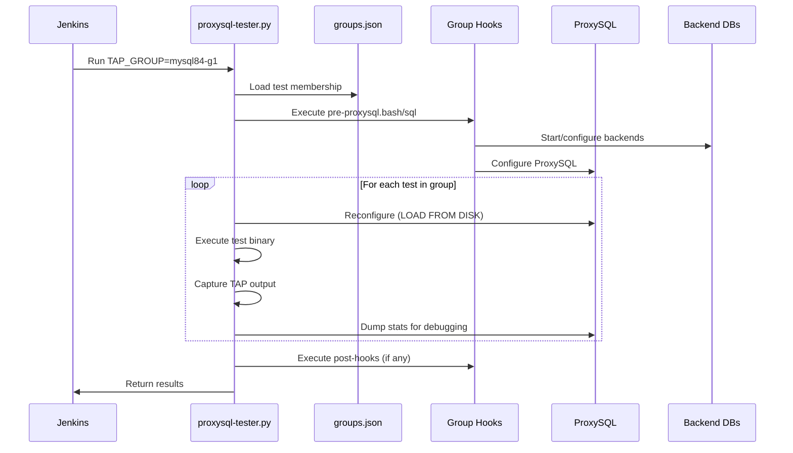

# TAP Test Infrastructure

This document describes the infrastructure components available for TAP testing. It serves as:

- A **reference for test writers** to understand the CI environment and available backends
- A **knowledge base for agentic workflows** to understand how tests execute in CI

## 1. Overview

The test infrastructure is managed by the [jenkins-build-scripts](https://github.com/ProxySQL/jenkins-build-scripts) repository, which contains:

- **Infrastructure definitions** - Docker Compose configurations for various database backends
- **ProxySQL configurations** - Config files and initialization scripts
- **Test runner scripts** - Python scripts that orchestrate test execution

TAP tests run against various backend database infrastructures managed by Docker Compose. The infrastructure provides:

- **Backend databases** (MySQL, PostgreSQL, ClickHouse, MariaDB)
- **ProxySQL instance** for testing
- **Network configuration** for connectivity
- **Environment variables** for test configuration

## 2. Test Runner

The `proxysql-tester.py` script orchestrates TAP test execution in CI.

### 2.1 Execution Overview

For each test group, the runner performs:

1. **Load group configuration** from `groups.json`
2. **Execute pre-hooks** (`pre-proxysql.bash`, `pre-proxysql.sql`)
3. **For each test:**
   - Reconnect to ProxySQL admin
   - Reconfigure ProxySQL (`LOAD * FROM DISK`, `LOAD * TO RUNTIME`)
   - Wait 5 seconds for stabilization
   - Execute test binary
   - Capture TAP output and return code
   - Dump runtime/stats tables for debugging
4. **Execute post-hooks** (if any)
5. **Report results**

### 2.2 Execution Flow



### 2.3 Environment Variables

#### Connection Variables

| Variable | Description | Default |
|----------|-------------|---------|
| `TAP_HOST` | ProxySQL host | `127.0.0.1` |
| `TAP_PORT` | ProxySQL MySQL port | `6033` |
| `TAP_ADMINHOST` | ProxySQL admin host | `127.0.0.1` |
| `TAP_ADMINPORT` | ProxySQL admin port | `6032` |
| `TAP_USERNAME` | Test user username | `testuser` |
| `TAP_PASSWORD` | Test user password | `testuser` |
| `TAP_ADMINUSERNAME` | Admin username | `admin` |
| `TAP_ADMINPASSWORD` | Admin password | `admin` |
| `TAP_MYSQLHOST` | Backend MySQL host | `127.0.0.1` |
| `TAP_MYSQLPORT` | Backend MySQL port | `3306` |

#### Test Runner Variables

| Variable | Description |
|----------|-------------|
| `TAP_GROUP` | Test group to execute |
| `TEST_PY_TAP_INCL` | Regex pattern for tests to include |
| `TEST_PY_TAP_EXCL` | Regex pattern for tests to exclude |
| `TEST_PY_TAP_SHUFFLE_LIMIT` | Limit number of tests (with shuffling) |
| `TEST_PY_TAP_REPEAT` | Number of times to repeat tests |
| `TEST_PY_EXIT_ON_FAIL_TEST` | Exit immediately on first failure |

### 2.4 Pre-Test Reconfiguration

Before each test, the runner resets ProxySQL state:

```sql
LOAD MYSQL VARIABLES FROM DISK;
LOAD MYSQL VARIABLES TO RUNTIME;
LOAD ADMIN VARIABLES FROM DISK;
LOAD ADMIN VARIABLES TO RUNTIME;
LOAD MYSQL USERS FROM DISK;
LOAD MYSQL USERS TO RUNTIME;
LOAD MYSQL SERVERS FROM DISK;
LOAD MYSQL SERVERS TO RUNTIME;
LOAD MYSQL QUERY RULES FROM DISK;
LOAD MYSQL QUERY RULES TO RUNTIME;
-- ... and similar for PostgreSQL, debug variables, etc.
```

This ensures each test starts with a clean, known state.

## 3. Available Infrastructures

### 3.1 Infrastructure Types

| Infrastructure | Backend | Purpose |
|----------------|---------|---------|
| `infra-default` | Multi-backend | Standard testing (MySQL, Galera, GR, ClickHouse, PostgreSQL) |
| `infra-mysql84` | MySQL 8.4 | MySQL 8.4 specific features |
| `infra-mysql84-gr` | MySQL 8.4 GR | MySQL 8.4 Group Replication |
| `infra-mysql90` | MySQL 9.0 | MySQL 9.0 specific features |
| `infra-mysql90-gr` | MySQL 9.0 GR | MySQL 9.0 Group Replication |
| `infra-mysql91` | MySQL 9.1 | MySQL 9.1 specific features |
| `infra-mysql91-gr` | MySQL 9.1 GR | MySQL 9.1 Group Replication |
| `infra-mysql92` | MySQL 9.2 | MySQL 9.2 specific features |
| `infra-mysql92-gr` | MySQL 9.2 GR | MySQL 9.2 Group Replication |
| `infra-mysql93` | MySQL 9.3 | MySQL 9.3 specific features |
| `infra-mysql93-gr` | MySQL 9.3 GR | MySQL 9.3 Group Replication |
| `infra-mariadb*` | MariaDB | MariaDB compatibility testing |
| `infra-pgsql16` | PostgreSQL 16 | PostgreSQL 16 testing |
| `infra-pgsql17` | PostgreSQL 17 | PostgreSQL 17 testing |
| `infra-clickhouse*` | ClickHouse | ClickHouse testing |

### 3.2 Default Infrastructure Components

The `infra-default` infrastructure starts multiple backend clusters for comprehensive testing:

| Component | Containers | Database Version | Ports | Purpose |
|-----------|------------|------------------|-------|---------|
| **MySQL Replication** | mysql1, mysql2, mysql3 | MySQL 5.7 | 13306-13308 | Primary/replica setup |
| **MySQL 5.7 GR** | mysqlgr1, mysqlgr2, mysqlgr3 | MySQL 5.7 | 14306-14308 | Group Replication (5.7) |
| **MySQL 8.0 GR** | mysql8gr1, mysql8gr2, mysql8gr3 | MySQL 8.0 | 14806-14808 | Group Replication (8.0) |
| **MySQL 8.0 Galera** | mysqlgal1, mysqlgal2, mysqlgal3, replica1 | MySQL 8.0 (Galera) | 15306-15309 | Galera cluster + async replica |
| **Binlog Reader** | mysqlbl1, mysqlbl2, mysqlbl3, reader1-3 | MySQL 5.7 | 19306-19308 | Binlog reader testing |
| **ClickHouse** | clickhouse | ClickHouse 22.5.1 | 9000, 8123 | ClickHouse backend |
| **MariaDB** | mariadb1, mariadb2, mariadb3 | MariaDB 10 | 17306-17308 | MariaDB replication |
| **PostgreSQL** | pgsql1 | PostgreSQL 16 | 15432 | PostgreSQL (v3.0+ only) |

**Note:** PostgreSQL containers are only started if ProxySQL supports PostgreSQL (version 3.0+).

## 4. Backend Hostgroups

Each infrastructure uses a unique set of hostgroup IDs to organize backends. Hostgroups are used to:

- **Route queries** to appropriate backends (writers vs readers)
- **Test failover scenarios** by manipulating hostgroup membership
- **Validate query routing rules** that direct traffic based on hostgroup

When writing tests that involve specific backend types (e.g., testing read/write splitting), you need to know the hostgroup IDs for the infrastructure your test runs on. You can query `runtime_mysql_servers` to discover the current hostgroup configuration, or reference the tables below.

### 4.1 Hostgroup Naming Convention

Infrastructures use a PREFIX-based naming scheme defined in their `.env` files:

| Variable | Meaning |
|----------|---------|
| `WHG` | Writer Hostgroup (primary) |
| `RHG` | Reader Hostgroup (replicas) |
| `BHG` | Backup Hostgroup |
| `OHG` | Offline Hostgroup |

The hostgroup ID is typically `${PREFIX}00`, `${PREFIX}01`, etc.

### 4.2 Default Infrastructure Hostgroups

Hostgroups for `infra-default` components:

| Component | Writer HG | Reader HG | Ports |
|-----------|-----------|-----------|-------|
| MySQL Replication | 50 | 60 | 13306-13308 |
| MySQL 5.7 GR | 1400 | 1401 | 14306-14308 |
| MySQL 8.0 GR | 14800 | 14801 | 14806-14808 |
| MySQL 8.0 Galera | 1500 | 1501 | 15306-15309 |
| Binlog Reader | 50 | 60 | 19306-19308 |
| MariaDB | 1700 | 1701 | 17306-17308 |

### 4.3 Version-Specific Infrastructure Hostgroups

| Infrastructure | PREFIX | Writer HG | Reader HG | Backup HG | Offline HG |
|----------------|--------|-----------|-----------|-----------|------------|
| `infra-mysql84` | 29 | 2900 | 2901 | 2902 | 2903 |
| `infra-mysql90` | 31 | 3100 | 3101 | 3102 | 3103 |

### 4.4 Discovering Hostgroups at Runtime

In your test, you can query the current hostgroup configuration:

```cpp
// Get all configured servers and their hostgroups
MYSQL_QUERY(admin, "SELECT hostgroup_id, hostname, port, status FROM runtime_mysql_servers");
```

## 5. Connection Details

### 5.1 ProxySQL Ports

| Port | Purpose | Environment Variable |
|------|---------|---------------------|
| 6032 | Admin interface | `TAP_ADMINPORT` |
| 6033 | MySQL protocol | `TAP_PORT` |
| 6034 | PostgreSQL protocol | `TAP_PGSQLPORT` |

### 5.2 Default Credentials

| User | Password | Purpose |
|------|----------|---------|
| `admin` | `admin` | ProxySQL admin |
| `testuser` | `testuser` | Test user (MySQL/PostgreSQL) |
| `root` | `root` or `rootpass` | Backend MySQL root |

### 5.3 Environment Variables

These are set by the test runner and available to your test:

```cpp
// Access via CommandLine class
CommandLine cl;
cl.getEnv();

// Available properties:
cl.host           // TAP_HOST (ProxySQL host)
cl.port           // TAP_PORT (ProxySQL MySQL port)
cl.username       // TAP_USERNAME (test user)
cl.password       // TAP_PASSWORD (test user password)

cl.admin_host     // TAP_ADMINHOST
cl.admin_port     // TAP_ADMINPORT
cl.admin_username // TAP_ADMINUSERNAME
cl.admin_password // TAP_ADMINPASSWORD

cl.mysql_host     // TAP_MYSQLHOST (direct backend)
cl.mysql_port     // TAP_MYSQLPORT
cl.mysql_username // TAP_MYSQLUSERNAME
cl.mysql_password // TAP_MYSQLPASSWORD

cl.pgsql_host     // TAP_PGSQLHOST
cl.pgsql_port     // TAP_PGSQLPORT
cl.pgsql_username // TAP_PGSQLUSERNAME
cl.pgsql_password // TAP_PGSQLPASSWORD
```

## 6. Infrastructure Directory Structure

This section details the file structure and key components of infrastructure directories in the [jenkins-build-scripts](https://github.com/ProxySQL/jenkins-build-scripts) repository.

### 6.1 Directory Layout

Each infrastructure directory (e.g., `infra-mysql84/`, `infra-default/`) follows this structure:

```
infra-mysql84/
├── docker-compose.yml           # Container definitions
├── docker-compose-init.bash     # Main startup script
├── docker-compose-destroy.bash  # Cleanup script
├── .env                         # Environment variables
├── bin/
│   ├── docker-mysql-post.bash       # MySQL post-startup configuration
│   ├── docker-proxy-post.bash       # ProxySQL post-startup configuration
│   └── docker-orchestrator-post.bash # Orchestrator post-startup configuration
└── conf/
    ├── proxysql/
    │   ├── proxysql.cnf         # ProxySQL configuration file
    │   └── infra-config.sql     # ProxySQL SQL initialization
    ├── mysql/
    │   ├── mysql1/my.cnf        # MySQL node 1 configuration
    │   ├── mysql2/my.cnf        # MySQL node 2 configuration
    │   ├── mysql3/my.cnf        # MySQL node 3 configuration
    │   └── ssl/                 # SSL certificates (if applicable)
    └── orchestrator/            # Orchestrator configs (if applicable)
        ├── orc1/orchestrator.conf.json
        ├── orc2/orchestrator.conf.json
        └── orc3/orchestrator.conf.json
```

### 6.2 Key Files

| File | Purpose |
|------|---------|
| `docker-compose.yml` | Defines containers, networks, volumes, and port mappings |
| `docker-compose-init.bash` | Main entry point - starts containers and runs post-configuration |
| `docker-compose-destroy.bash` | Stops and removes all containers |
| `.env` | Defines MySQL version, port prefix, and hostgroup IDs |
| `bin/docker-mysql-post.bash` | Waits for MySQL, sets up replication, creates users |
| `bin/docker-proxy-post.bash` | Waits for ProxySQL, applies `infra-config.sql` |
| `conf/proxysql/proxysql.cnf` | ProxySQL base configuration (ports, credentials, settings) |
| `conf/proxysql/infra-config.sql` | SQL to configure servers, users, and query rules |
| `conf/mysql/mysql*/my.cnf` | MySQL configuration for each node |

### 6.3 Environment File (.env)

The `.env` file defines variables used by docker-compose and configuration scripts:

```bash
# MySQL version for Docker image
MYSQL_VERSION=8.4

# Prefix for ports and hostgroups (unique per infrastructure)
PREFIX=29

# Hostgroup definitions
WHG=${PREFIX}00            # Writer Hostgroup (2900)
RHG=${PREFIX}01            # Reader Hostgroup (2901)
BHG=${PREFIX}02            # Backup Hostgroup (2902)
OHG=${PREFIX}03            # Offline Hostgroup (2903)

# MySQL container ports
MYSQL1_PORT=${PREFIX}306   # 29306
MYSQL2_PORT=${PREFIX}307   # 29307
MYSQL3_PORT=${PREFIX}308   # 29308

# Orchestrator ports
ORC1_PORT=${PREFIX}101     # 29101
ORC2_PORT=${PREFIX}102     # 29102
ORC3_PORT=${PREFIX}103     # 29103
```

### 6.4 Docker Compose Configuration

The `docker-compose.yml` defines the containers. Example for MySQL nodes:

```yaml
services:
  mysql1:
    hostname: mysql1.${INFRA}
    image: mysql:${MYSQL_VERSION}
    ports:
      - "${MYSQL1_PORT}:3306"
    volumes:
      - ./conf/mysql/mysql1:/etc/mysql/conf.d
      - ${INFRA_LOGS_PATH}/${INFRA}/mysql1:/var/log/mysql
    networks:
      - backend
    environment:
      - MYSQL_ROOT_PASSWORD=root

  mysql2:
    hostname: mysql2.${INFRA}
    image: mysql:${MYSQL_VERSION}
    ports:
      - "${MYSQL2_PORT}:3306"
    depends_on:
      - mysql1
    # ... similar configuration

networks:
  backend:
```

Key points:
- `${INFRA}` is the directory name (e.g., `infra-mysql84`)
- `${MYSQL_VERSION}` comes from `.env`
- Port mappings use variables from `.env`
- Containers share a `backend` network

### 6.5 Post-Startup Scripts

#### docker-mysql-post.bash

This script runs after MySQL containers start. It:

1. **Waits for MySQL nodes** to be ready
2. **Configures replication** between nodes
3. **Creates test users** (monitor, testuser, ssluser, etc.)
4. **Creates test databases** (sysbench, jdbc_test)

Example snippet showing replication setup:

```bash
# Configure mysql2 as replica of mysql1
mysql -h mysql2.${INFRA} -P 3306 -uroot -proot -e "
STOP REPLICA;
SET GLOBAL READ_ONLY = 1;
RESET BINARY LOGS AND GTIDS;
CHANGE REPLICATION SOURCE TO 
  SOURCE_HOST='mysql1',
  SOURCE_USER='root',
  SOURCE_PASSWORD='root',
  SOURCE_AUTO_POSITION = 1;
START REPLICA;
"
```

Example snippet showing user creation:

```bash
# Create test users on primary (replicates to replicas)
mysql -h mysql1.${INFRA} -P 3306 -uroot -proot -e "
CREATE USER monitor@'%' IDENTIFIED BY 'monitor';
GRANT USAGE, REPLICATION CLIENT ON *.* TO monitor@'%';

CREATE USER testuser@'%' IDENTIFIED BY 'testuser';
GRANT ALL ON \`%test%\`.* TO testuser@'%';

CREATE USER ssluser@'%' IDENTIFIED BY 'ssluser' REQUIRE SSL;
GRANT ALL ON *.* TO ssluser@'%';
"
```

#### docker-proxy-post.bash

This script configures ProxySQL after it starts:

```bash
# Wait for ProxySQL to be ready
while [[ ! $(mysql -h127.0.0.1 -P6032 -uadmin -padmin -e 'SELECT version()' 2>/dev/null) ]]; do
  sleep 1
done

# Apply infrastructure-specific configuration (with variable substitution)
mysql -uadmin -padmin -h127.0.0.1 -P6032 < <(eval "echo \"$(cat ./conf/proxysql/infra-config.sql)\"")
```

### 6.6 ProxySQL Configuration

#### proxysql.cnf

Base ProxySQL configuration:

```
admin_variables=
{
    admin_credentials="admin:admin;radmin:radmin"
    mysql_ifaces="0.0.0.0:6032"
}

mysql_variables=
{
    threads=8
    max_connections=2048
    interfaces="0.0.0.0:6033"
    monitor_username="monitor"
    monitor_password="monitor"
    monitor_connect_interval=10000
    monitor_ping_interval=10000
    monitor_read_only_interval=1500
}
```

#### infra-config.sql

SQL commands to configure ProxySQL with backend servers. Variables like `${WHG}`, `${RHG}`, and `${INFRA}` are substituted at runtime:

```sql
-- Configure servers
DELETE FROM mysql_servers WHERE comment LIKE '%${INFRA}';
INSERT INTO mysql_servers (hostgroup_id,hostname,port,comment) 
  VALUES (${WHG},'mysql1.${INFRA}',3306,'mysql1.${INFRA}');
INSERT INTO mysql_servers (hostgroup_id,hostname,port,comment) 
  VALUES (${RHG},'mysql1.${INFRA}',3306,'mysql1.${INFRA}');
INSERT INTO mysql_servers (hostgroup_id,hostname,port,comment) 
  VALUES (${RHG},'mysql2.${INFRA}',3306,'mysql2.${INFRA}');
INSERT INTO mysql_servers (hostgroup_id,hostname,port,comment) 
  VALUES (${RHG},'mysql3.${INFRA}',3306,'mysql3.${INFRA}');

-- Configure replication hostgroups
DELETE FROM mysql_replication_hostgroups WHERE comment LIKE '%${INFRA}';
INSERT INTO mysql_replication_hostgroups (writer_hostgroup,reader_hostgroup,comment) 
  VALUES (${WHG},${RHG},'${INFRA}');

LOAD MYSQL SERVERS TO RUNTIME;
SAVE MYSQL SERVERS TO DISK;

-- Configure users
DELETE FROM mysql_users WHERE comment LIKE '%${INFRA}';
INSERT INTO mysql_users (username,password,active,default_hostgroup,comment) 
  VALUES ('${INFRA}','${INFRA}',1,${WHG},'${INFRA}');

LOAD MYSQL USERS TO RUNTIME;
SAVE MYSQL USERS TO DISK;
```

## 7. Debugging

When tests fail, use the **logs** and **dumps** available as Jenkins artifacts to diagnose the issue.

### 7.1 Available Logs

#### Test Logs

| Log | Jenkins Path | Contents |
|-----|--------------|----------|
| Test output | `ci_tests_logs/proxysql-tester.py/<group>/<test-name>.log` | TAP test stdout/stderr |
| ProxySQL log (failed tests) | `ci_tests_logs/proxysql-tester.py/<group>/<test-name>.proxysql.log` | Extracted ProxySQL log entries |
| Test runner | `ci_tests_logs/proxysql-tester.log` | Python test runner output |

#### ProxySQL Logs

| Log | Jenkins Path | Contents |
|-----|--------------|----------|
| Main ProxySQL log | `ci_infra_logs/regular_infra/proxysql/proxysql.log.gz` | Server output (gzipped) |
| Single backend log | `ci_infra_logs/single_backend_infra/proxysql/proxysql.log.gz` | Single backend tests |

#### Infrastructure Logs

| Log | Jenkins Path | Contents |
|-----|--------------|----------|
| Container startup | `ci_infra_logs/<infra-name>/<timestamp>_docker-compose-init.log` | Docker Compose output |
| Container shutdown | `ci_infra_logs/<infra-name>/<timestamp>_docker-compose-destroy.log` | Cleanup logs |

#### ASAN Logs (Debug Builds)

| Log | Jenkins Path | Contents |
|-----|--------------|----------|
| Regular tests | `ci_tests_logs/asan_report_regular_infra_tests.log` | Memory error analysis |
| Single backend | `ci_tests_logs/asan_report_single_backend_tests.log` | Memory error analysis |

### 7.2 ProxySQL Stats Database

The SQLite database `proxysql_stats.db` (in `ci_infra_logs/regular_infra/proxysql/`) contains stats and event logs useful for debugging.

### 7.3 Core Dumps

If ProxySQL crashes, the following files are saved in `ci_infra_logs/`:

| File | Contents |
|------|----------|
| `core.<pid>.<exec>.gz` | Core dump (gzipped) |
| `*.backtrace` | GDB backtrace |

## 8. Supporting Services

### 8.1 Orchestrator

[Orchestrator](https://github.com/openark/orchestrator) is a MySQL topology discovery and failover management tool that runs alongside some infrastructure setups.

**Infrastructures using Orchestrator:**

| Infrastructure | Orchestrator Containers | Purpose |
|----------------|------------------------|---------|
| `docker-mysql-proxysql` | orc1, orc2, orc3 | Manages MySQL replication topology |
| `docker-mysql-binlog_reader` | orc1, orc2, orc3 | Manages binlog reader topology |
| `infra-mysql84`, `infra-mysql90`, etc. | orc1, orc2, orc3 | Version-specific replication management |

Orchestrator operates in the background and is transparent to TAP tests. You interact with MySQL backends directly; Orchestrator handles topology discovery and failover automatically.

## Related Documents

- [tap_test_guide.md](tap_test_guide.md) - How to write TAP tests
- [tap_test_groups.md](tap_test_groups.md) - Test group system
