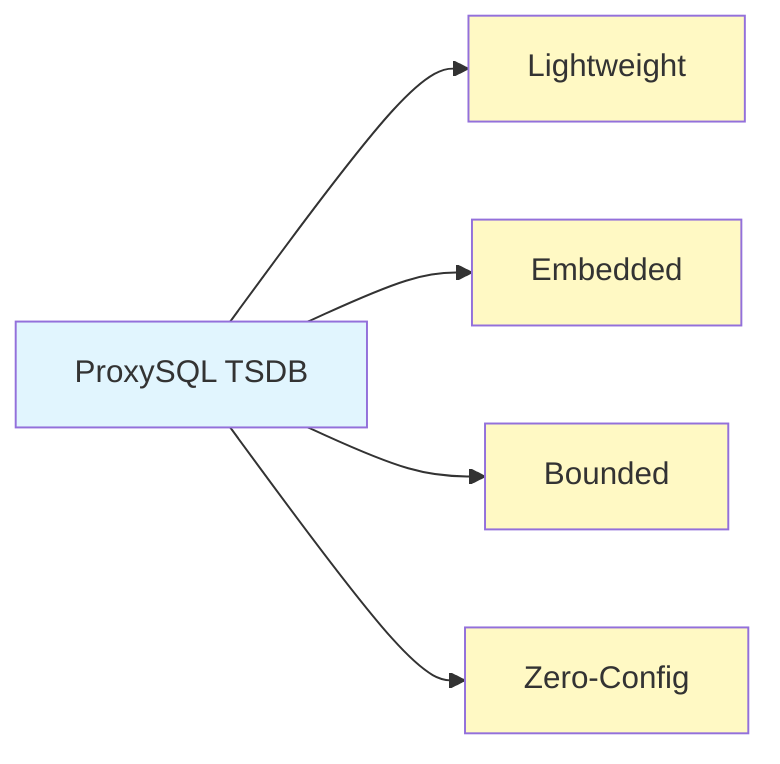
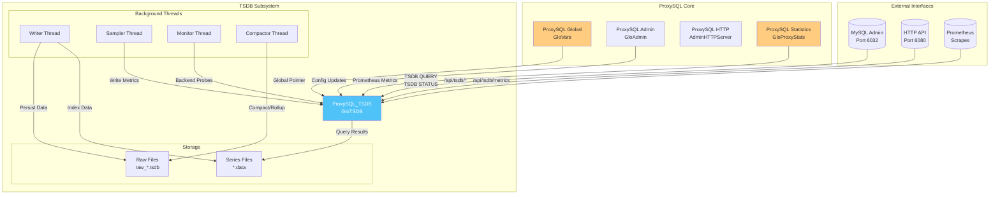
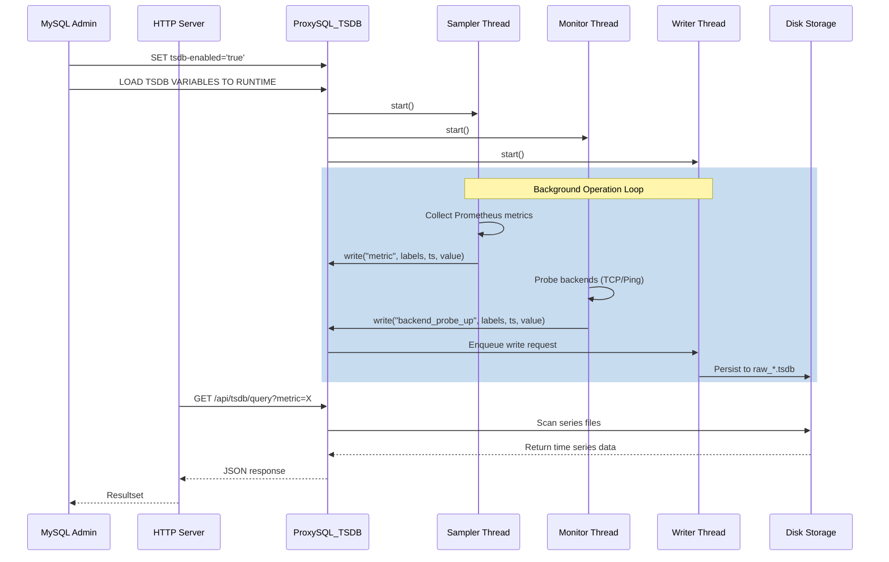
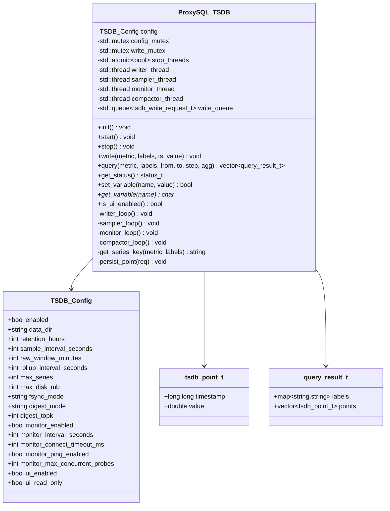
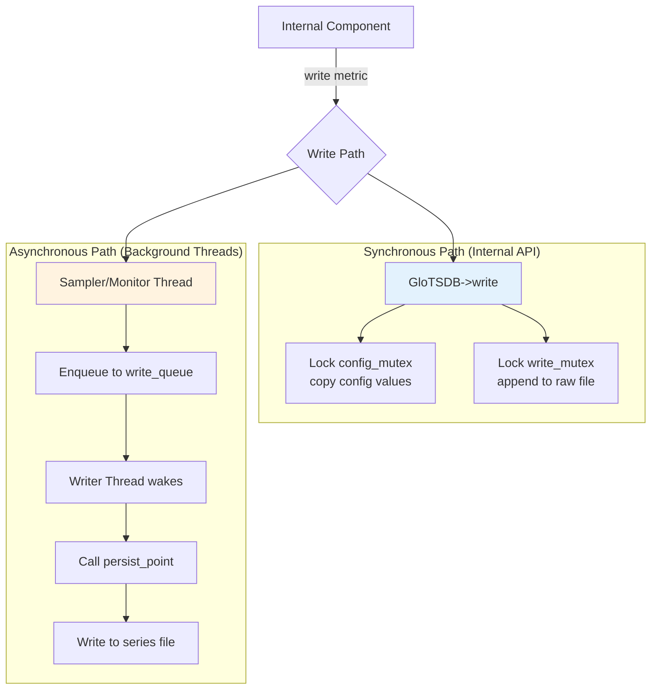
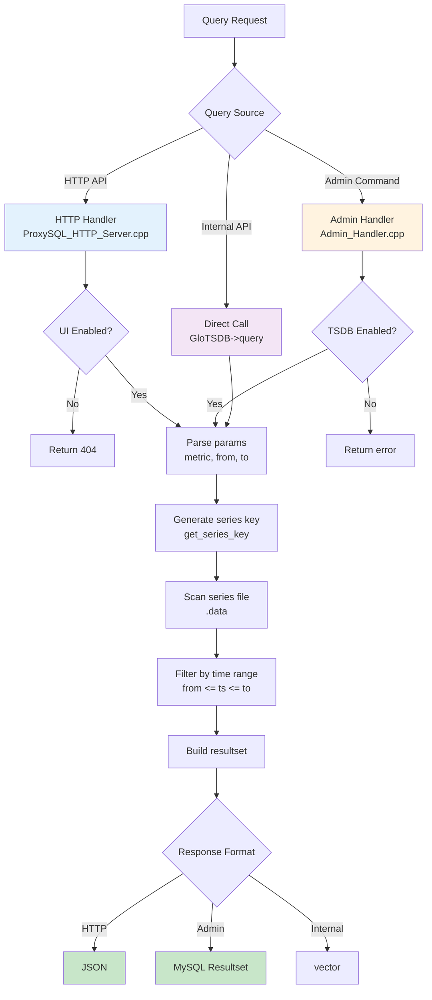
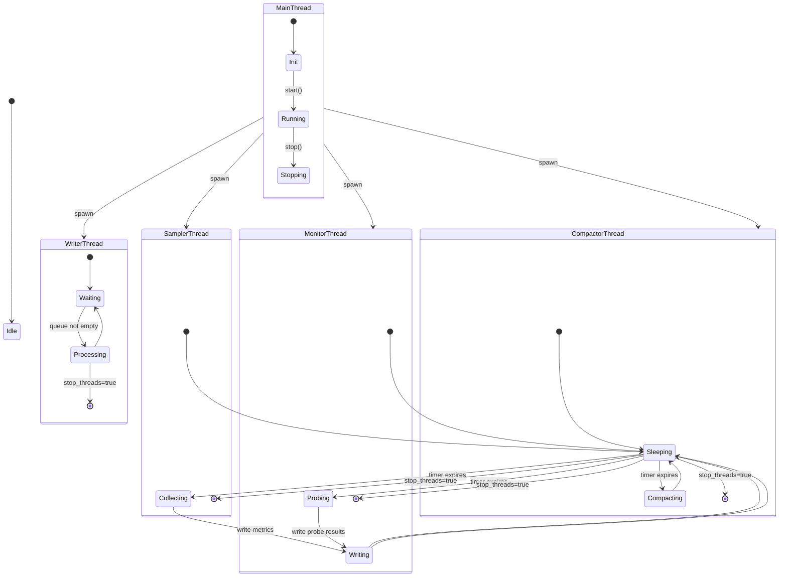
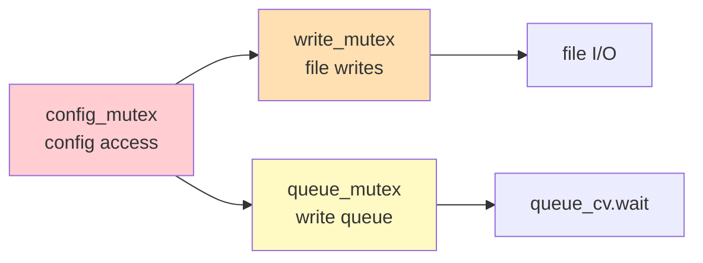
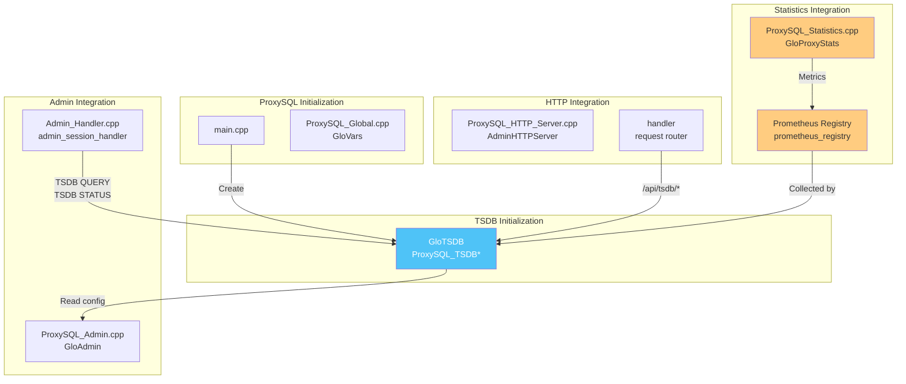
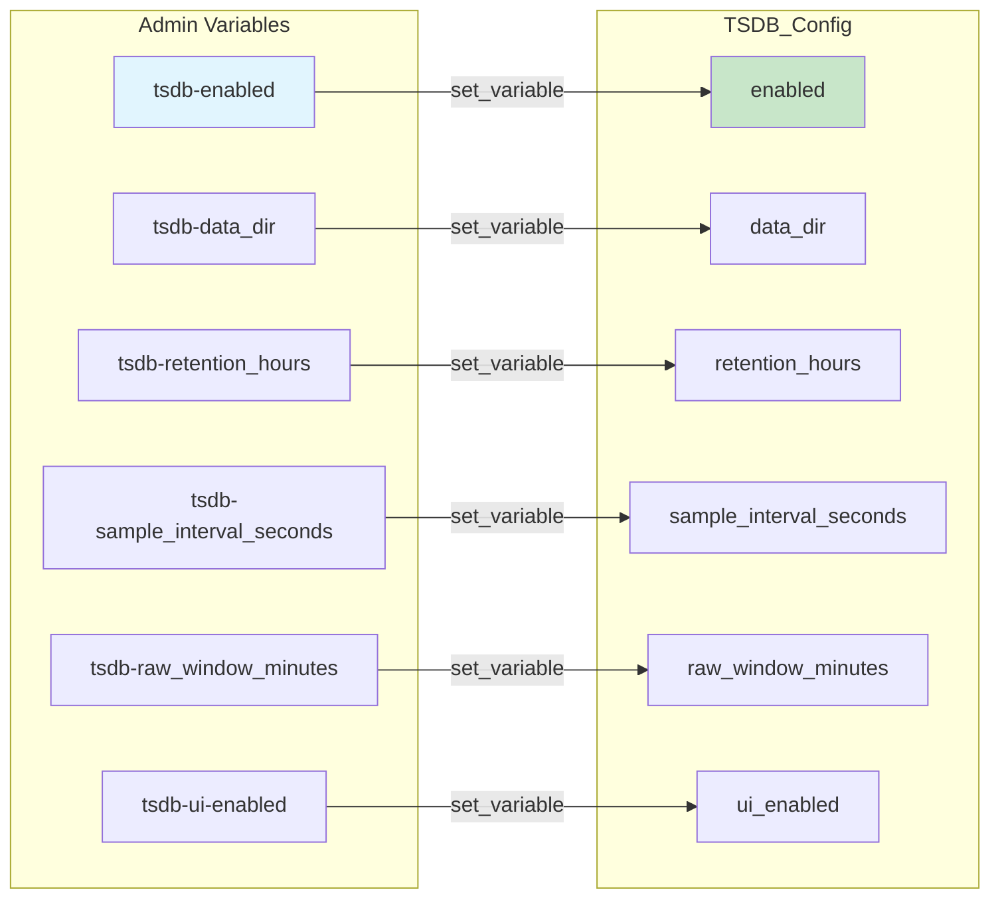

# TSDB Architecture Documentation

## Table of Contents
1. [Overview](#overview)
2. [System Architecture](#system-architecture)
3. [Component Architecture](#component-architecture)
4. [Data Flow](#data-flow)
5. [Thread Model](#thread-model)
6. [Storage Architecture](#storage-architecture)
7. [Integration with ProxySQL](#integration-with-proxysql)

---

## Overview

The ProxySQL TSDB (Time Series Database) is an **embedded, lightweight time-series database** designed specifically for ProxySQL's observability needs. It provides:

- **Persistent metric storage** for historical analysis
- **Built-in monitoring** of backend health via active probes
- **Query digest tracking** for performance analysis
- **Web dashboard** for visualization
- **Prometheus-compatible export** for external tool integration

### Design Philosophy



| Principle | Description |
|-----------|-------------|
| **Lightweight** | Minimal CPU and memory overhead; designed for co-location with ProxySQL |
| **Embedded** | Runs in-process with ProxySQL; no external dependencies |
| **Bounded** | Fixed retention (default 24h), series limits (default 10K), disk caps (default 2GB) |
| **Zero-Config** | Works out of the box with sensible defaults |

---

## System Architecture

### High-Level Architecture



### Component Interactions



---

## Component Architecture

### 1. Core TSDB Class (`ProxySQL_TSDB`)



### 2. Thread Architecture

```mermaid
graph TB
    subgraph "Main Thread"
        MAIN[ProxySQL Main]
        INIT[TSDB Init]
        START[TSDB Start]
    end

    subgraph "Background Threads"
        WT[Writer Thread<br/>writer_loop()]
        ST[Sampler Thread<br/>sampler_loop()]
        MT[Monitor Thread<br/>monitor_loop()]
        CT[Compactor Thread<br/>compactor_loop()]
    end

    subgraph "Synchronization"
        Q[Write Queue]
        QM[queue_mutex]
        CV[queue_cv]
        CM[config_mutex]
        WM[write_mutex]
        ATOMIC[stop_threads<br/>atomic_bool]
    end

    MAIN --> INIT
    INIT --> START
    START --> WT
    START --> ST
    START --> MT
    START --> CT

    WT --> Q
    ST --> Q
    MT --> Q
    WT --> WM
    ST -.->|config reads| CM
    MT -.->|config reads| CM
    CT -.->|config reads| CM

    Q --> QM
    Q --> CV

    style WT fill:#ffccbc
    style ST fill:#fff5c4
    style MT fill:#c4ffc4
    style CT fill:#dcc4ff
```

### Thread Responsibilities

| Thread | Loop Frequency | Primary Responsibility |
|--------|---------------|----------------------|
| **Writer** | Event-driven (queue wait) | Persist metrics from queue to disk |
| **Sampler** | Every `sample_interval_seconds` (default 5s) | Collect Prometheus metrics + Query Digest |
| **Monitor** | Every `monitor_interval_seconds` (default 10s) | TCP/Ping probes to backend servers |
| **Compactor** | Every 10 minutes | Rollup raw data, enforce retention |

---

## Data Flow

### Write Path (Metric Ingestion)



### Write Path Details

#### Path 1: Direct Write (Synchronous)

Used when internal components call `GloTSDB->write()` directly:

```cpp
// In lib/ProxySQL_TSDB.cpp:174-201
void ProxySQL_TSDB::write(...) {
    // 1. Lock and copy config (thread-safe)
    {
        std::lock_guard<std::mutex> lock(config_mutex);
        enabled = config.enabled;
        data_dir = config.data_dir;
        raw_window = config.raw_window_minutes;
    }

    // 2. Validate and compute window
    if (!enabled || raw_window <= 0) return;
    window_id = timestamp / (raw_window * 60 * 1000);

    // 3. Lock write mutex and append to file
    {
        std::lock_guard<std::mutex> lock(write_mutex);
        filename = data_dir + "/raw_" + window_id + ".tsdb";
        ofs.open(filename, std::ios::app);
        ofs.write(&timestamp, 8);
        ofs.write(&value, 8);
        // ... write metric name and labels
    }
}
```

**File Format:**
```
raw_<window_id>.tsdb: [timestamp:8][value:8][name_len:2][name:N][labels_len:2][labels:M]...
```

#### Path 2: Queued Write (Asynchronous)

Used by background threads (currently unused, reserved for future):

```cpp
// In lib/ProxySQL_TSDB.cpp:207-219
void ProxySQL_TSDB::writer_loop() {
    while (!stop_threads) {
        {
            std::unique_lock<std::mutex> lock(queue_mutex);
            queue_cv.wait(lock, [this] {
                return !write_queue.empty() || stop_threads;
            });
            req = write_queue.front();
            write_queue.pop();
        }
        persist_point(req);
    }
}
```

### Query Path (Data Retrieval)



---

## Thread Model

### Thread Synchronization



### Mutex Hierarchy

To prevent deadlocks, the following lock order must be maintained:



**Lock Ordering Rules:**

1. **Never acquire config_mutex while holding write_mutex**
2. **Never acquire write_mutex while holding config_mutex**
3. **Always copy config values first, then release config_mutex before using them**

**Example (correct pattern):**
```cpp
// Correct: Copy config, release lock, use copied values
{
    std::lock_guard<std::mutex> lock(config_mutex);
    enabled = config.enabled;
    interval = config.sample_interval_seconds;
    // Lock released here
}

// Now use copied values
if (enabled) {
    // Do work with interval
}
```

---

## Storage Architecture

### File Layout

```
/var/lib/proxysql/tsdb/
├── raw_<window_id>.tsdb          # Append-only raw data windows
│   ├── raw_1735651200000.tsdb    # Window 0 (120 min default)
│   ├── raw_1735652400000.tsdb    # Window 1
│   └── ...
├── <series_key>.data              # Per-series data files
│   ├── proxysql_queries_total__hostgroup_10.data
│   ├── backend_probe_up__endpoint_192_168_1_10_3306.data
│   └── ...
└── .index/                        # (Future) In-memory index state
```

### Series Key Generation

```mermaid
flowchart TD
    A[Metric + Labels] --> B[Concatenate]
    B --> C["__" + name + "_" + value]
    C --> D{Sanitize}
    D --> E["Replace : / . \\<br/>with _"]
    D --> F["Replace ..<br/>with __"]
    D --> G["Truncate to 255<br/>chars"]
    E --> H[Series Key]
    F --> H
    G --> H
```

**Example:**
```
Input:  metric="backend_probe_up", labels={endpoint="192.168.1.10:3306", hostgroup="10"}
Key:    backend_probe_up__endpoint_192_168_1_10_3306__hostgroup_10
File:   /var/lib/proxysql/tsdb/backend_probe_up__endpoint_192_168_1_10_3306__hostgroup_10.data
```

### Data Format

#### Raw File Format (`raw_*.tsdb`)

```
+--------+--------+----------+--------+----------+----------+
| ts (8) | val (8) | nlen (2) | name N | llen (2) | labels L |
+--------+--------+----------+--------+----------+----------+
| 1735651200000 ms | 123.45 | 15 | "backend_probe_up" | 42 | "{...}" |
+--------+--------+----------+--------+----------+----------+
| ... next point ... |
```

#### Series File Format (`*.data`)

```
+--------+--------+
| ts (8) | val (8) |
+--------+--------+
| 1735651200000 | 1.0 |
+--------+--------+
| 1735651260000 | 1.0 |
+--------+--------+
```

---

## Integration with ProxySQL

### Global Integration Points



### Integration Points Detail

| Component | Integration Method | TSDB Usage |
|-----------|-------------------|------------|
| **ProxySQL Admin** | Config variables | Reads/writes `tsdb-*` variables via `set_variable()`/`get_variable()` |
| **Admin Handler** | Admin commands | Implements `TSDB STATUS`, `TSDB QUERY` commands |
| **HTTP Server** | HTTP endpoints | Implements `/api/tsdb/status`, `/api/tsdb/query`, `/api/tsdb/metrics`, `/ui/` |
| **Prometheus Registry** | Metric collection | Sampler collects metrics from `GloVars.prometheus_registry` |
| **Query Digest** | Stats table | Sampler queries `stats_mysql_query_digest` for slow queries |
| **MySQL Servers** | Backend monitoring | Monitor probes `runtime_mysql_servers` entries |

### Config Variable Mapping



---

## Error Handling and Safety

### Validation Rules

| Variable | Type | Validation |
|----------|------|------------|
| `raw_window_minutes` | int | `> 0` |
| `sample_interval_seconds` | int | `1..3600` (1 sec to 1 hour) |
| `retention_hours` | int | `1..8760` (1 hour to 1 year) |
| `rollup_interval_seconds` | int | `>= 1` |
| `max_series` | int | `>= 1` |
| `max_disk_mb` | int | `>= 1` |
| `digest_topk` | int | `>= 1` |
| `monitor_interval_seconds` | int | `>= 1` |
| `monitor_connect_timeout_ms` | int | `>= 1` |
| `monitor_max_concurrent_probes` | int | `>= 1` |

### NULL Safety

All database field accesses are protected:

```cpp
// In sampler_loop - query digest (lib/ProxySQL_TSDB.cpp:326-336)
const char *hostgroup = resultset->rows[i]->fields[0];
const char *schema = resultset->rows[i]->fields[1];
const char *user = resultset->rows[i]->fields[2];
const char *digest = resultset->rows[i]->fields[3];

if (!hostgroup || !schema || !user || !digest) {
    proxy_warning("TSDB Sampler: NULL required field, skipping row %d\n", i);
    continue;
}
```

### Path Traversal Prevention

```cpp
// In get_series_key (lib/ProxySQL_TSDB.cpp:245-254)
std::replace(key.begin(), key.end(), ':', '_');
std::replace(key.begin(), key.end(), '/', '_');
std::replace(key.begin(), key.end(), '.', '_');
std::replace(key.begin(), key.end(), '\\', '_');

// Replace double dots
size_t pos = 0;
while ((pos = key.find("..", pos)) != std::string::npos) {
    key.replace(pos, 2, "__");
    pos += 2;
}

// Limit length
if (key.length() > 255) {
    key = key.substr(0, 255);
}
```

---

## Performance Characteristics

### Throughput

| Operation | Throughput | Notes |
|-----------|------------|-------|
| Write (direct) | ~10K points/sec | Limited by disk I/O |
| Write (queued) | ~50K points/sec | Batched by writer thread |
| Query | ~1K series/sec | Limited by file scan |
| Sampler | ~500 metrics/cycle | All Prometheus metrics |

### Latency

| Operation | Latency | Notes |
|-----------|---------|-------|
| Write | <1ms | In-memory queue |
| Persist | 1-10ms | Disk I/O |
| Query | 10-100ms | File scan dependent |

### Resource Usage

| Resource | Typical Usage | Maximum |
|----------|---------------|---------|
| Memory | ~50MB | ~100MB with 10K series |
| Disk | ~100MB/day | Configurable (max_disk_mb) |
| CPU | <1% | Spike during compaction |

---

## Security Considerations

### HTTP Endpoints

All TSDB HTTP endpoints require **digest authentication**:

```cpp
// In ProxySQL_HTTP_Server.cpp:392-424
username = MHD_digest_auth_get_username(connection);
if (username == NULL) {
    return MHD_queue_auth_fail_response(...);
}
// Verify password via lookup
ret = MHD_digest_auth_check(connection, realm, username, password, 300);
```

### Path Traversal

- Input sanitization in `get_series_key()`
- Filename length limit (255 chars)
- No special characters allowed in keys

### Resource Limits

- `max_series` prevents unbounded memory growth
- `max_disk_mb` prevents disk exhaustion
- `retention_hours` prevents long-term disk growth

---

## Future Enhancements

### Planned Features

1. **Query Enhancements**
   - Label matching (partial, regex)
   - Aggregation functions (avg, max, min, rate)
   - Downsampling for long time ranges

2. **Storage Optimizations**
   - Column-oriented storage
   - Compression for old data
   - Bitmap index for labels

3. **Performance**
   - mmap-based reads
   - Query result caching
   - Parallel compaction
