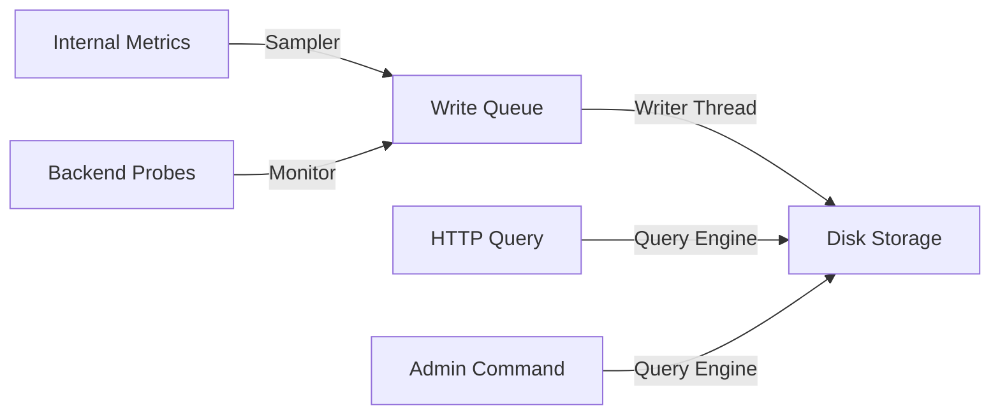
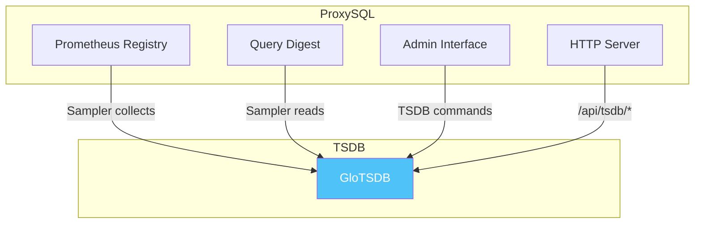

# Embedded TSDB Overview

## What is the TSDB?

The **ProxySQL TSDB** (Time Series Database) is an **embedded, lightweight time-series database** built directly into ProxySQL. It provides:

- **Historical metric storage** - Persist query statistics, connection counts, backend health
- **Built-in monitoring** - Active health checks for all backend servers
- **Web dashboard** - Visualize metrics without external tools
- **Prometheus export** - Optional integration with external monitoring stacks

### Key Benefits

| Benefit | Description |
|---------|-------------|
| **Zero external dependencies** | No Prometheus, Grafana, or external database required |
| **Always-on monitoring** | Built-in backend health checks |
| **Historical analysis** - Debug past performance issues |
| **Simple setup** | Enable with a single SQL command |
| **Production-ready** | Bounded resource usage, won't impact ProxySQL performance |

## Documentation Guide

| Document | Description | Link |
|----------|-------------|-----|
| **Architecture** | System design, components, data flow, thread model | [architecture.md](./embedded_tsdb_architecture.md) |
| **Reference Manual** | Configuration variables, commands, API reference | [reference.md](./embedded_tsdb_reference.md) |
| **Specifications** | Technical specs, data formats, protocols, test specs | [specs.md](./embedded_tsdb_specs.md) |
| **Quickstart** | Getting started guide | [quickstart.md](./embedded_tsdb_quickstart.md) |
| **Metrics Catalog** | Available metrics and their meanings | [metrics_catalog.md](./embedded_tsdb_metrics_catalog.md) |

## Quick Start

```sql
-- Enable TSDB
SET tsdb-enabled='true';
LOAD TSDB VARIABLES TO RUNTIME;

-- Access the dashboard
-- http://localhost:6080/ui/
```

## Architecture Overview

The TSDB subsystem consists of four main components:

```mermaid
graph LR
    subgraph "TSDB Subsystem"
        S[Sampler Thread<br/>Collects metrics]
        M[Monitor Thread<br/>Probes backends]
        W[Writer Thread<br/>Persists data]
        Q[Query Engine<br/>HTTP + Admin API]
    end

    S -->|Writes| W
    M -->|Writes| W
    Q -->|Reads| W
    end
```

### Component Responsibilities

| Component | Function | Frequency |
|-----------|----------|-----------|
| **Sampler** | Collects internal metrics (query counts, connections, etc.) | Every 5 seconds (configurable) |
| **Monitor** | TCP/Ping probes to backend servers | Every 10 seconds (configurable) |
| **Writer** | Persists metrics to disk | Continuous (event-driven) |
| **Compactor** | Rolls up old data, enforces retention | Every 10 minutes |
| **Query Engine** | Serves HTTP API and admin commands | On-demand |

## Storage Architecture

```
/var/lib/proxysql/tsdb/
├── raw_<window>.tsdb          # Raw data files (append-only)
└── <series_key>.data          # Per-series data files
```

### Data Flow



## Integration with ProxySQL

The TSDB integrates with ProxySQL at multiple points:



## What Gets Monitored?

### 1. Traffic Metrics
- Query counts and latency
- Frontend connections
- Backend connections
- Query cache stats

### 2. Backend Health
- TCP connect success/failure
- Connection latency
- Ping results (if enabled)

### 3. Query Digest (Optional)
- Top-K slow queries
- Query execution counts
- Total time per query

### 4. System Health
- TSDB internal stats
- Memory usage
- Uptime

## Design Principles

### Bounded Resources

The TSDB is designed with **hard limits** to prevent it from impacting ProxySQL's primary function (query routing):

| Limit | Default | Purpose |
|-------|---------|---------|
| `max_series` | 10,000 | Prevent unbounded memory growth |
| `max_disk_mb` | 2,048 (2GB) | Prevent disk exhaustion |
| `retention_hours` | 24 | Prevent long-term disk growth |

### Append-Only Storage

- **Fast writes** - Append to files, no in-place updates
- **Immutable segments** - Raw files never modified after creation
- **Simple compaction** - Old files deleted when retention expires

### Thread Safety

- **Config mutex** protects all configuration changes
- **Write mutex** protects file I/O
- **Atomic flags** for clean shutdown

## When to Use TSDB

| Use Case | Recommended |
|----------|-------------|
| **Quick troubleshooting** | ✅ Ideal - last 24 hours of data |
| **Performance analysis** | ✅ Identify slow queries, bottlenecks |
| **Backend monitoring** | ✅ Track backend health over time |
| **Long-term analytics** | ❌ Use external system (Prometheus/Grafana) instead |
| **High-cardinality metrics** | ⚠️ May hit series limit |

## When NOT to Use TSDB

- **Long-term retention** (> 1 week) - Use external TSDB
- **High-cardinality data** - Thousands of unique label combinations
- **Complex analytics** - Use external query/BI tools
- **Cross-server aggregation** - Use external monitoring

## Trade-offs

### What TSDB Does Well

| Feature | Description |
|---------|-------------|
| **Immediate troubleshooting** - "Why was the query slow 2 hours ago?" |
| **Backend health trends** - "When did backend X start failing?" |
| **Resource utilization** - "What are the top queries by execution count?" |
| **Zero-config observability** - Enable and forget, works out of the box |

### What TSDB Doesn't Do

| Feature | Alternative |
|---------|-------------|
| **Long-term storage** | Export to Prometheus/Grafana |
| **Complex analytics** | Export to external database |
| **Distributed monitoring** | Use centralized monitoring |
| **Alerting** | Use external alerting system |

## Configuration at a Glance

| Variable | Default | Description |
|----------|---------|-------------|
| `tsdb-enabled` | `false` | Master switch |
| `tsdb-retention_hours` | `24` | How long to keep data |
| `tsdb-sample_interval_seconds` | `5` | How often to sample metrics |
| `tsdb-ui_enabled` | `true` | Enable HTTP endpoints and UI |
| `tsdb-monitor_enabled` | `true` | Enable backend monitoring |
| `tsdb-max_series` | `10000` | Maximum unique series |

See the [Reference Manual](./embedded_tsdb_reference.md) for complete configuration documentation.

## Next Steps

1. **Read the Architecture** - [architecture.md](./embedded_tsdb_architecture.md)
2. **Follow the Quickstart** - [quickstart.md](./embedded_tsdb_quickstart.md)
3. **Explore the API** - [reference.md](./embedded_tsdb_reference.md)
4. **Check the Specs** - [specs.md](./embedded_tsdb_specs.md)
