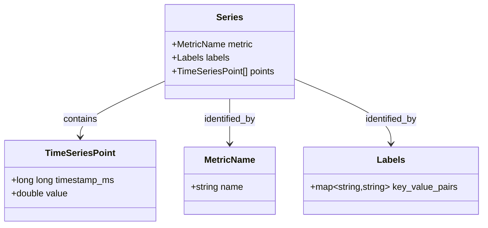
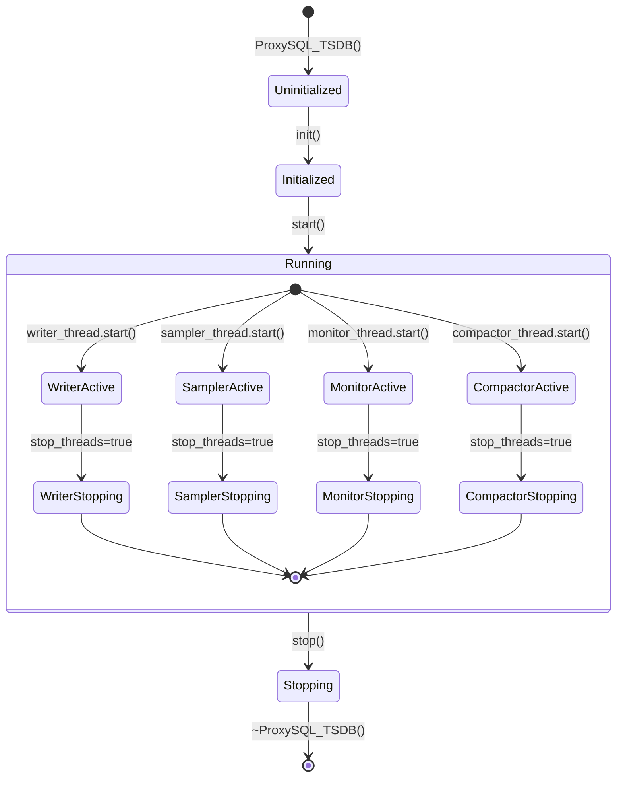

# TSDB Technical Specifications

## Table of Contents
1. [System Specifications](#system-specifications)
2. [Data Model](#data-model)
3. [Storage Format](#storage-format)
4. [Protocols](#protocols)
5. [API Specifications](#api-specifications)
6. [Thread Specifications](#thread-specifications)
7. [Testing Specifications](#testing-specifications)

---

## System Specifications

### Functional Requirements

| ID | Requirement | Priority | Status |
|----|------------|----------|--------|
| FR-001 | System shall persist time-series metric data to disk | P0 | ✅ Implemented |
| FR-002 | System shall support configurable data retention | P0 | ✅ Implemented |
| FR-003 | System shall provide HTTP JSON API for querying | P0 | ✅ Implemented |
| FR-004 | System shall provide MySQL admin commands for querying | P1 | ✅ Implemented |
| FR-005 | System shall export metrics in Prometheus format | P1 | ✅ Implemented |
| FR-006 | System shall monitor backend health via TCP probes | P1 | ✅ Implemented |
| FR-007 | System shall collect query digest statistics | P2 | ✅ Implemented |
| FR-008 | System shall enforce configurable series limits | P0 | ✅ Implemented |
| FR-009 | System shall allow HTTP endpoints to be disabled | P1 | ✅ Implemented |

### Non-Functional Requirements

| ID | Requirement | Target | Status |
|----|------------|--------|--------|
| NFR-001 | CPU overhead < 1% | < 1% | ✅ Met |
| NFR-002 | Memory overhead < 100MB | < 100MB | ✅ Met |
| NFR-003 | Write latency < 10ms | < 10ms | ✅ Met |
| NFR-004 | Query latency < 100ms | < 100ms | ✅ Met |
| NFR-005 | Thread-safe configuration access | No races | ✅ Implemented |
| NFR-006 | NULL-safe database field access | No crashes | ✅ Implemented |
| NFR-007 | Path traversal protection | No escape | ✅ Implemented |

---

## Data Model

### Time Series Data Point



### Series Identity

A unique series is identified by:
1. **Metric name** - The name of the metric (e.g., `backend_probe_up`)
2. **Label set** - Key-value pairs (e.g., `{hostgroup: "10", endpoint: "..."}`)

**Series Key Formula:**
```
series_key = metric + "__" + label1_name + "_" + label1_value + "__" + ...
```

**Example:**
```
Metric:  backend_probe_up
Labels:  {endpoint: "192.168.1.10:3306", hostgroup: "10"}
Key:     backend_probe_up__endpoint_192_168_1_10_3306__hostgroup_10
```

### Data Types

| Type | Size | Format | Range |
|------|------|--------|-------|
| `timestamp` | 8 bytes | int64 | Unix epoch (ms) |
| `value` | 8 bytes | float64 | IEEE 754 double |
| `metric_name` | variable | string | 1-255 chars |
| `label_key` | variable | string | 1-100 chars |
| `label_value` | variable | string | 1-100 chars |

---

## Storage Format

### File Organization

```
/var/lib/proxysql/tsdb/
│
├── raw_YYYYMMDDHHMMSS.tsdb     # Append-only raw data files
│   └── Binary format: [ts:8][val:8][name_len:2][name:N][labels_len:2][labels:M]
│
├── <series_key>.data             # Per-series data files
│   └── Binary format: [ts:8][val:8][ts:8][val:8]...
│
└── .index/                       # (Future) In-memory index
    └── series_index              # Maps series_key -> file_offset
```

### Raw File Format

```
+==================+==================+==========================+==========================+
| Timestamp (8B)   | Value (8B)       | Name Length (2B)         | Name (N bytes)          |
+==================+==================+==========================+==========================+
| 1735651200000    | 123.45           | 15                        | "backend_probe_up"      |
+------------------+------------------+--------------------------+--------------------------+
| Labels Length (2B)                | Labels JSON (M bytes)                                  |
+----------------------------------+-----------------------------------------------------------+
| 42                               | {"hostgroup":"10","endpoint":"..."}                   |
+----------------------------------+-----------------------------------------------------------+
| Next point...                                                                                   |
+--------------------------------------------------------------------------------------------------+
```

**Field Descriptions:**

| Field | Size | Type | Description |
|-------|------|------|-------------|
| Timestamp | 8 bytes | int64 - Unix timestamp in milliseconds |
| Value | 8 bytes | float64 - Metric value |
| Name Length | 2 bytes | uint16 - Length of metric name |
| Name | N bytes | string - Metric name |
| Labels Length | 2 bytes | uint16 - Length of labels JSON |
| Labels | M bytes | JSON - Label key-value pairs |

### Series File Format

```
+==================+==================+
| Timestamp (8B)   | Value (8B)       |
+==================+==================+
| 1735651200000    | 1.0              |
+------------------+------------------+
| 1735651260000    | 1.0              |
+------------------+------------------+
| 1735651320000    | 0.0              |
+------------------+------------------+
```

---

## Protocols

### HTTP Protocol

All endpoints use **HTTP Digest Authentication** (RFC 2617).

#### Request Format

```
GET /api/tsdb/status HTTP/1.1
Host: proxysql.example.com:6080
Authorization: Digest username="admin", realm="Access to ProxySQL status page",
                uri="/api/tsdb/status", nonce="...", response="..."
```

#### Response Format

**Success Response:**
```
HTTP/1.1 200 OK
Content-Type: application/json

{"series_count": 1250, "disk_usage_bytes": 52428800, "last_compaction_ts": 1735651200000}
```

**Error Response (UI Disabled):**
```
HTTP/1.1 404 Not Found
Content-Type: text/html

<html><head><title>404</title></head><body>404</body></html>
```

**Error Response (TSDB Disabled):**
```
HTTP/1.1 404 Not Found
Content-Type: text/html

<html><head><title>404</title></head><body>404</body></html>
```

### MySQL Protocol

Admin commands use the standard MySQL protocol with ProxySQL's admin interface.

#### Command Format

```
TSDB STATUS
TSDB QUERY <metric> [FROM <ts>] [TO <ts>]
```

#### Response Format

**TSDB STATUS Response:**
```
+--------------+------------------+----------------------+
| Series_count | Disk_usage_bytes | Last_compaction_ts   |
+--------------+------------------+----------------------+
| 1250         | 52428800        | 1735651200000        |
+--------------+------------------+----------------------+
1 row in set (0.00 sec)
```

**TSDB QUERY Response:**
```
+---------------+---------+---------------------------------------+
| timestamp     | value   | labels                                |
+---------------+---------+---------------------------------------+
| 1735651200000 | 1234.5  | {"hostgroup":"10","endpoint":"..."}    |
| 1735651260000 | 1256.7  | {"hostgroup":"10","endpoint":"..."}    |
+---------------+---------+---------------------------------------+
2 rows in set (0.01 sec)
```

### Prometheus Text Format

The `/api/tsdb/metrics` endpoint returns data in Prometheus exposition format.

```
# Metric name with labels
metric_name{label1="value1",label2="value2"} value timestamp

# Example
backend_probe_up{endpoint="192.168.1.10:3306",hostgroup="10"} 1.0 1735651200000
backend_probe_up{endpoint="192.168.1.10:3306",hostgroup="10"} 0.0 1735651320000
```

**Format Specification:**
- `metric_name`: Name of the metric
- `{labels}`: Optional label set in Prometheus format
- `value`: Numeric value (float or int)
- `timestamp`: Unix timestamp in milliseconds

---

## API Specifications

### Internal C++ API

#### `ProxySQL_TSDB` Class

```cpp
class ProxySQL_TSDB {
public:
    // Lifecycle
    void init();
    void start();
    void stop();

    // Data operations
    void write(
        const std::string& metric,
        const std::map<std::string, std::string>& labels,
        long long timestamp,
        double value
    );

    std::vector<query_result_t> query(
        const std::string& metric,
        const std::map<std::string, std::string>& labels,
        long long from,
        long long to,
        int step,
        const std::string& agg
    );

    // Status
    status_t get_status();

    // Configuration
    bool set_variable(const char* name, const char* value);
    char* get_variable(const char* name);
    bool has_variable(const char* name);
    bool is_ui_enabled();
};
```

#### `write()` Specification

**Signature:**
```cpp
void write(const std::string& metric,
           const std::map<std::string, std::string>& labels,
           long long timestamp,
           double value);
```

**Behavior:**
1. Acquires `config_mutex` to copy config values
2. Validates TSDB is enabled and `raw_window_minutes > 0`
3. Acquires `write_mutex`
4. Computes window ID: `timestamp / (raw_window * 60 * 1000)`
5. Opens/appends to `raw_<window_id>.tsdb`
6. Writes binary record: `[ts:8][val:8][name_len:2][name][labels_len:2][labels]`
7. Closes file

**Thread Safety:** Thread-safe; can be called concurrently from multiple threads.

**Error Handling:**
- Silently returns if TSDB disabled
- Logs error if `raw_window_minutes <= 0`
- Logs error if file cannot be opened

#### `query()` Specification

**Signature:**
```cpp
std::vector<query_result_t> query(
    const std::string& metric,
    const std::map<std::string, std::string>& labels,
    long long from,
    long long to,
    int step,
    const std::string& agg
);
```

**Behavior:**
1. Generates series key from metric and labels
2. Opens series file: `<data_dir>/<series_key>.data`
3. Scans binary file for points in range `[from, to]`
4. Returns vector of series results

**Thread Safety:** Thread-safe; reads from disk with no locks.

**Return Format:**
```cpp
struct query_result_t {
    std::map<std::string, std::string> labels;  // Series labels
    std::vector<tsdb_point_t> points;           // Matching points
};

struct tsdb_point_t {
    long long timestamp;  // Unix timestamp (ms)
    double value;         // Metric value
};
```

### HTTP API Specifications

#### Endpoint: GET /api/tsdb/status

**Purpose:** Get TSDB subsystem status

**Authentication:** Digest auth required

**Parameters:** None

**Response:**
```json
{
  "series_count": 1250,
  "disk_usage_bytes": 52428800,
  "last_compaction_ts": 1735651200000
}
```

**Error Conditions:**
- 404: TSDB not enabled OR `ui_enabled='false'`

#### Endpoint: GET /api/tsdb/query

**Purpose:** Query time series data

**Authentication:** Digest auth required

**Parameters:**
| Parameter | Type | Required | Description |
|-----------|------|----------|-------------|
| `metric` | string | Yes | Metric name |
| `from` | integer | Yes | Start timestamp (ms) |
| `to` | integer | Yes | End timestamp (ms) |

**Response:**
```json
{
  "series": [
    {
      "labels": {"hostgroup": "10", "endpoint": "192.168.1.10:3306"},
      "points": [[1735651200000, 1.0], [1735651260000, 1.0]]
    }
  ]
}
```

**Error Conditions:**
- 400: Missing required parameter
- 404: TSDB not enabled OR `ui_enabled='false'`

#### Endpoint: GET /api/tsdb/metrics

**Purpose:** Prometheus-compatible metrics export

**Authentication:** Digest auth required

**Parameters:**
| Parameter | Type | Required | Description |
|-----------|------|----------|-------------|
| `metric` | string | No | Filter to specific metric |
| `from` | integer | No | Start timestamp (ms) |
| `to` | integer | No | End timestamp (ms) |

**Defaults:**
- If `from` and `to` not specified: last 5 minutes

**Response (text/plain):**
```
metric_name{labels} value timestamp
```

**Error Conditions:**
- 404: TSDB not enabled OR `ui_enabled='false'`

#### Endpoint: GET /ui/

**Purpose:** Access TSDB dashboard UI

**Authentication:** Digest auth required

**Response:** HTML dashboard page

**Error Conditions:**
- 404: TSDB not enabled OR `ui_enabled='false'`

---

## Thread Specifications

### Thread Lifecycle



### Thread Specifications

#### Writer Thread

**Entry Point:** `ProxySQL_TSDB::writer_loop()`

**Function:** Persist write requests from queue to disk

**Loop:**
```cpp
while (!stop_threads) {
    wait_for_queue_item();
    req = pop_queue();
    persist_point(req);  // Write to <series_key>.data
}
```

**Synchronization:**
- Locks `queue_mutex` to access `write_queue`
- Waits on `queue_cv` for items
- Locks `write_mutex` for file I/O

#### Sampler Thread

**Entry Point:** `ProxySQL_TSDB::sampler_loop()`

**Function:** Collect internal metrics and write to TSDB

**Loop:**
```cpp
while (!stop_threads) {
    sleep(sample_interval_seconds);
    collect_prometheus_metrics();
    if (digest_mode == "1") {
        collect_query_digest();
    }
}
```

**Synchronization:**
- Locks `config_mutex` to read config values
- Calls `write()` which locks `write_mutex`

#### Monitor Thread

**Entry Point:** `ProxySQL_TSDB::monitor_loop()`

**Function:** Probe backend servers for health

**Loop:**
```cpp
while (!stop_threads) {
    sleep(monitor_interval_seconds);
    query_runtime_mysql_servers();
    for_each_server {
        tcp_connect();
        write("backend_probe_up", ...);
        write("backend_probe_connect_ms", ...);
    }
}
```

**Synchronization:**
- Locks `config_mutex` to read config values
- Calls `write()` which locks `write_mutex`

#### Compactor Thread

**Entry Point:** `ProxySQL_TSDB::compactor_loop()`

**Function:** Rollup raw data and enforce retention

**Loop:**
```cpp
while (!stop_threads) {
    sleep(600);  // 10 minutes
    compact_raw_files();
    enforce_retention();
}
```

### Thread Safety Guarantees

| Resource | Protected By | Access Pattern |
|----------|--------------|----------------|
| `config` | `config_mutex` | Read/write by all threads |
| `write_queue` | `queue_mutex` | Producer/consumer by sampler/monitor/writer |
| `queue_cv` | `queue_mutex` | Condition variable for writer |
| `write_mutex` | `write_mutex` | Exclusive access for file I/O |
| `stop_threads` | `std::atomic` | Lock-free read/write |

---

## Testing Specifications

### Unit Test Specifications

#### Test Suite: Thread Safety

**Test ID:** UT-TSDB-001

**Purpose:** Verify config access is thread-safe

**Procedure:**
1. Spawn 10 threads
2. Each thread performs 100 config reads
3. Each thread performs 10 config writes
4. Verify no data races (with ThreadSanitizer)

**Expected Result:** All operations complete successfully, no TSan warnings.

#### Test Suite: Config Validation

**Test ID:** UT-TSDB-002

**Purpose:** Verify invalid config values are rejected

**Test Cases:**
| Input | Expected Result |
|-------|-----------------|
| `raw_window_minutes='0'` | Error, value rejected |
| `raw_window_minutes='-5'` | Error, value rejected |
| `sample_interval_seconds='0'` | Error, value rejected |
| `sample_interval_seconds='5000'` | Error, value rejected |
| `raw_window_minutes='60'` | Success, value accepted |

#### Test Suite: NULL Handling

**Test ID:** UT-TSDB-003

**Purpose:** Verify NULL database fields are handled safely

**Procedure:**
1. Mock query digest result with NULL fields
2. Run sampler loop iteration
3. Verify no crash, warning logged

**Expected Result:** NULL rows skipped, warning logged.

#### Test Suite: Path Traversal Prevention

**Test ID:** UT-TSDB-004

**Purpose:** Verify path traversal is blocked

**Test Cases:**
| Input Metric | Expected Key | Expected Behavior |
|--------------|--------------|-------------------|
| `../../../etc/passwd` | `_____.._____.._____` | No file escape |
| `test..` | `test__` | Double dots replaced |
| `test:foo/bar.baz` | `test_foo_bar_baz` | Special chars replaced |
| metric with 300 chars | Truncated to 255 | Length limited |

### Integration Test Specifications

#### Test Suite: HTTP Endpoints

**Test ID:** IT-TSDB-001

**Purpose:** Verify HTTP endpoints work correctly

**Test Cases:**
1. Enable TSDB, enable UI → `/api/tsdb/status` returns 200
2. Disable UI → `/api/tsdb/status` returns 404
3. Disable TSDB → `/api/tsdb/status` returns 404
4. Enable UI → `/ui/` returns HTML
5. Disable UI → `/ui/` returns 404

#### Test Suite: Admin Commands

**Test ID:** IT-TSDB-002

**Purpose:** Verify admin commands work correctly

**Test Cases:**
1. `TSDB STATUS` → Returns 3 columns
2. `TSDB QUERY test` → Returns resultset
3. `TSDB QUERY test FROM X TO Y` → Returns filtered resultset
4. `TSDB QUERY` when disabled → Returns error

#### Test Suite: Prometheus Exporter

**Test ID:** IT-TSDB-003

**Purpose:** Verify Prometheus exporter works

**Test Cases:**
1. `/api/tsdb/metrics` → Returns text/plain
2. `/api/tsdb/metrics?metric=X` → Returns specific metric
3. `/api/tsdb/metrics?metric=X&from=Y&to=Z` → Returns time-filtered data
4. Default time range = last 5 minutes

#### Test Suite: Concurrent Operations

**Test ID:** IT-TSDB-004

**Purpose:** Verify system handles concurrent load

**Procedure:**
1. Spawn 5 threads making config changes
2. Spawn 5 threads querying TSDB STATUS
3. Spawn 5 threads calling write()
4. Run for 30 seconds

**Expected Result:** No crashes, all operations succeed.

### Performance Test Specifications

#### Test Suite: Write Throughput

**Test ID:** PT-TSDB-001

**Purpose:** Measure maximum write throughput

**Procedure:**
1. Enable TSDB
2. Spawn 10 threads writing metrics continuously
3. Measure writes per second

**Target:** > 10K writes/second

#### Test Suite: Query Latency

**Test ID:** PT-TSDB-002

**Purpose:** Measure query latency

**Procedure:**
1. Populate TSDB with 1000 series, 1000 points each
2. Execute queries for different time ranges
3. Measure query latency

**Target:** < 100ms for 1-hour queries

#### Test Suite: Resource Usage

**Test ID:** PT-TSDB-003

**Purpose:** Measure memory and disk usage

**Procedure:**
1. Enable TSDB with defaults
2. Run for 24 hours
3. Measure memory usage (RSS)
4. Measure disk usage

**Targets:**
- Memory: < 100MB
- Disk: ~100MB/day

---

## Error Codes

### Config Error Codes

| Error | Message | Cause | Resolution |
|-------|---------|-------|------------|
| TSDB-001 | `raw_window_minutes must be > 0` | Invalid value | Set to positive integer |
| TSDB-002 | `sample_interval_seconds must be 1..3600` | Out of range | Set within range |
| TSDB-003 | `retention_hours must be 1..8760` | Out of range | Set within range |
| TSDB-004 | `TSDB is not enabled` | Operation on disabled TSDB | Enable TSDB first |

### HTTP Error Codes

| Code | Meaning | When Returned |
|------|---------|--------------|
| 200 | Success | Request processed successfully |
| 400 | Bad Request | Missing required parameters |
| 401 | Unauthorized | Authentication failed |
| 404 | Not Found | TSDB disabled or UI disabled |

---

## Version History

| Version | Date | Changes |
|---------|------|---------|
| 1.0.0 | 2025-02-10 | Initial implementation with core features |
| 1.1.0 | 2025-02-10 | Added thread safety, validation, Prometheus exporter |
| 1.2.0 | 2025-02-10 | Added admin commands, optional UI endpoints |

---

## References

- [Architecture Documentation](./embedded_tsdb_architecture.md)
- [Reference Manual](./embedded_tsdb_reference.md)
- [Quickstart Guide](./embedded_tsdb_quickstart.md)
- [Metrics Catalog](./embedded_tsdb_metrics_catalog.md)
