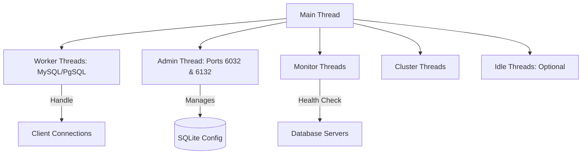
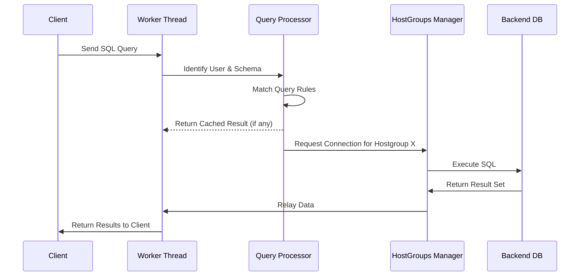

# Architecture Overview

## High-Level Design

ProxySQL is a high-performance, protocol-aware proxy server for MySQL and PostgreSQL. It is written in C++ and designed around an **asynchronous, multi-threaded, and event-driven architecture**.

### Core Principles
1. **Maximal Uptime**: Configuration changes happen at runtime without restarts.
2. **High Scalability**: Uses an event-driven model (`libev`) to handle thousands of concurrent connections per thread.
3. **Protocol Awareness**: Deeply understands MySQL and PostgreSQL wire protocols for advanced routing and rewriting.
4. **Resilience**: Integrated monitoring and auto-shunning of unhealthy backend nodes.

---

## Threading Model

ProxySQL employs a multi-threaded worker model where different thread types handle specific tasks to avoid contention and ensure predictability.

### Thread Types
- **MySQL Worker Threads**: Handle the bulk of the client traffic, including authentication, query parsing, and result set relaying.
- **PgSQL Worker Threads**: Dedicated threads for handling the PostgreSQL protocol.
- **Admin Thread**: Manages the administrative interface, supporting both MySQL protocol (default port `6032`) and PostgreSQL protocol (default port `6132`).
- **Monitor Threads**: Continuously perform health checks (pings, connection tests, replication lag) on backend servers.
- **Cluster Threads**: Handle inter-node synchronization in a ProxySQL Cluster.

---

## Core Components

### 1. Connection Pool (HostGroups Manager)
ProxySQL groups backend servers into **Hostgroups**. Each hostgroup maintains its own pool of persistent connections.
- **Multiplexing**: Allows multiple frontend sessions to share a smaller number of backend connections.
- **Latency Awareness**: Automatically routes traffic to the fastest responding servers.
- **Replication Tracking**: Monitors `read_only` status to distinguish between Writers and Readers.

### 2. Query Processor
This is the "brain" of ProxySQL. For every query, the processor decides:
- **Routing**: Which hostgroup should handle this query?
- **Rewriting**: Does the SQL need to be modified (e.g., adding index hints)?
- **Caching**: Is there a valid cached result in memory?
- **Blocking**: Should this query be denied based on security rules?

### 3. Query Digest System
ProxySQL computes a unique "fingerprint" (digest) for every query by normalizing values. This allows for high-performance statistics tracking and rule matching based on query types rather than specific data.

---

## Data Flow: The Query Lifecycle

The following diagram illustrates how a query moves through the system:

---

## Performance Optimizations

### Lock-Free Statistics
ProxySQL uses thread-local storage (`__thread`) for statistics and counters. This allows worker threads to update metrics without expensive global locks, ensuring performance scales linearly with the number of CPU cores.

### Memory Management
Integrating **jemalloc** ensures efficient memory allocation and reduces fragmentation, which is critical for long-running proxy processes handling large result sets.

### Compiled Regex Caching
Query matching patterns are compiled and cached in memory. ProxySQL supports both RE2 and PCRE engines for high-speed pattern matching across thousands of rules.

---

## Persistence & Clustering

### Multi-Layer Configuration
All configuration is stored in an internal SQLite database. This allows for transactional updates and ensures that the persistent state (`disk`) can be separated from the active state (`runtime`). 
*See [Multi-Layer Configuration System](../main_runtime/multi_layer_configuration) for more details.*

### P2P Clustering
ProxySQL Cluster uses a peer-to-peer model with checksum-based synchronization. Nodes compare configuration versioning and epochs to ensure the entire cluster converges on the same state without a single point of failure.
