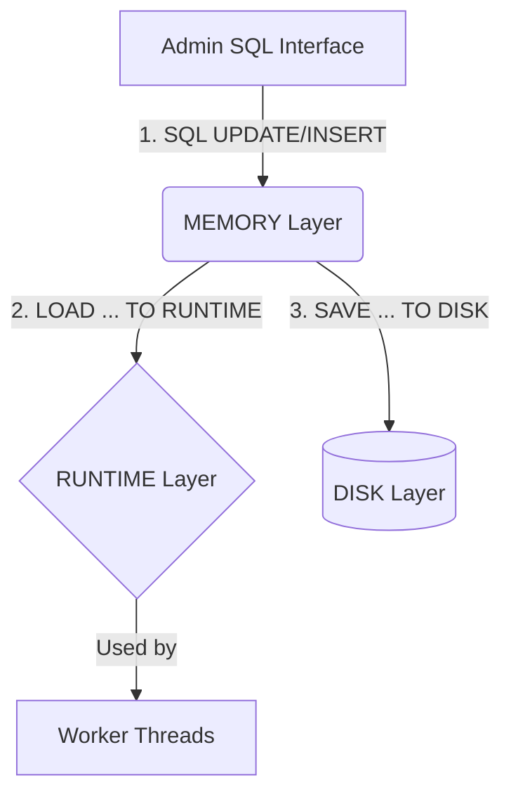
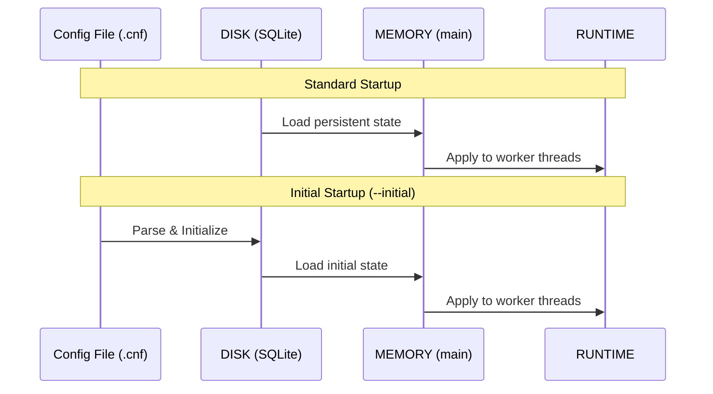

# The Multi-Layer Configuration System

## Overview

ProxySQL is designed for **maximal uptime** and **dynamic reconfiguration**. To achieve this, it employs a sophisticated multi-layer configuration system that allows administrators to modify almost every aspect of the proxy at runtime without requiring a restart or dropping active connections.

## Why Multi-Layer?

Traditional software often requires a restart to reload a configuration file. This is unacceptable for a high-availability proxy. ProxySQL's system solves this by providing:
1. **Dynamic Changes**: Apply configuration updates instantly to the processing threads.
2. **Safety**: A "staging" area (Memory) to verify SQL-based configuration before making it active.
3. **Persistence**: Ensure that runtime changes survive a reboot.
4. **Version Control**: The ability to revert to a previous persistent state if a runtime change causes issues.

---

## The Four Layers

### 1. RUNTIME
The **Runtime** layer represents the internal data structures used by the ProxySQL worker threads. This is the only layer that actively affects the behavior of the proxy. When a thread needs to know a variable value or a routing rule, it looks here.
- **Access**: Read-only via `stats` or `runtime_` tables.
- **Modification**: Only via `LOAD ... TO RUNTIME` commands.

### 2. MEMORY (Main)
The **Memory** layer (also known as the `main` database) is an in-memory SQLite database. It serves as the primary interface for administrators. You use standard SQL (`INSERT`, `UPDATE`, `DELETE`) to modify tables in this layer.
- **Access**: Read/Write via the Admin interface.
- **Modification**: Standard SQL statements.
- **Persistence**: **NOT persistent**. Changes here are lost on restart unless saved to DISK.

### 3. DISK
The **Disk** layer is a persistent SQLite database stored on the local file system (typically `proxysql.db`). On startup, ProxySQL populates the Memory layer from this database.
- **Access**: Via `disk` schema in Admin or direct SQLite client.
- **Modification**: Only via `SAVE ... TO DISK` commands (or direct SQLite editing, though not recommended).

### 4. CONFIG FILE
The **Configuration File** (`proxysql.cnf`) is a static text file. It is primarily used for the **initial bootstrap** of a fresh ProxySQL installation.
- **Access**: Standard text editor.
- **Modification**: Manual editing.
- **Role**: Overrides DISK only if ProxySQL is started with the `--initial` or `--reload` flags.

---

## Configuration Workflow

### Applying a Change
The typical workflow for modifying ProxySQL configuration is:
1. Modify the **MEMORY** layer using SQL.
2. Move changes to **RUNTIME** to make them active.
3. Move changes to **DISK** to make them persistent.

### Startup Flow
When ProxySQL starts, it follows this priority logic to populate the layers:

1. **DISK to MEMORY**: Usually, ProxySQL loads the persistent state from the SQLite file into memory.
2. **MEMORY to RUNTIME**: The loaded state is then pushed to the runtime structures.
3. **CONFIG FILE (Optional)**: If started with `--initial`, the config file overwrites the disk database.

## Moving Configuration Between Layers

Moving data between these layers is handled by specific [Admin Commands](../the_admin_schemas/admin_commands).

- **To activate changes**: `LOAD <MODULE> TO RUNTIME`
- **To persist changes**: `SAVE <MODULE> TO DISK`
- **To revert changes from disk**: `LOAD <MODULE> FROM DISK`
- **To inspect runtime state**: `SAVE <MODULE> TO MEMORY` (copies internal state back to SQLite for viewing)
