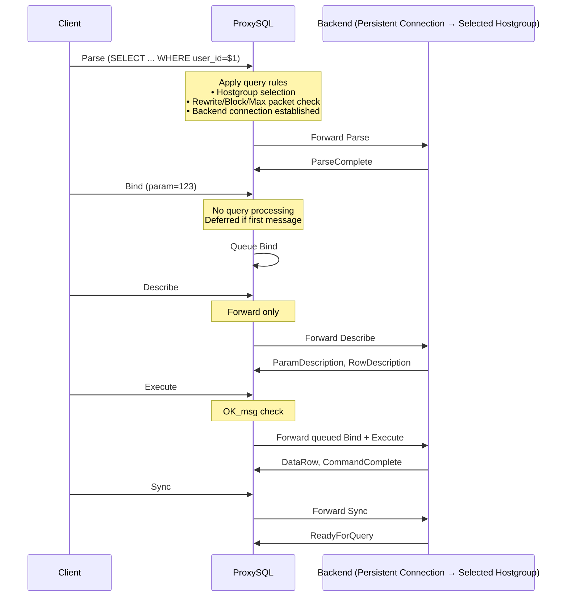
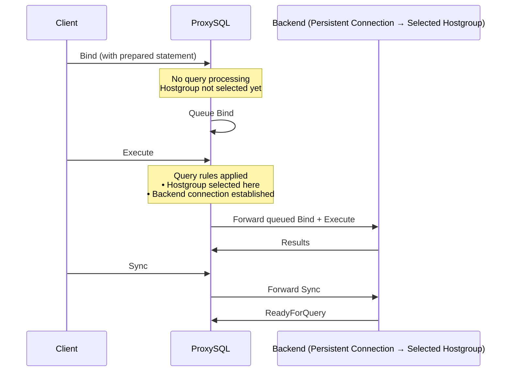
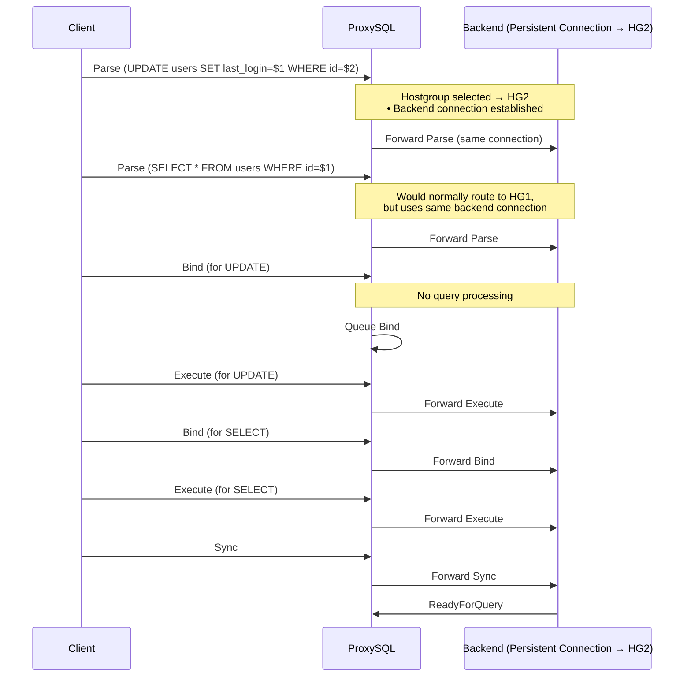

# Applying Query Rules in the PostgreSQL Extended Query Protocol

Starting with **ProxySQL v3.0.3**, the PostgreSQL module introduces support for the **Extended Query Protocol**.  
This protocol consists of multiple message types — **Parse**, **Bind**, **Describe**, **Execute**, **Close**, and **Sync** — which require special handling when applying query rules.  
The implementation includes specific logic to determine how these rules are evaluated and applied throughout the extended query message flow.

### Query Routing Behavior

- **Host Group Selection:** The first message in the extended query pipeline that triggers query processing determines which host group will handle the entire query sequence.
- **Connection Persistence:** Once a backend connection is established, it remains consistent for all messages in the extended query pipeline (until `Sync` message).
- **Fallback:** If no matching query rule exists, queries are routed to the default host group.

### Important: Bind and Close Statement Handling
- **No Query Processing:** Bind and Close messages do **NOT** trigger query processing or hostgroup selection.
- **Deferred Routing:** If Bind or Close is the first message in a sequence, the **NEXT** message that triggers query processing (Parse, Execute, Describe) will determine the hostgroup.

### Query Rules Application
The following query rule actions are applied at different stages of the extended query flow:

#### Parse Message Stage
These actions are evaluated and applied when the Parse packet is received:

**Messages That Can Determine Hostgroup (IF First in Pipeline)**
- Parse 
- Describe
- Execute

**Parse Message Processing**
- **Query Rewrite**: SQL text can be modified before parsing (`pgsql_query_rules -> replace_pattern`).
- **Max Packet Size**: If a packet is larger than `pgsql-max_allowed_packet` value, reject the query.
- **Block Query**: Reject query with defined error message (`pgsql_query_rules -> error_msg`).

#### Execute Message Processing
These actions are applied during the Execute phase:
- **OK Message**: Return success response to client without executing query on backend server (`pgsql_query_rules -> OK_msg`).

---

### Sequence 1: Standard Extended Query

### Sequence 2: Bind as First Message

### Sequence 3: Multi-Statement Pipeline

