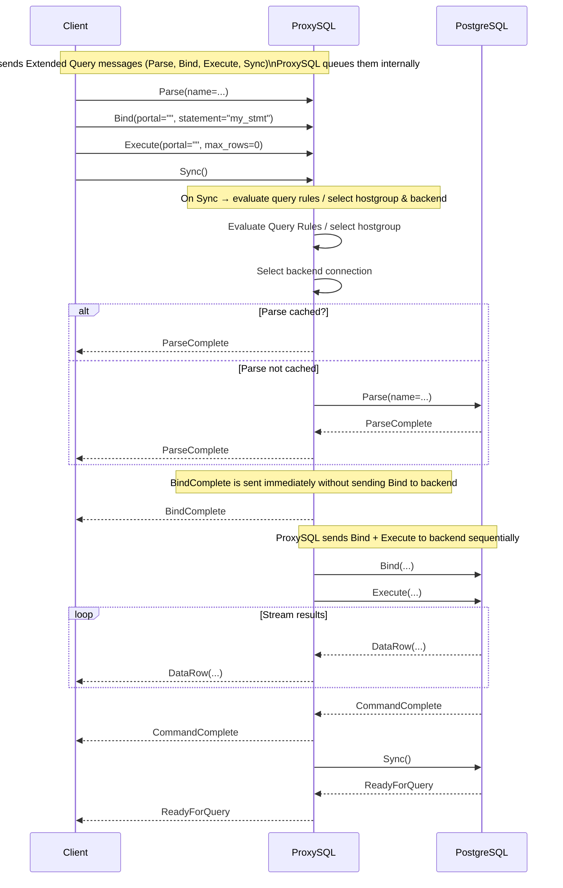

# PostgreSQL Extended Query Protocol Support

## Overview

As of **ProxySQL 3.0.3**, the PostgreSQL module supports **Extended Query Protocol**, allowing ProxySQL to natively handle PostgreSQL protocol-level prepared statements, parameter bindings, and execution messages.

This feature makes ProxySQL compatible with most PostgreSQL client libraries (`libpq`, `psycopg`, `pgJDBC`, etc.) that use Extended Query Protocol by default.

The feature is **enabled automatically**, with no configuration changes required.

---

## What Is the Extended Query Protocol?

PostgreSQL clients communicate with the server using one of two query modes:

| Protocol | Description |
|-----------|--------------|
| **Simple Query Protocol** | Sends an entire SQL statement in a single `Query` message. |
| **Extended Query Protocol** | Splits execution into multiple messages (`Parse`, `Bind`, `Describe`, `Execute`, `Sync`, etc.) to support prepared statements, parameter binding, and binary formats. |

### Typical Extended Query Sequence

1. **Parse** – Define a prepared statement.  
2. **Bind** – Bind parameters to that statement and create a portal.  
3. **Describe** *(optional)* – Request metadata.  
4. **Execute** – Execute the prepared statement.  
5. **Sync** – Signal the end of the message sequence.

---

## How ProxySQL Handles the Extended Query Protocol

ProxySQL handles PostgreSQL’s Extended Query Protocol by managing message sequencing, routing, and response forwarding transparently.

### Internal Workflow

1. **Queuing:**  
   - As Extended Query messages (`Parse`, `Bind`, `Describe`, `Execute`, etc.) arrive from a client, ProxySQL **queues them internally**.  
   - These messages are **not sent immediately** to any backend.

2. **On `Sync`:**  
   - Once ProxySQL receives a `Sync` message, it:
     1. [**Evaluates PostgreSQL query rules**](./applying_query_rules_in_extended_query_protocol) to determine the destination hostgroup.  
        - If no rule matches, the **default hostgroup** is used.  
     2. **Selects a backend connection** from that hostgroup.  
     3. **Sends all queued messages sequentially** to the selected backend connection.

3. **Response Streaming:**  
   - As responses are received from the backend, ProxySQL **forwards them immediately** to the client.  
   - Responses are not buffered — they are streamed in real time.

> **Note:**  
> ProxySQL maintains an [**Prepared Statements Cache**](./prepared_statement_cache) to reuse prepared statements across backend connections and reduce redundant parsing.  

---

## Supported Messages

| Category | Message Types |
|-----------|----------------|
| Parsing and Binding | `Parse`, `Bind`, `Describe`, `Close` |
| Execution | `Execute`, `Sync` |
| Communication | `ErrorResponse`, `ReadyForQuery` |

### Unsupported / Deferred Messages

| Message | Status | Notes |
|----------|---------|-------|
| `Flush` | ❌ Not supported |
| `Execute(max_rows)` | ⚠️ `max_rows` ignored — ProxySQL returns the full result set. |

---

## Extended Query Flow Diagram

---
## Limitations

| Feature / Message | Status | Notes |
|--------------------|---------|-------|
| **Named portals** | ❌ Not supported | Only **unnamed portals** are supported. Messages referencing a named portal will fail. |
| **`COPY FROM STDIN` in Extended Query mode** | ❌ Not supported | Use **Simple Query mode** for `COPY FROM STDIN` operations. |
| **`LISTEN` / `NOTIFY`** | ❌ Not supported | ProxySQL does not currently forward asynchronous notifications. |
| **`FLUSH` message type** | ❌ Not supported | Ignored by ProxySQL — queued messages are only processed on `Sync`. |
| **`Execute(maxRows)`** | ⚠️ Ignored | ProxySQL always returns the **full result set**. Since `libpq` does not support `maxRows`, this is consistent with normal driver behavior. |
| **`SET` parameters (session-level)** | ⚠️ Limited | When executed in Extended Query mode **outside an explicit transaction**, `SET` parameters are **not rolled back** automatically on error. |
| **Query Cache** | ❌ Not supported | The **Query Cache** feature is **disabled** when using **Extended Query mode**; caching applies only to Simple Query operations. |

---

### Additional Notes

- These limitations do **not affect normal query execution** for most applications.  
- Popular PostgreSQL drivers (`libpq`, `pgJDBC`, `psycopg`) continue to work normally, as they primarily use **unnamed portals** and **full result sets**.  
- Support for named portals and incremental row fetching is planned for a future release.
