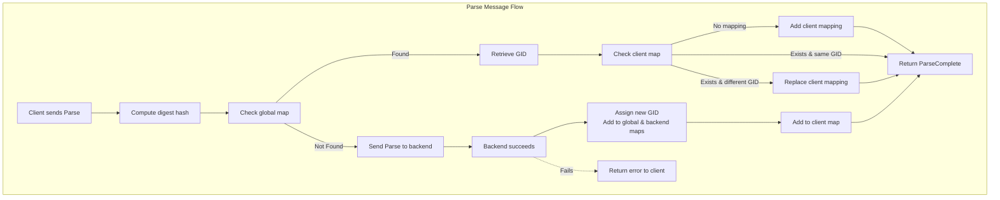
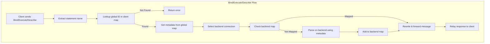
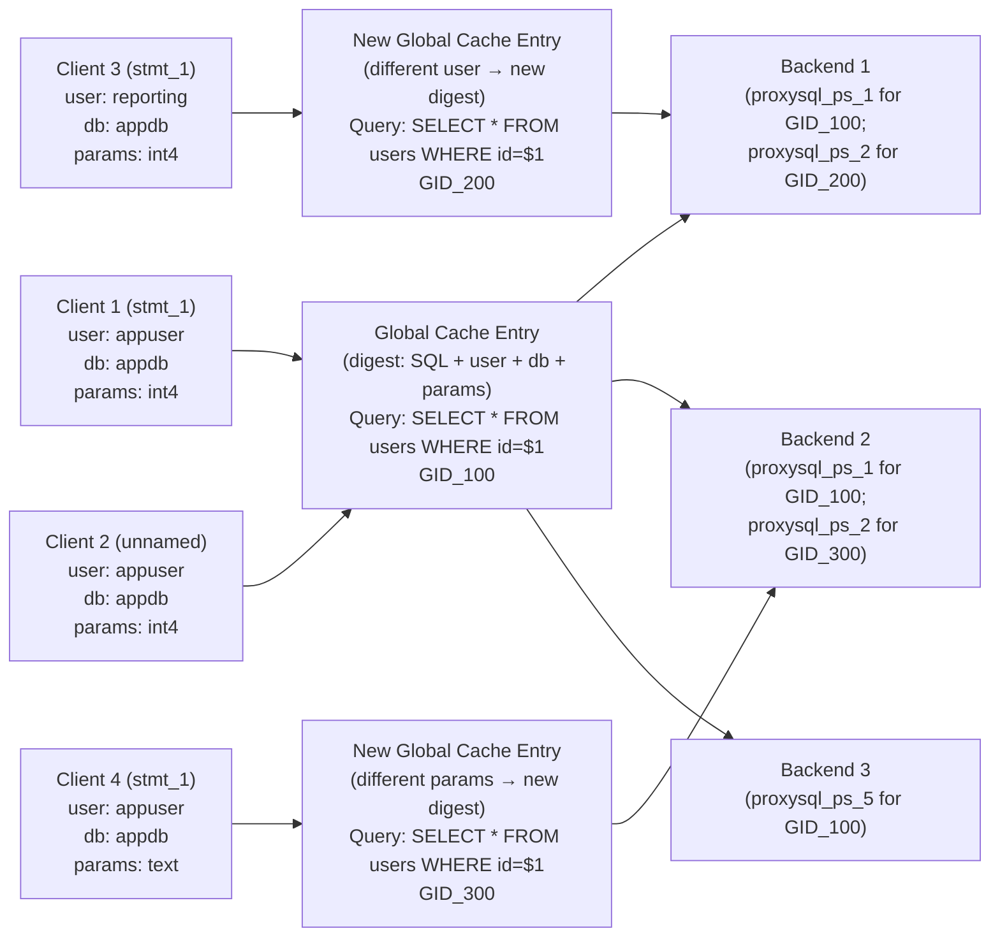

# Prepared Statements Cache

Starting from **ProxySQL v3.0.3**, support for PostgreSQL’s extended query protocol includes **prepared statement caching**.  
This mechanism improves performance by reusing prepared statements across client connections and backend sessions, eliminating redundant `Parse` operations and reducing latency on the database servers.

Prepared statements are cached globally inside ProxySQL, meaning once a statement has been parsed and stored, it can be efficiently reused without re-preparing it on the backend — unless needed by backend connection.

---

## Prepared Statement Caching and Identifiers

To efficiently manage prepared statements, ProxySQL maintains three internal data structures (maps). These ensure that prepared statements can be shared, tracked, and reused safely across clients and backends.

### Global Map (process-wide)

- The **global map** is keyed by a **hash (digest)** generated from:
  - The SQL query text  
  - Logged-in user  
  - Target database (schema)  
  - Protocol-level parameter types (if provided)

  This ensures that cached prepared statements are reused **only between compatible clients** — i.e., those using the same SQL, same parameter structure, and connected as the same user to the same database.

- Each entry in the global map contains:
  - The SQL text
  - Protocol-level parameter type metadata
  - A unique **global ID** identifying the cached prepared statement

  The metadata in the global map can be used to create the prepared statement on a backend connection if it doesn’t already exist there.

### Client Map (per client connection)

- Maps the **statement name** (as received from the client) to the **global ID** of the prepared statement in the global map.  
- This mapping ensures ProxySQL can translate client-side statement identifiers into global cached statements.

### Backend Map (per backend connection)

- Maps a **global ID** to a **backend-side statement name**, typically named `proxysql_ps_{n}`.  
- `{n}` is unique **within each backend connection**, but may repeat across different backends.  
- This ensures isolation between backend connections while maintaining consistent linkage to global cached statements.

---

## Parse Message Flow

When a client sends a `Parse` message to prepare a statement, ProxySQL performs the following steps:

1. **Compute the digest hash**: Generate a unique hash based on the SQL query text, the logged-in user, the target schema (database), and any provided protocol-level parameter types. This hash ensures uniqueness and compatibility for caching.

2. **Lookup in the global map**: Search for an existing entry matching the computed hash.
   - **If an entry is found** (indicating the statement has been prepared before in a compatible context):
     - Retrieve the corresponding global ID.
     - Proceed to step 3 for client map handling.
   - **If no entry is found**:
     - Route a `Parse` request to an appropriate backend connection (Query Rules, default hostgroup).
     - Upon successful preparation on the backend, generate a unique backend statement name (e.g., `proxysql_ps_1`).
     - Add to the global map: Store the SQL text, parameter metadata, and assign a new unique global ID, keyed by the hash.
     - Add to the backend map: Map the global ID to the backend's statement name for this specific backend connection.
     - Add to the client map: Map the client's statement name to the new global ID.
     - Return `ParseComplete` to the client.

3. **Handle client map mapping (only if global entry found)**:
   - Check the client map for an existing mapping for the client's statement name.
     - **If no mapping exists**: Add a new entry (client statement name → global ID) and return `ParseComplete`.
     - **If a mapping exists**:
       - **If mapped to the same global ID**: Return `ParseComplete` immediately without any further action.
       - **If mapped to a different global ID**: Replace the old global ID with the new one in the client map, then return `ParseComplete`.  
         **Note**: Allowed only for unnamed statements.

---

## Bind/Execute/Describe Flow

For operations following preparation—such as `Bind` (binding parameters to a portal), `Execute` (running the bound statement), or `Describe` (retrieving metadata about the statement or portal)—ProxySQL uses the cached metadata to efficiently forward requests:

1. **Extract client statement name**: Retrieve the statement name from the incoming message.

2. **Lookup global ID in client map**: Use the statement name to find the associated global ID.
   - If no mapping exists, this indicates an invalid or unprepared statement; return an error to the client.

3. **Retrieve metadata from global map**: Using the global ID, fetch the stored SQL text and parameter type metadata for consistency.

4. **Select backend connection**: Determine the target backend based on query rules, or default hostgroup.

5. **Check backend map for the selected connection**:
   - **If the global ID is mapped** to a backend statement name:
     - Rewrite the message to use the backend's statement name instead of the client's.
     - Forward the `Bind`, `Execute`, or `Describe` directly to the backend.
   - **If the global ID is not mapped**:
     - Issue a new `Parse` to the backend using the cached metadata from the global map (SQL text and parameter types).
     - On successful backend preparation, add the mapping (global ID → backend statement name) to the backend map.
     - Rewrite and forward the original `Bind`, `Execute`, or `Describe` message using the new backend name.

6. **Handle response and sync**: ProxySQL relays the backend's response (e.g., `BindComplete`, `RowDescription`, `DataRow`, `CommandComplete`) back to the client, followed by `ReadyForQuery` if a `Sync` is implied or sent.

---

## Visual Overview
### Prepared Statement Mapping and Caching

### Explanation

- **Clients 1 and 2** share the same cached prepared statement (**GID_100**) because they use the same SQL text, parameter types (`int4`), user (`appuser`), and database (`appdb`). Even though Client 2 uses an unnamed statement, the digest remains identical.  
- **Client 3** creates a new cache entry (**GID_200**) because it connects as a different user (`reporting`). The query text is identical, but the digest differs due to the user context.  
- **Client 4** creates another new cache entry (**GID_300**) because its parameter type differs (`text` instead of `int4`).  
- **Backends prepare statements lazily** — a prepared statement is only created on a backend when it is first required for execution. For example, **Backend 3** only prepares `GID_100` when a query using that statement is routed to it.  
- **No conflicts occur** between backends. Each backend maintains its own namespace, meaning `proxysql_ps_1` on Backend 1 and `proxysql_ps_1` on Backend 2 refer to different physical prepared statements.  
- A single backend can manage multiple prepared statements concurrently — for example, **Backend 1** maintains both `GID_100` and `GID_200`, while **Backend 2** holds `GID_100` and `GID_300`.  

# Observability
The cached prepared statements can be viewed through the `stats_pgsql_prepared_statements_info` table.
This table provides details such as the `user`, `database`, `digest`, and `reference counts`, indicating how many client and backend connections are currently using each prepared statement.
It offers a straightforward way to monitor and validate the effectiveness of prepared statement caching in ProxySQL.
